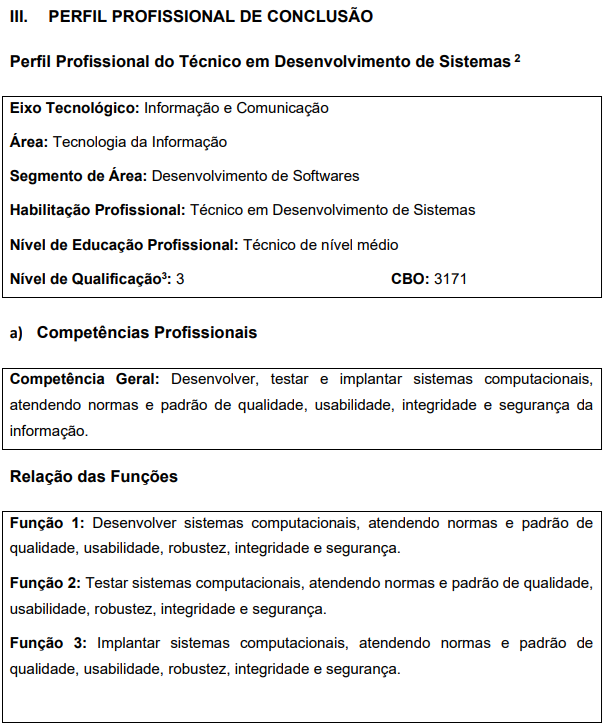
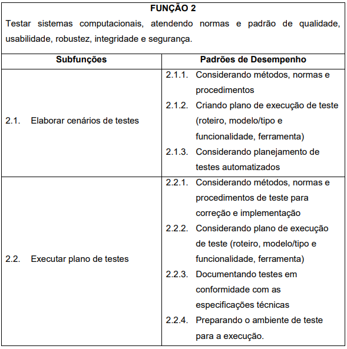

# Técnico em Desenvolvimento de Sistemas

## Pesquisa de satisfação
|Nome|Unidade|Curso|Turma|Formulário de avaliação|
|-|-|-|-|-|
|Liara Guarizo Tolloto|513 - JAGUARIÚNA|Técnico em Desenvolvimento de Sistemas|1DES-SESI A_26|https://nam.dcv.ms/kYJd37ig7G|
|Otávio Augusto Barbosa|513 - JAGUARIÚNA|Técnico em Desenvolvimento de Sistemas|1DES-SESI A_26|https://nam.dcv.ms/UIXUrslWJB|
|Felipe Martins|513 - JAGUARIÚNA|Técnico em Desenvolvimento de Sistemas|1DES-SESI B_26|https://nam.dcv.ms/nn9olnEEwC|
|Isabele Hilary Reis Silva|513 - JAGUARIÚNA|Técnico em Desenvolvimento de Sistemas|1DES-SESI B_26|https://nam.dcv.ms/zUsDQ9WXJM|
|Joana Fernandes Fabrin|513 - JAGUARIÚNA|Técnico em Desenvolvimento de Sistemas|1DES-SESI B_26|https://nam.dcv.ms/Ho4cA7xMlc|
|Elisa Marielle de Oliveira Carvalho|513 - JAGUARIÚNA|Técnico em Desenvolvimento de Sistemas|2DES - SESI 1A|https://nam.dcv.ms/Z4GFo1ows9|
|Francisco de Paula Souza|513 - JAGUARIÚNA|Técnico em Desenvolvimento de Sistemas|2DES - SESI 1A|https://nam.dcv.ms/poXaqNuauA|
|Gabriela Caroline da Silva|513 - JAGUARIÚNA|Técnico em Desenvolvimento de Sistemas|2DES - SESI 1A|https://nam.dcv.ms/NUA010Du8l|
|Júlia Gabrielly da Silva Gonzaga|513 - JAGUARIÚNA|Técnico em Desenvolvimento de Sistemas|2DES - SESI 1A|https://nam.dcv.ms/eU1k4cZ41n|
|Julia Novo de Souza|513 - JAGUARIÚNA|Técnico em Desenvolvimento de Sistemas|2DES - SESI 1A|https://nam.dcv.ms/aS6vunJV9V|
|Kaique Gonçalves Pavan|513 - JAGUARIÚNA|Técnico em Desenvolvimento de Sistemas|2DES - SESI 1A|https://nam.dcv.ms/QietK62t7m|
|Luiza Amaral Corazin|513 - JAGUARIÚNA|Técnico em Desenvolvimento de Sistemas|2DES - SESI 1A|https://nam.dcv.ms/2463cvnSyH|
|Maria Fernanda Moraes de Oliveira|513 - JAGUARIÚNA|Técnico em Desenvolvimento de Sistemas|2DES - SESI 1A|https://nam.dcv.ms/6BdCHWuunS|
|Marina Defendi|513 - JAGUARIÚNA|Técnico em Desenvolvimento de Sistemas|2DES - SESI 1A|https://nam.dcv.ms/OwiCTaw4RK|
|Enzo Semenssi Toniato|513 - JAGUARIÚNA|Técnico em Desenvolvimento de Sistemas|2DES - SESI 2B|https://nam.dcv.ms/WRI2fh38Bm|

## [Plano de Curso](./planejamento/Plano_de_Curso_2025.pdf)
## Competências transversais - Cursos autoinstitucionais
- 1 Portal **[EAD](https://ead.sp.senai.br)**
- 2 Verificar se está matriculado em algum curso e completar todos os que estiver matriculado.
- Cursos sugeridos
    - Desvendando a Indústria 4.0 - 20h
    - Excel Básico - 14h
    - Web 3.0 - 20h
    - Fluência - Fundamentos da Inteligência Artificial - 8h
- 3 Para se matricular nos cursos acima, caso não esteja matriculado acessar **[SENAI Jaguariúna](https://sp.senai.br/cursos?unidade=513)** e pesquisar o curso.
- 4 Se tiver dificuldades de acesso, senha, clique **[Tutorial de como acessar o Portal EAD](https://ead.sp.senai.br/tutorial/comoacessar/)**
- 5 Enviar os certificados (Print ou PDF) neste formulário para ganhar pontos na nota final dos componentes ministrados no curso técnico. **[FORMULÁRIO PARA ENVIO DOS CERTIFICADOS](https://forms.gle/STMxikkU8qVfLuEb8)**

## Destaque do Plano de Curso
- 
- 
- 
- 

