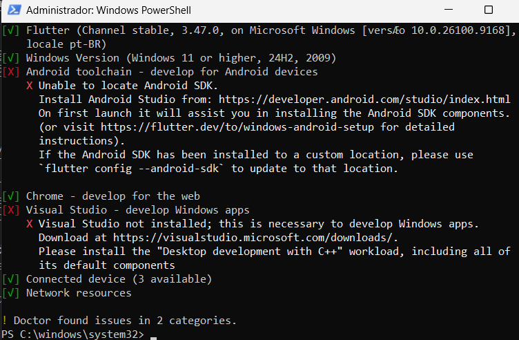
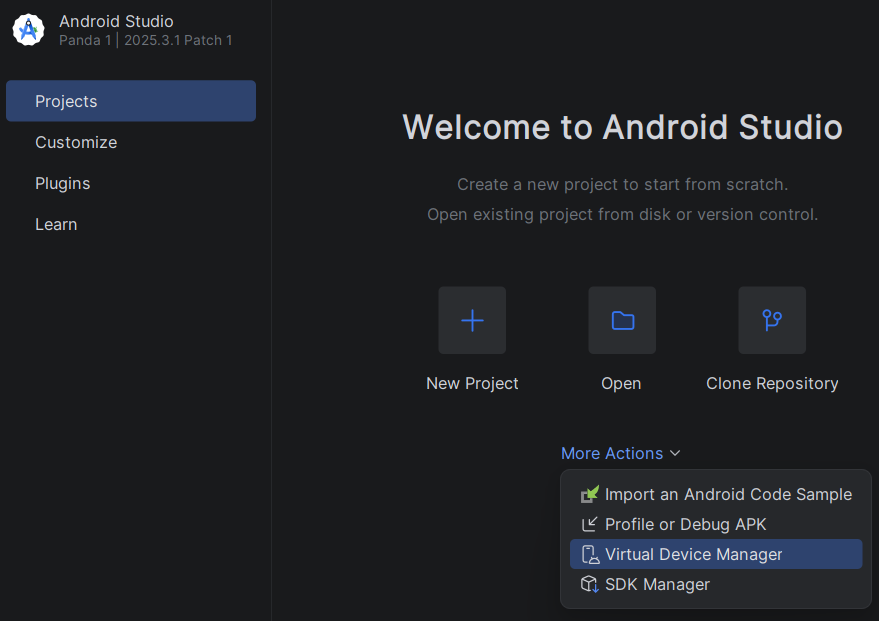

# Ambiente DEV

Acesse seu **e-mail educacional**, baixe e instale o **office**

---
## 2º Ano
- [Google Chrome](https://www.google.com/intl/pt-BR/chrome/)
    - Fazer download do Chrome
        - NNF - Next,  Next, Finish 
- [Node.js](https://nodejs.org/pt-br/download)
    - Instalador Windows(msi)
        - NNF - Next,  Next, Finish
- [XAMPP](https://www.apachefriends.org/pt_br/index.html)
    - Baixar (XAMPP para Windows)
        - NNF - Next,  Next, Finish
- [Git For Windows](https://git-scm.com/install/windows)
    - Windows (Click here to download)
        - NNF - Next,  Next, Finish
    - Clique com o botão direito na Área de trabalho
        - Mostrar mais opções
        - Open Git Bash Here
        ```bash
        git config --global user.email "seu_email_do_git@gmail.com"
        git config --global user.name "seu_login_do_git"
        ```
        - Clone um de seus repositórios, abra a pasta
        - Altere alguma coisa e faça commit (Abra o git bash na pasta do repositório)
            ```bash
            git add .
            git commit -m "teste"
            git push
            ```
            - Clique no botão **Azul**, Autorize o novo commit pelo navegador `colocando sua senha ou outra autenticação`.
- [VsCode](https://code.visualstudio.com/)
    - Download For Windows
        - Marcar Abrir com Code
        - 
- Reinicie o computador
---
## 3º Ano
Todas as do Segundo ano mais as seguintes:
- [Insomnia](https://insomnia.rest/download)
    - Download for Windows
        - NNF - Next,  Next, Finish
- [Flutter](https://docs.flutter.dev/install/manual)
    - Desça a página e clique no botão azul **[flutter_windows_vesao-stable.zip]**
    - Descompacte em **c:\** ficando a pasta desta forma **`c:\flutter`**
    - Edite a `Variável de ambiente path` acrescentando **`c:\flutte\bin`**
        - Reinicie o computador
        - Abra o PowerShell como Administrador e execute:
        ```
        flutter doctor
        ```
        
        - Não esqueça de instalar as **extensões** flutter do **VsCode**
- [Android Studio](https://developer.android.com/studio?hl=pt-br)
    - Fazer o download do Android Studio Quail..
        - NNF - Next,  Next, Finish
        - Ao concluir a instalação nem precisa abri-lo, precisamos apenas do:
            - Virtual Device Manager
            
---