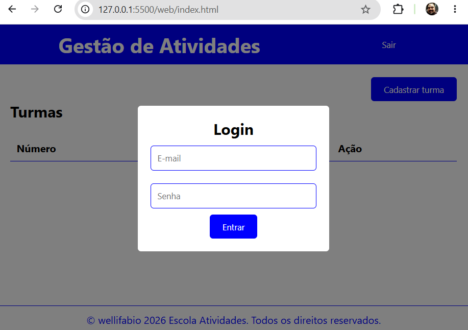
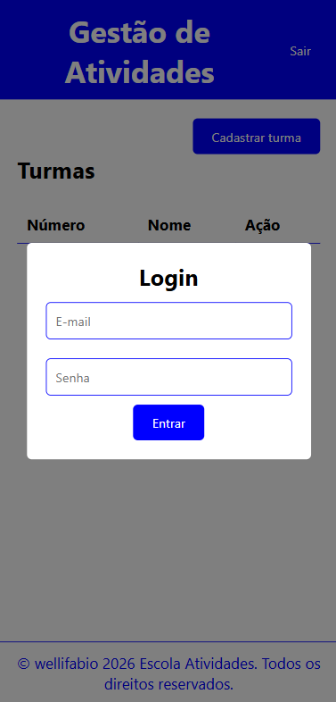
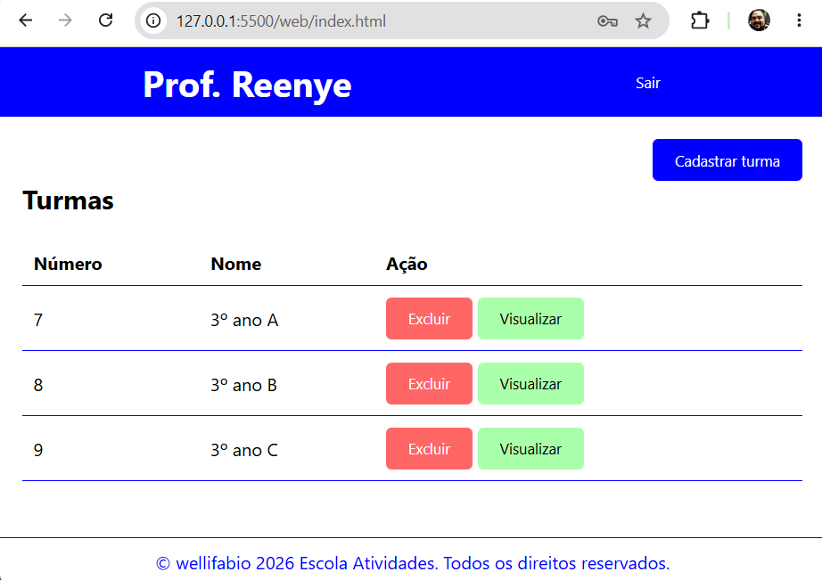
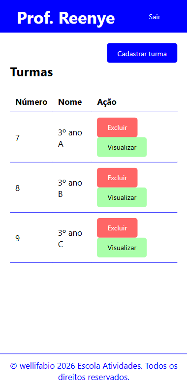
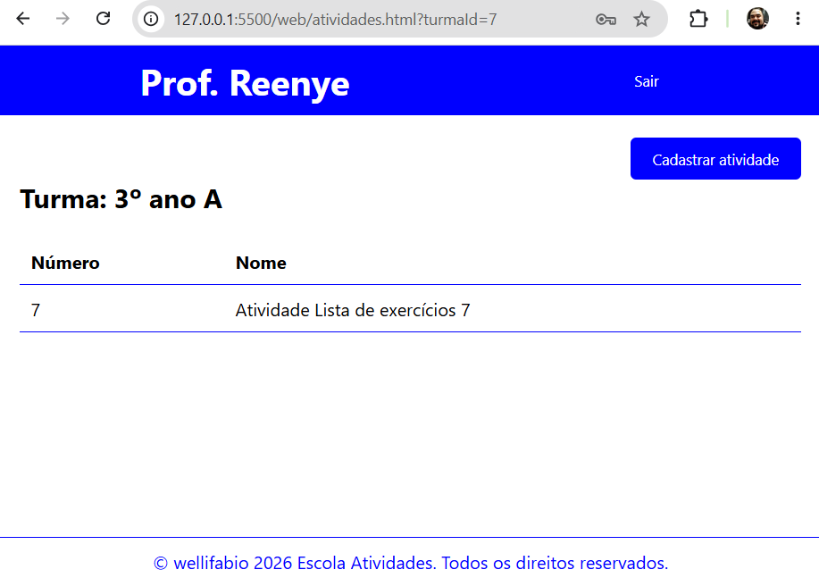
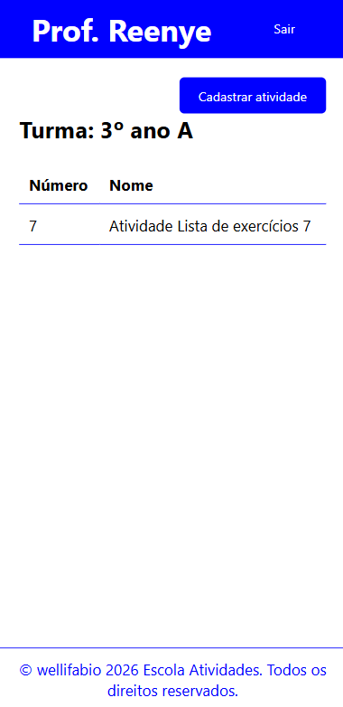
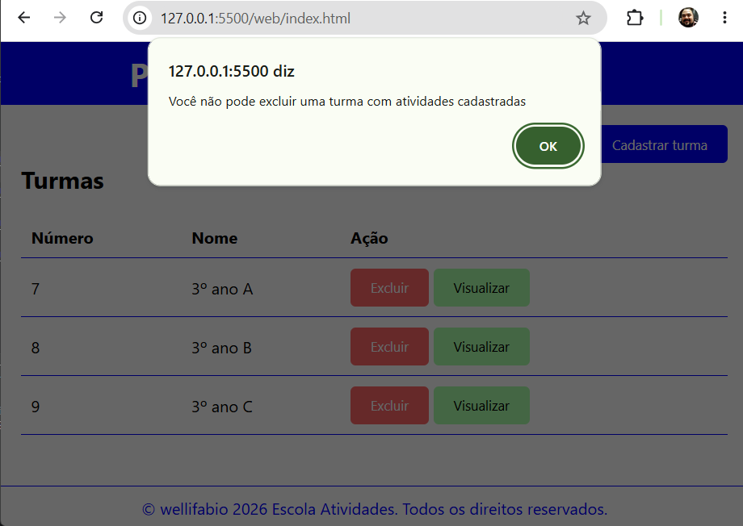
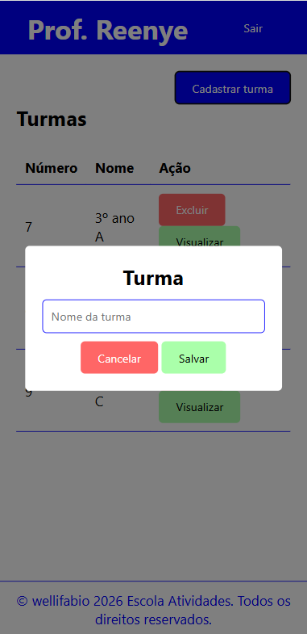

# ESCOLA - ATIVIDADES

## Solução da Situação de Aprendizagem Desafiadora
### Objetivo
O objetivo desta aula é desenvolver um sistema web full-stack para controle de **turmas** e **atividades** de **professores**, baseado no SAEP 2023.1.
### Contextualização
Na educação a falta de organização relacionada às atividades desenvolvidas pelos professores durante as aulas pode ocasionar problemas de gestão dos conhecimentos já trabalhados e avaliados. É fundamental, para que se possa atingir os objetivos educacionais, que os professores tenham controle sobre as atividades que serão aplicadas às turmas.<br>Muitas escolas situadas em áreas remotas do Brasil não possuem um sistema para solucionar essa falta de organização, acarretando prejuízos aos estudantes, professores e ao processo educacional como um todo.

## Desafio
Você foi desafiado a desenvolver um sistema web ou desktop que permitirá ao professor se autenticar em um sistema para visualizar, registrar, excluir suas turmas, assim como registrar atividades para as suas turmas e sair do sistema.

## Resultados e entregas esperadas
|Nº|Requisitos|Tipo de requisito|Tempo<br>estimado<br>(minutos)|
|-|-|:-:|:-:|
|1|Back-end com a criação e conexão com o banco de dados|Funcional - Desenvolvimento do banco de dados e API|10|
|2|Tela de autenticação de usuários (login)|Funcional - Desenvolvimento do sistema|20|
|3|Tela principal do professor|Funcional - Desenvolvimento do sistema|15|
|4|Cadastro de turma|Funcional - Desenvolvimento do sistema|15|
|5|Listar turmas do professor|Desenvolvimento do sistema|20|
|6|Exclusão de turma|Funcional - Desenvolvimento do sistema|20|
|7|Tela de atividades da turma|Funcional - Desenvolvimento do sistema|15|
|8|Listar atividades da turma|Funcional - Desenvolvimento do sistema|15|
|9|Cadastro de atividade para a turma|Funcional - Desenvolvimento do sistema|15|
|10|Sair do sistema (logout)|Funcional - Desenvolvimento do sistema|05|
|11|Lista de requisitos de infraestrutura|Não Funcional - Documentação do sistema, README.md com descrição básica do sistema, lista das tecnologias, prints das telas e passo a passo de como executar o back-end e front-end localmente|05|


## Passo a Passo de como executar e testar
### BackEnd
- 1 Acesse a pasta ./api
- 2 Abra com o **VsCode** e em um terminal (CMD ou bash), navegue até a pasta /api, instale as dependências.
```bash
cd api
npm install
```
- 3 Crie o arquivo .env contendo as variáveis de ambiente
```env
PORT=3000
DATABASE_URL="mysql://root@localhost:3306/escola_atividades"
```
- 4 Abra o XAMPP, de **Start** no MySQL, faça a migração do banco de dados e execute a API
```bash
npx prisma migrate dev --name init
npx prisma generate
npx prisma db seed
npm run dev
```

### FrontEnd
- 1 Acesse a pasta ./web
- 2 Abra com **VsCode** e execute o *index.html* com **Live Server**

## Print das telas
 |Versão WEB|Responsivo|
 |-|-|
 |||
 |||
 |||
 |||