# ESTACIONAMENTO ACME WEB
Situação de Aprendizagem - Full-stack (Node.JS, JavaSript, VsCode, ORM Prisma, Insomnia)
## Contextualização
O ESTACIONAMENTO ACME tem atuado em nossa cidade com ótimo atendimento e segurança, é nosso cliente e necessita de um sistema Web para registro dos estacionamentos diários.<br>O P.O. após uma visita ao cliente, elaborou o DER e UML DC(Diagrama de Classes) a seguir e elencou os requisitos funcionais.<br>

## Desafios
- 1 Faça **fork** deste repositório e clone na sua estação de trabalho.
- 2 Desenvolva um sistema **WEB full-stack** conforme **regras de negócio, requisitos e casos de teste** a seguir.
- 3 Faça commits constantes das suas atualizações, informando o que for feito
- 4 Ao concluir faça um **pull request**

### Regras de negócio
- [RN001] Todos os **veículos** evem ser cadastrados em um banco de dados
- [RN002] Neste momento não é necessário controle de acesso, pois o sistema será utilizado pelo somente **atendente** e instalado somente em seu computador.
- [RN003] As vezes que o veículo estacionar será chamado de **estadia** e será atrelada ao veículo, na entrada a data de saída e o valor ficarão em branco, ao saír os campos saida e valorTotal deve ser gerados e calculados.
- [RN004] O sistema deve possuir uma UI Web para o atendente cadastrar os veículos e as estadias.

### Requisitos funcionais
- [RF001] O sistema deve permitir o CRUD de veículos.
    - [RF001.1] Os campos cor e ano não são obrigatórios, podem ser nulos.
    - [RF001.2] Ao enviar a placa de um veículo deve retornar os dados específicos e seus **estacionamentos**.
- [RF002] O sistema deve permitir o CRUD de estadias (estacionamentos).
    - [RF002.1] O sistema deve associar a estadia a um veículo.
    - [RF002.2] Ao cadastrar uma nova estadia **create** no controller, a data e hora da **entrada** deve ser gerada pelo Banco de Dados @dedault(now()).
    - [RF002.3] Ao cadastrar uma nova estadia **create** no controller, a **saida**, pode ser nula **"?"** pois será preenchida na rota **update** quando o veículo saír do estacionamento.
    - [RF002.4] Ao cadastrar uma nova estadia **create** no controller, o **valorTotal**, deve ser nulo **"?"** pois será calculado na rota **update** quando o veículo saír do estacionamento.
    - [RF002.5] Se ao realizar **update** o campo **saida** for enviado/preenchido o sistema deve calcular a **valorTotal** com a formula **"valorHora * (saida - entrada)"**.

### Requisitos não funcionais
- [NF001] A API deve ser desenvolvida para responder tanto a UI Web como a futuros aplicativos.
- [NF002] A UI pode ser desenvolvida com ou sem frameworks como bootstrap por exemplo.
- [NF003] A documentação deve conter os três diagramas da UML [DC (Diagrama de Classes), DCU (Diagrama de Casos de Uso) e DA (Diagrama de Atividades)]
- [NF004] O README.md principal do projeto deve conter esta documentação acrescida da lista das tecnologias utilizadas e um passo a passo de como executar e testar.

### Casos de teste: Ponto a Ponto
- [CT001] Deve ser cadastrado pelo menos 5 veículos.
    - [CT001.1] Pelo menos dois veículos devem ter ano e cor cadastrados.
- [CT002] Cadastre, altere e exclua um veículo.
- [CT003] Cadastre uma estadia para cada veículo.
    - [CT003.1] Pelo menos dois veículos devem ter duas ou mais Estadias cadastradas.
- [CT004] Cadastre, altere e exclua uma estadia.
- [CT005] Altere pelo menos duas estadias preenchendo a **saida** e verificando se calcula o **valorTotal**.

## Tecnologias
- VsCode
- BackEnd
    - NodeJS
    - MariaDB (XAMPP)
    - Prisma
    - Insomnia
- FrontEnd
    - HTML
    - CSS
    - JavaScript

## Passo a Passo de como executar e testar
### BackEnd
- 1 Acesse a pasta ./api
- 2 Abra com o **VsCode** e em um terminal (CMD ou bash), navegue até a pasta /api, instale as dependências.
```bash
cd api
npm install
```
- 3 Crie o arquivo .env contendo as variáveis de ambiente
```env
PORT=3000
DATABASE_URL="mysql://root@localhost:3306/est_acme"
```
- 4 Abra o XAMPP, de **Start** no MySQL, faça a migração do banco de dados e execute a API
```bash
npx prisma migrate dev --name init
npx prisma generate
npx prisma db seed
npm run dev
```

### BackEnd
- 1 Acesse a pasta ./web
- 2 Abra com VsCode e execute o index.html com Live Server

## Print das telas
 |Versão WEB|Responsivo|
 |-|-|
 |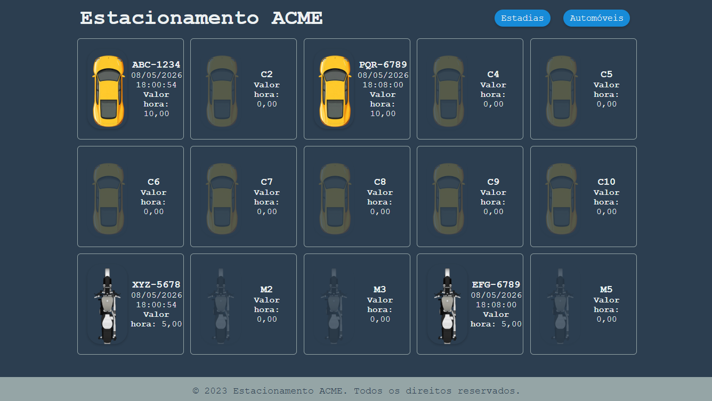|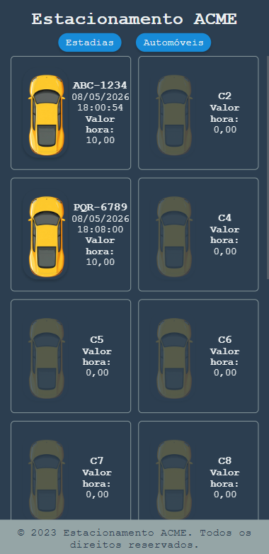|
 |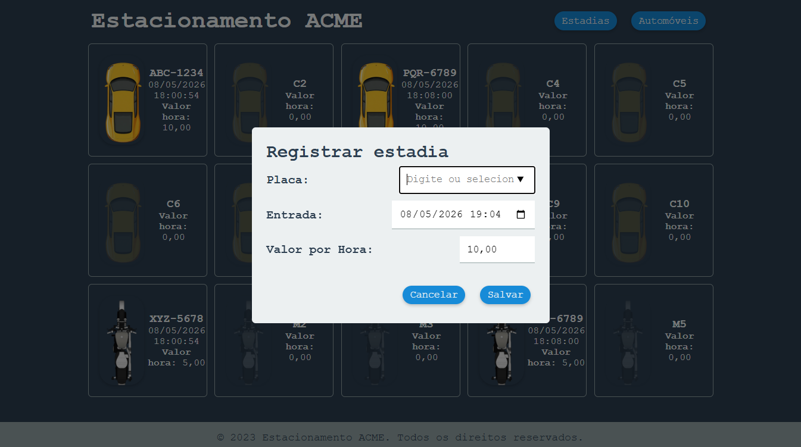|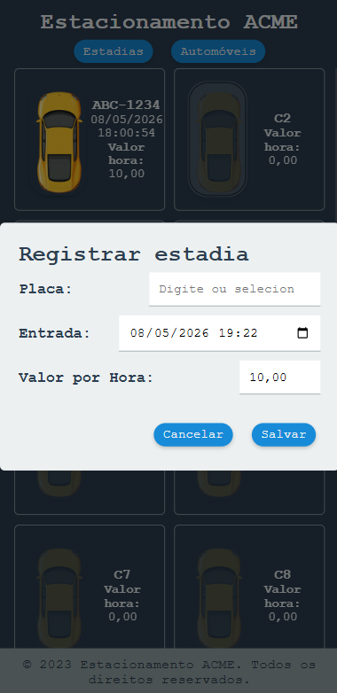|
 |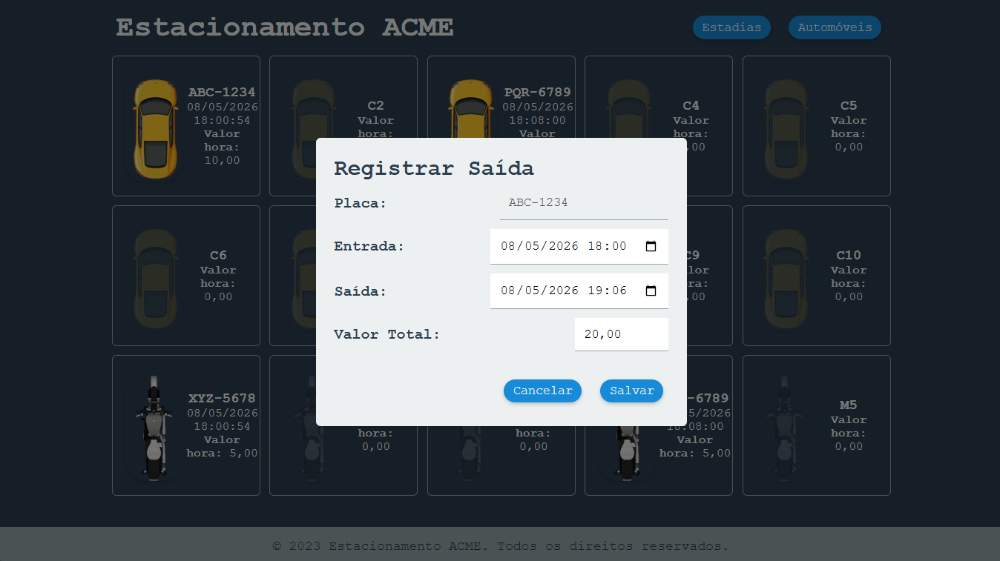|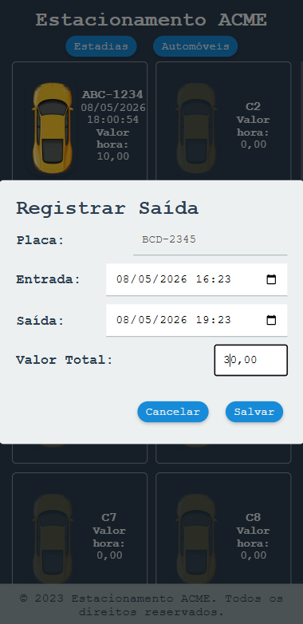|
 |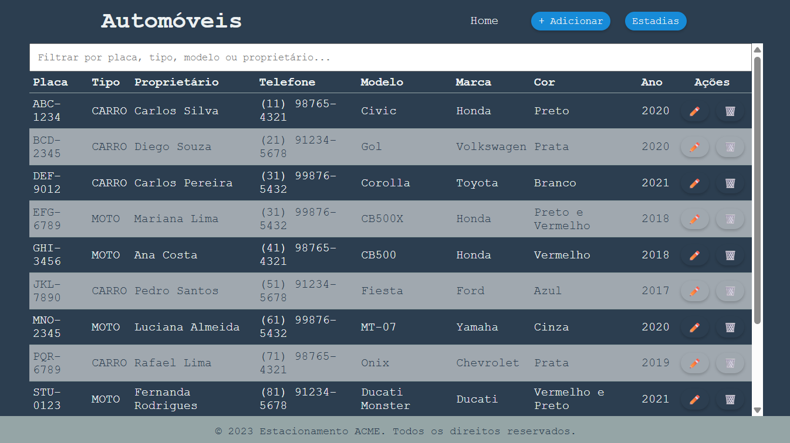|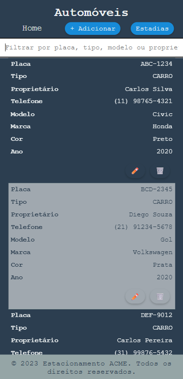|
 |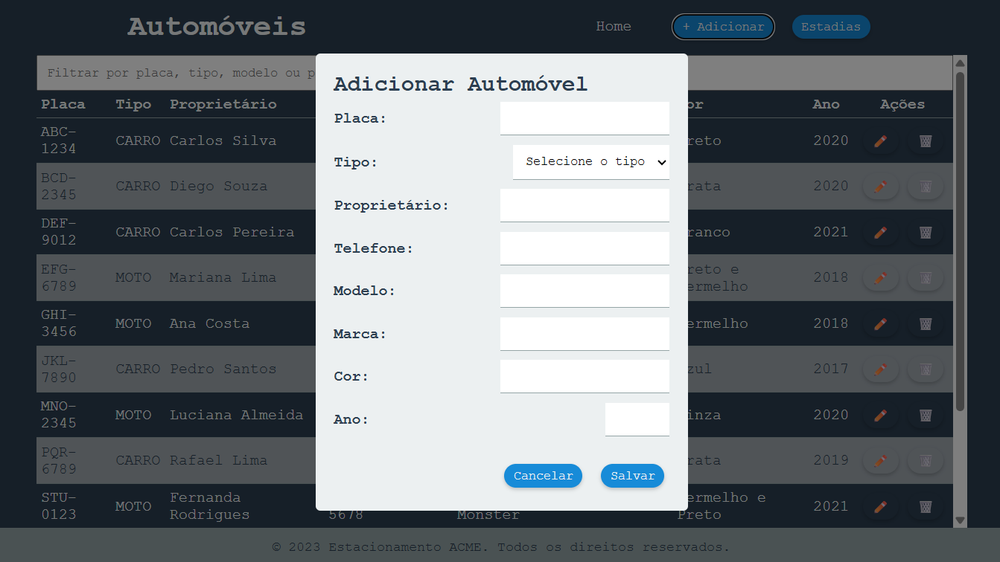|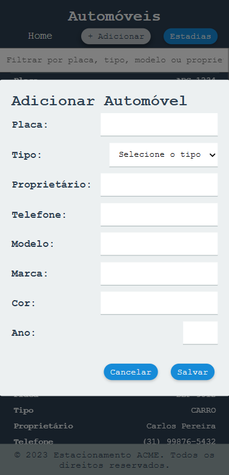|
 |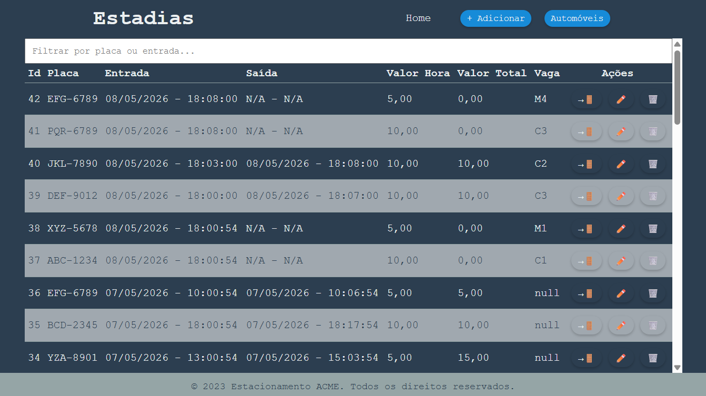|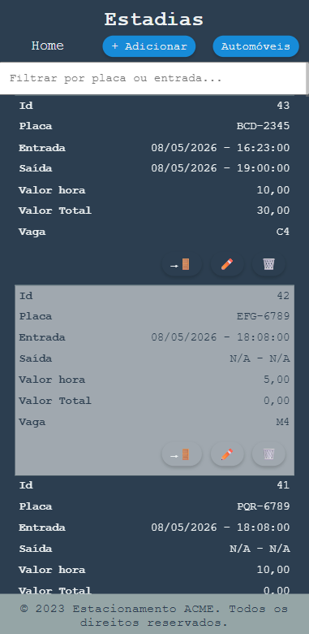|
 |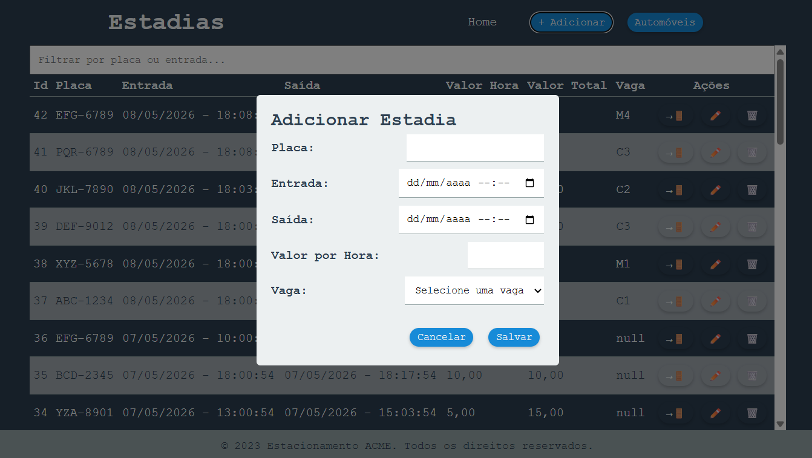|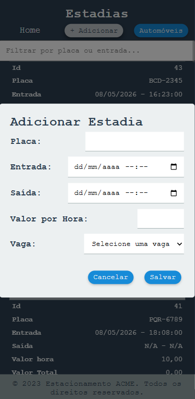|
 |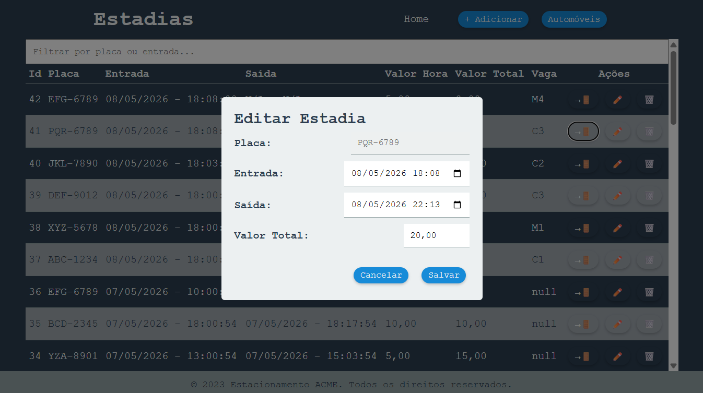|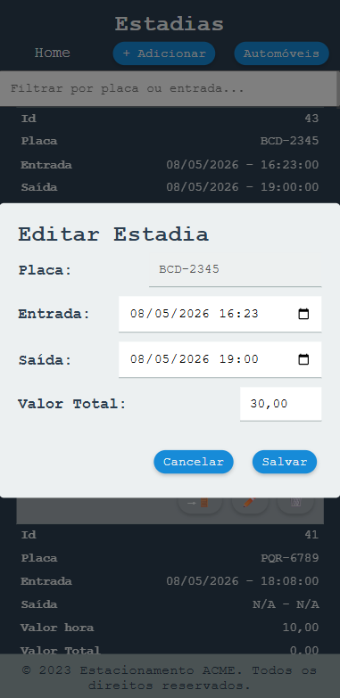|    