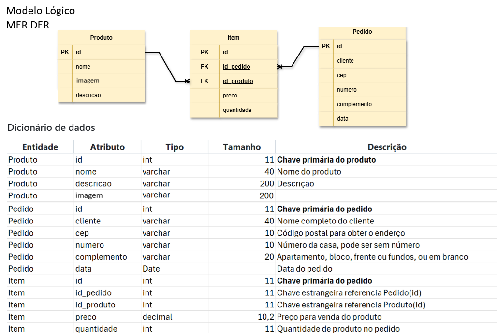
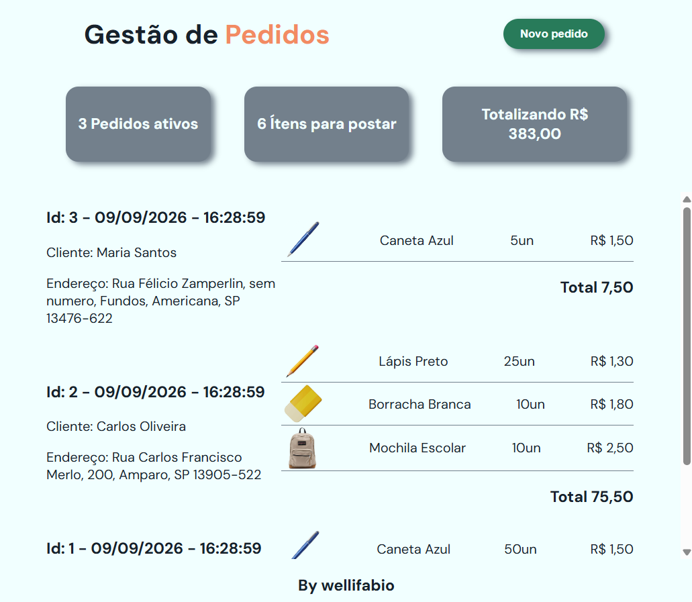
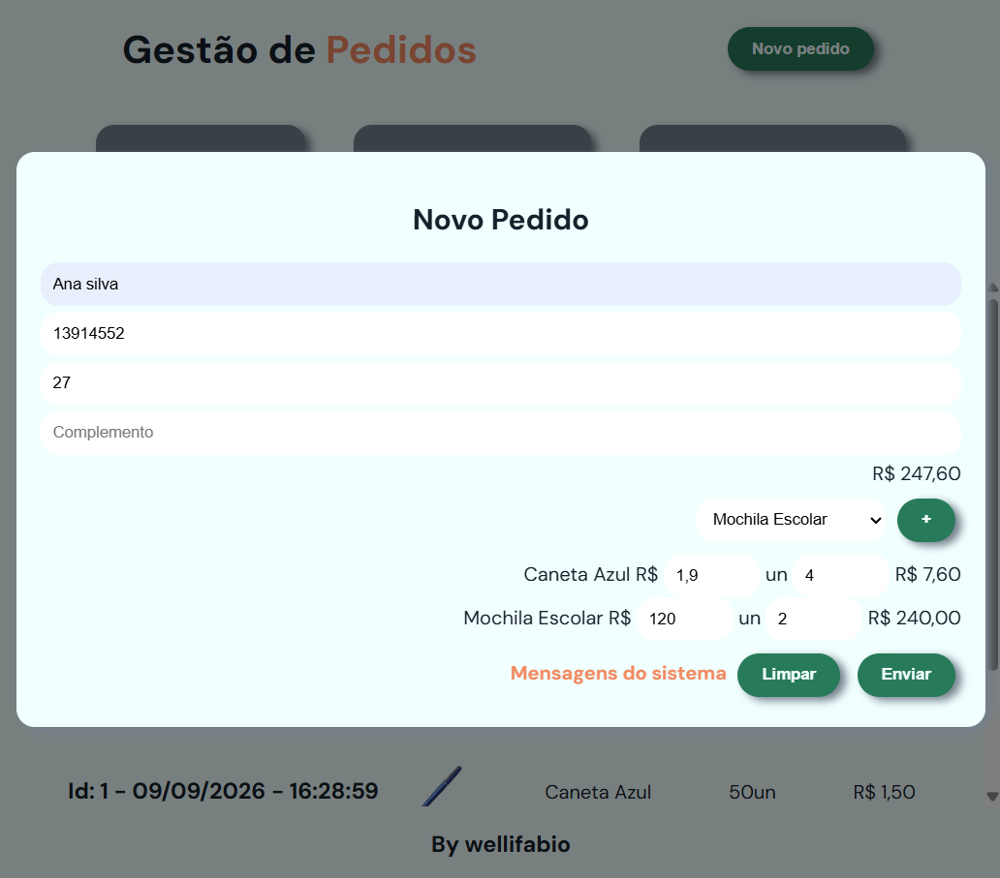

# Gestão de Pedidos
Sistema de gestão de pedidos genérico que utiliza como exemplo produtos de uma papelaria CRUD(Listar e Cadastrar). Exemplo full stack para alunos do curso de desenvolvimento de sistemas do SESI SENAI Amparo, 2026.

## Tecnologias
- VsCode
- Node.js
- Prisma 7
- XAMPP MySQL MariaDB
- HTML, CSS, JS

# Passos para executar o projeto
- 1 Clone este repositório
- 2 Abra com VsCode
- 3 Certifique-se de ter o MySQL MariaDB em execução.
    - Se utiliza XAMPP abra o Control Palnel e de **Start** em MySQL
    - Certifique-se de não ter um banco de dados com o mesmo nome `pedidos_exemplo` se tiver altere o nome em .env
- 4 Instale e execute o Back-end, 
    - Crie o arquivo `backend/.env` contendo
```js
PORT=3000
DATABASE_URL="mysql://root@localhost:3306/pedidos_exemplo"
```
    - Abra terminal do VsCode `CTRL + '`, navegue até a pasta backend e instale as dependências, o banco de dados, os dados e execute o servidor
```bash
cd backend
npm install
npx prisma generate
npx prisma migrate dev --name init
npx prisma db seed
npm run dev
```
- 5 Na pasta frontend execute o index.html com live server do VsCode.

## Documentos


## Resultados

