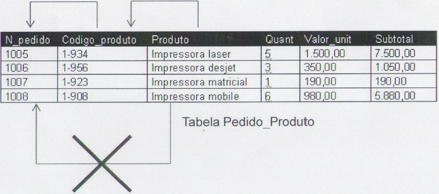
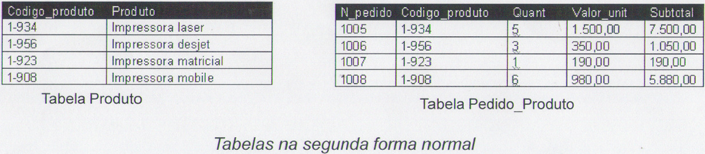
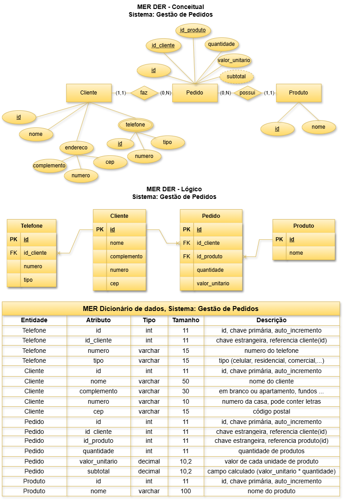

# Aula03 - Normalização de dados
Aplicar normas de criação e gerenciamento de banco de dados

## Capacidades Técnicas
- 3 Utilizar tipos de dados para definição dos atributos do banco de dados
- 4 Elaborar diagramas de modelagem do banco de dados de acordo com a arquitetura definida
- 5 Utilizar relacionamentos entre as tabelas do banco de dados
- 6 Normalizar a estrutura do banco de dados

## Capacidades Socioemocionais
- 1 Demonstrar autogestão
- 2 Demonstrar pensamento analítico

## Conhecimentos
- 2 Modelo relacional
    - 2.1.4 Formas normais

## Formas normais (1ª, 2ª e 3ª)
Normalização é o processo pelo qual se aplicam regras a todas as tabelas do banco de dados com o objetivo de evitar falhas no projeto, como redundância de dados e mistura de diferentes assuntos numa mesma tabela.
- A partir do MER normalmente temos um modelo normalizado
- Serve para validar o MER
### Existem três formas mais conhecidas
- 1ª Forma Normal
- 2ª Forma Normal
- 3ª Forma Normal

## 1ª Forma Normal
Uma relação está na primeira forma normal 1ªFN, se não houver grupos de dados repetidos, isto é, se todos os valores forem únicos (não for multivalorado ou composto)
- A primeira forma normal não admite mais que um valor em um campo
### Sequência para 1ªFN
- Identificar a chave primária da tabela;
- Identificar a(s) coluna(s) que tem(êm) dados repetidos e removê-la(s)
- Criar uma nova tabela com chave primária para armazenar o dado repetido e;
- Criar uma relação entre a tabela principal e a tebela secundária.

### Exemplo **Tabela Cliente**
A tabela a seguir está desnormalizada, não está na 1ª forma normal.
|id|nome|telefone|endereco|
|-|-|-|-|
|1|Ana Maria Silva|19 99987-8789 19 99980-4848|Rua Carlos Frascisco Merlo, 21, 13905-522|
|2|Valentina Oliveira|19 98450-1212|Rua Andorinha, 12, 13903-333|
|3|Enzo Martins|19 99988-2121 19 99777-2222 19 99900-1010|Rua Nelson Henrioque da Silva, 195B, 13903-235|
- *Tabela desnormalizada*
#### Analizando:
Todos os clientes possuem Rua, número e CEP, porém essas informações estão na mesma célula da tabela, logo ela não **está na  1ª forma normal**. Para normalizar devemos colocar cada informação em uma coluna diferente, como no exemplo a seguir:

|id|nome|telefone|rua|numero|cep|
|-|-|-|-|-|-|
|1|Ana Maria Silva|19 99987-8789 19 99980-4848|Rua Carlos Frascisco Merlo|21|13905-522|
|2|Valentina Oliveira|19 98450-1212|Rua Andorinha|12|13903-333|
|3|Enzo Martins|19 99988-2121 19 99777-2222 19 99900-1010|Rua Nelson Henrioque da Silva| 195B|13903-235|
- A tabela *ainda não está na 1ª forma normal*, pois há clientes com mais de um telefone e estão em uma mesma célula.
- Para normalizar será necessário criar uma nova tabela para armazenar os números dos telefones e o campo chave da **Tabela Cliente**. Veja o resultado a seguir:

|id|nome|rua|numero|cep|
|-|-|-|-|-|
|1|Ana Maria Silva|Rua Carlos Frascisco Merlo|21|13905-522|
|2|Valentina Oliveira|Rua Andorinha|12|13903-333|
|3|Enzo Martins|Rua Nelson Henrioque da Silva| 195B|13903-235|
- *Tabela 1ª forma normal*

|id|id_cliente|telefone|
|-|-|-|
|1|1|19 99987-8789|
|2|1|19 99980-4848|
|3|2|19 98450-1212|
|4|3|19 99988-2121|
|5|3|19 99777-2222|
|6|3|19 99900-1010|
- *Tabela 1ª forma normal*

## 2ª Forma Normal
- Para estar na 2FN é preciso estar na 1FN
- Todos os atributos não chaves da tabela devem depender unicamente da chave primária (não podendo depender apenas de parte dela, ou seja não pode conter dependência parciais).
    - **Dependência parcial:** ocorre quando uma coluna depende apenas de uma parte de uma chave primária composta.
- A **segunda forma normal** trata destas anomalias e evita que valores fiquem em redundância no banco de dados.
### Exemplo **Tabela Pedido_Produto**

- A tabela *não está na 2ª forma normal*
### Sequência para a 2FN
- Identificar as colunas que não são funcionalmente dependentes da chave primária da tabela;
- Remover esta coluna da tabela principal; e
- Criar uma nova tabela com esses dados.
#### Analizando:
- O nome do produto depende do código do produto, porém não depende de N_pedido que é a chave primária da tabela, portando não está na 2FN. Isto gera problemas com a manutenção dos dados, pois se houver alteração no nome do produto, teremos que alterar em todos os registros da tabela de venda.
- Para normalizar esta tabela teremos que criar a tebela **Produto** que ficará com os atributos Codigo_produto e produto e na tabela **Pedido_Produto** manteremos somente os atributos N_pedido, codigo_produto, quant, valor_unit e subtotal.:

- O exemplo acima utiliza nomenclatura de campos desatualizada, a **seguir** segue as mesmas tabelas além de normalizadas, com campos atualizados
- Tabela **Produto**:

|id|nome_produto|
|-|-|
|1|Impressora laser|
|2|Impressora deskjet|
|3|Impressora matricial|
|4|Impressora mobile|

- Tabela **Pedido**:

|id|id_produto|quantidade|valor_unitario|subtotal|
|-|:-:|:-:|-:|-:|
|1005|1|5|1500.00|7500.00|
|1006|2|3|350.00|1050.00|
|1007|3|1|190.00|190.00|
|1008|4|6|980.00|5880.00|

## 3ª Forma Normal
- Para estar na 3FN é preciso estar na 2FN
- Coluna não-chave não pode depender de outra não-chave
- É preciso identificar as colunas que são funcionalmente dependentes das outras colunas não chave e extraí-las, (ou seja, eliminar aqueles campos que podem ser obtidos pela equação de outros campos na mesma tabela);
- A finalidade é que nenhuma coluna tenha dependência de qualquer outra que não seja exclusivamente chave.

### Sequência para a 3FN
- Identificar todos os atributos que são funcionalmente dependentes de outros atributos não chave;
- Removê-los

#### Exemplo **Tabela Pedido**:

|id|id_produto|quantidade|valor_unitario|subtotal|
|-|:-:|:-:|-:|-:|
|1005|1|5|1500.00|7500.00|
|1006|2|3|350.00|1050.00|
|1007|3|1|190.00|190.00|
|1008|4|6|980.00|5880.00|

- Esta tabela *não está na 3ª forma normal*

#### Analizando:
Considerando ainda nossa tabela Pedido, vemos que não está na 3FN pois o **subtotal** é o resultado da multiplicação da **quantidade** pelo **valor_unitario**, desta forma a coluna subtotal depende de duas outras colunas não-chave.
- Para normalizar basta **remover** a coluna **subtotal**

|id|id_produto|quantidade|valor_unitario|
|-|:-:|:-:|-:|
|1005|1|5|1500.00|
|1006|2|3|350.00|
|1007|3|1|190.00|
|1008|4|6|980.00|

- *Tabela na 3ª forma normal*

## Conclusão
Quais problemas de tabelas não normalizadas?
- Repetição e a desorganização das informações;
- Problemas na inclusão, alteração e exclusão de informações

## Benefícios
- Evitar anomalias;
- Reduz redundância;
- Reduz inconsistência;
- Melhora o desempenho / performance;
- Facilitar a manipulação;
- Facilitar a manutenção;

# Exemplo: "Sistema de gestão de pedidos normalizado"

- Tabela Telefone

|id|id_cliente|numero|tipo|
|-|-|-|-|
|1|1|19 99987-8789|Celular|
|2|1|19 99980-4848|Celular|
|3|2|19 98450-1212|Residencial|
|4|3|19 99988-2121|Celular|
|5|3|19 99777-2222|Residencial|
|6|3|19 99900-1010|Comercial|

- Tabela Cliente

|id|nome|complemento|numero|cep|
|-|-|-|-|-|
|1|Ana Maria Silva||21|13905-522|
|2|Valentina Oliveira|Ap:19 Bloco:2|12|13903-333|
|3|Enzo Martins|Ap: 19| 195B|13903-235|

- Tabela Produto

|id|nome_produto|
|-|-|
|1|Impressora laser|
|2|Impressora deskjet|
|3|Impressora matricial|
|4|Impressora mobile|

- Tabela Pedido

|id|id_produto|id_cliente|quantidade|valor_unitario|subtotal|
|-|:-:|:-:|:-:|-:|-:|
|1005|1|1|5|1500.00|7500.00|
|1006|2|1|3|350.00|1050.00|
|1007|3|2|1|190.00|190.00|
|1008|4|3|6|980.00|5880.00|

## Atividades
No mesmo tema sorteado na aula anterior, aplique as regras de normalização no seu banco de dados e conclua a entrega através do github.
- Crie um arquivo README.md contendo:
    - Título do projeto
    - Imagem do MER DER Conceitual **.PNG**
    - Imagem do MER DER Lógico **.PNG**
    - Dicionário de dados em formato tabela tipo **MarkDown**
    - Dados de teste em tabelas tipo **.CSV**
## Entrega
Envie o link do seu repositório do github para **[este formulário](https://forms.gle/7GGDZd4S9efA6ode7)**
- [Exemplo de envio](https://github.com/wellifabio/sesi_bcd_aula03_mer_der_dd_dados_2026.git)