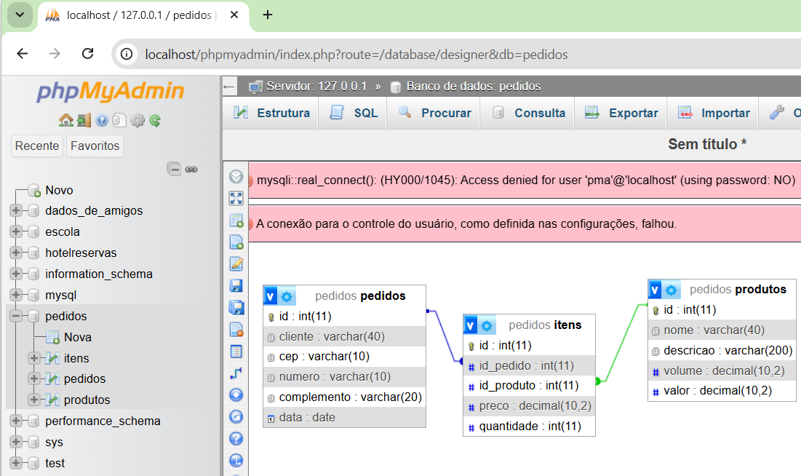

# Aula04 - SQL

### Capacidades Técnicas
- 9 Utilizar linguagem de definição de dados (DDL)
- 10 Utilizar linguagem de manipulação de dados (DML)

## Conhecimentos
  - 2.2 SQL (Structured Query Language)
  - 2.4  DDL (Data Definition Language)
    - 2.4.1 CREATE DATABASE
    - 2.4.2 DROP DATABASE
    - 2.4.3 USE
    - 2.4.4 CREATE TABLE
    - 2.4.5 ALTER TABLE
    - 2.4.6 DROP TABLE
    - 2.4.7 CREATE INDEX
    - 2.4.8 DROP INDEX

## SQL - Structured Query Language (Linguagem de Consulta Estruturada)
é a linguagem padrão usada para criar, consultar, atualizar e gerenciar dados em bancos de dados relacionais
### Divisões da linguagem SQL
- DDL - Data Definition Language (Linguagem de Definição de Dados)
- DML - Data Manipulation Language (Linguagem de Manipulação de Dados)
- DCL - Data Control Language (Linguagem de Controle de Dados)
- DQL - Data Query Language (Linguagem de Consulta de Dados)

## Prática
Vamos criar com SQL o banco de dados do: **Sistema de Vendas/Pedidos** cujo MER foi apresentado na aula anterior.
- O banco de dados será criado no SGBD MySQL **Workbench**.

|Entidade|Atributo|Tipo|Tamanho|Descrição|
|-|-|-|-|-|
|Produto|id|int|11|Chave primária do produto|
|Produto|nome|varchar|40|Nome do produto|
|Produto|descricao|varchar|200|Descrição|
|Produto|volume|decimal|10,2|Em litros, para calcular o frete|
|Produto|valor|decimal|10,2|Valor médio do produto|
|Produto|quantidade|int|11|Atributo derivado obtido através do cálculo |de |produção|
|Pedido|id|int|11|Chave primária do pedido|
|Pedido|cliente|varchar|40|Nome completo do cliente|
|Pedido|cep|varchar|10|Código postal para obter o enderço|
|Pedido|numero|varchar|10|Número da casa, pode ser sem número|
|Pedido|complemento|varchar|20|Apartamento, bloco, frente ou fundos, ou |em |branco|
|Pedido|data|Date||Data do pedido|
|Item|id|int|11|Chave primária do pedido|
|Item|id_pedido|int|11|Chave estrangeira referencia Pedido(id)|
|Item|id_produto|int|11|Chave estrangeira referencia Produto(id)|
|Item|preco|decimal|10,2|Preço para venda do produto|
|Item|quantidade|int|11|Quantidade de produto no pedido|
|Item|total|decimal|10,2|Atributo derivado obtido através do preco vezes |quantidade


## Script de criação do banco de dados DDL
Crie uma pasta chamada **bd_pedidos** e dentro dela crie um arquivo chamado `pedidos_ddl.sql` com o seguinte conteúdo:
```sql
-- CRUD (Criar, Ler, Atualizar e Deletar)
-- DDL (Data Definition Language)
-- CRUD DDL (Create, [Show, Describe], Alter, Drop)

-- Para criar do zero podemos excluir o banco se já existe e criar novamente
DROP DATABASE IF EXISTS pedidos;
-- Criar um banco de dados chamado "pedidos"
CREATE DATABASE pedidos;
-- Selecionar o banco de dados "pedidos" para uso
USE pedidos;
-- Criar a tabela de Produtos
CREATE TABLE produtos (
    id int primary key not null auto_increment,
    nome varchar(40) not null,
    descricao varchar(200) not null,
    volume decimal(10,2) not null,
    valor decimal(10,2) not null
);
-- Criar a tabela de Pedidos
CREATE TABLE pedidos (
    id int primary key not null auto_increment,
    cliente varchar(40) not null,
    cep varchar(10) not null,
    numero varchar(10),
    complemento varchar(20),
    data DATE not null default(CURDATE())
);
-- Criar a tabela de Itens do Pedido
CREATE TABLE itens (
    id int primary key not null auto_increment,
    id_pedido int not null,
    id_produto int not null,
    preco decimal(10,2) not null,
    quantidade int not null
);
-- Criando os relacionamentos, alterando a tabela de itens
alter table itens add constraint eh foreign key (id_produto) references produtos(id);
alter table itens add constraint possui foreign key (id_pedido) references pedidos(id);
-- Exibir os resultados
describe produtos;
describe pedidos;
describe itens;
show tables;
```
- Para executar o script, abra o MySQL Workbench, conecte-se ao servidor, copie e cole o script na janela de consulta (query) e clique no botão de raio para executar o script.

- Ou abra o terminal do MySQL, conecte-se ao servidor e execute o script com o comando `source caminho/para/o/arquivo/caixeiro_ddl.sql`.
- Ou abra o XAMPP e clique em start no MySQL e em terminal, digite `mysql -u root`, copie e cole o script

- Ou abra o Xampp, clique no botão Admin do MySQL, abra o PhpMyAdmin, clique no banco de dados compras_caixeiro, clique na aba SQL, copie e cole o script e clique no botão Executar.
- Clique em Designer para ver o DER Lógico


# Atividades
- Crie o script ddl.sql para criar o banco de dados do **[Projeto: Gestão de Pedidos](https://github.com/wellifabio/sesi_bcd_aula03_mer_der_dd_dados_2026.git)**
- Crie o script ddl.sql para criar o banco de dados do sistema que você desenvolveu na aula03