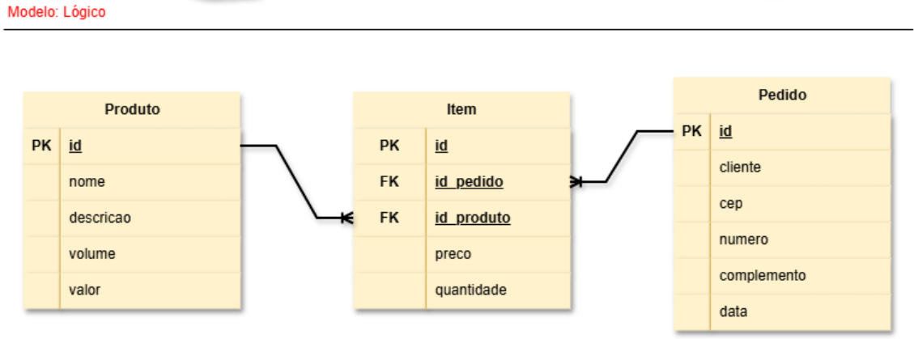

# Aula04 - SQL

### Capacidades Técnicas
- 9 Utilizar linguagem de definição de dados (DDL)
- 10 Utilizar linguagem de manipulação de dados (DML)

## Conhecimentos
  - 2.2 SQL (Structured Query Language)
  - 2.4  DDL (Data Definition Language)
    - 2.4.1 CREATE DATABASE
    - 2.4.2 DROP DATABASE
    - 2.4.3 USE
    - 2.4.4 CREATE TABLE
    - 2.4.5 ALTER TABLE
    - 2.4.6 DROP TABLE
    - 2.4.7 CREATE INDEX
    - 2.4.8 DROP INDEX

## SQL - Structured Query Language (Linguagem de Consulta Estruturada)
é a linguagem padrão usada para criar, consultar, atualizar e gerenciar dados em bancos de dados relacionais
### Divisões da linguagem SQL
- DDL - Data Definition Language (Linguagem de Definição de Dados)
- DML - Data Manipulation Language (Linguagem de Manipulação de Dados)
- DCL - Data Control Language (Linguagem de Controle de Dados)
- DQL - Data Query Language (Linguagem de Consulta de Dados)

## Prática
Vamos criar com SQL o banco de dados do: **Sistema de Compras do Caixeiro Viajante** cujo MER foi apresentado na aula anterior.
- O banco de dados será criado no SGBD MySQL Workbench.

# Atividades
- Crie o banco de dados do **[Projeto: Gestão de Pedidos](https://github.com/wellifabio/sesi_bcd_aula03_mer_der_dd_dados_2026.git)**
- Crie o banco de dados do sistema que você desenvolveu na aula03