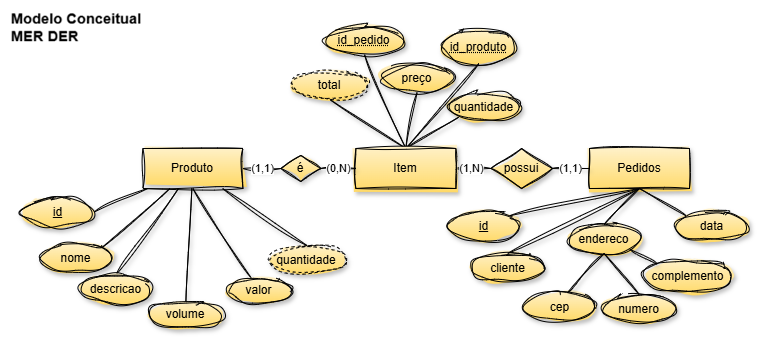

# Aula05 - Manipulação de dados com SQL

## Capacidades técnicas
- 9 Utilizar linguagem de definição de dados (DDL)
- 10 Utilizar linguagem de manipulação de dados (DML)
- 11 Utilizar funções nativas do banco de dados

## Conhecimentos
  - 2.5 Migração de dados
    - 2.5.1 Exportação de dados
    - 2.5.2 Importação de dados
  - 2.6  DML (Data Manipulation Language)
    - 2.6.1 INSERT
    - 2.6.2 UPDATE
    - 2.6.3 DELETE
    - 2.6.4 SELECT

## Capacidades Socioemocionais
- 1 Demonstrar autogestão
- 2 Demonstrar pensamento analítico
- 4 Demonstrar autonomia

## Prática
Vamos executar o script de criação do banco de dados do Caixeiro Viajante, que será utilizado para a prática de manipulação de dados com SQL.

|MER DER Conceitual - BD Caixeiro Viajante|
|-|
||

- Crie uma pasta na área de trabalho com o nome `pedidos`;
- Abra a pasta com VsCode dentro dela crie um arquivo chamado `ddl.sql`.
- Copie e cole o Script abaixo no arquivo `ddl.sql` e salve o arquivo.

```sql
-- CRUD (Criar, Ler, Atualizar e Deletar)
-- DDL (Data Definition Language)
-- CRUD DDL (Create, [Show, Describe], Alter, Drop)

-- Para criar do zero podemos excluir o banco se já existe e criar novamente
DROP DATABASE IF EXISTS pedidos;
-- Criar um banco de dados chamado "pedidos"
CREATE DATABASE pedidos;
-- Selecionar o banco de dados "pedidos" para uso
USE pedidos;
-- Criar a tabela de Produtos
CREATE TABLE produtos (
    id int primary key not null auto_increment,
    nome varchar(40) not null,
    descricao varchar(200) not null,
    volume decimal(10,2) not null,
    valor decimal(10,2) not null
);
-- Criar a tabela de Pedidos
CREATE TABLE pedidos (
    id int primary key not null auto_increment,
    cliente varchar(40) not null,
    cep varchar(10) not null,
    numero varchar(10),
    complemento varchar(20),
    data DATE not null default(CURDATE())
);
-- Criar a tabela de Itens do Pedido
CREATE TABLE itens (
    id int primary key not null auto_increment,
    id_pedido int not null,
    id_produto int not null,
    preco decimal(10,2) not null,
    quantidade int not null
);
-- Criando os relacionamentos, alterando a tabela de itens
alter table itens add constraint eh foreign key (id_produto) references produtos(id);
alter table itens add constraint possui foreign key (id_pedido) references pedidos(id);
-- Exibir os resultados
describe produtos;
describe pedidos;
describe itens;
show tables;
```
- Execute o script no MySQL Workbench ou em outro cliente SQL, para criar o banco de dados e as tabelas.
- Vamos criar outro arquivo chamado `dml.sql` e criar um script de manipulação de dados, para inserir os dados da [planilha](./dados_pedidos.xlsx) que criamos na aula02 que agora está atualizada neste repositório, baixe-a e coloque-a na sua pasta. 
- Iniciaremos pelos dados da tabela `fornecedor`, inserindo um por vez.
```sql
-- DML (Data Manipulation Language)
-- CRUD (Criar, Ler, Atualizar e Deletar)
-- DML CRUD (Insert, Select, Update, Delete)
USE pedidos;
-- Inserir dados na tabela de produtos
INSERT INTO produtos (nome, descricao, volume, valor) VALUE
('Abajur', 'Abajur Grande', 10, 15.00);
-- Ver os dados para conferência
SELECT * FROM produtos;
-- Excluir o produto inserido
DELETE FROM produtos WHERE id = 1;
-- Ver os dados para conferência
SELECT * FROM produtos;
-- Inserindo varios dados na tabela de produtos
INSERT INTO produtos (nome, descricao, volume, valor) VALUES
('Abajur', 'Abajur Grande', 10, 15.00),
('Abajur', 'Abajur Médio', 7, 10.00),
('Abajur', 'Abajur Paqueno', 5, 8.00),
('Porta jóias', 'Porta jóias Grande', 10, 12.00),
('Porta jóias', 'Porta jóias Médio', 7, 7.00),
('Porta jóias', 'Porta jóias Paqueno', 5, 5.00),
('Mini escada', 'Decoração para festas', 2, 17.00),
('Mini carruagem', 'Decoração para festas', 2, 18.00),
('Mini Kombi', 'Decoração para festas', 2, 25.00),
('Mini Fusca', 'Decoração para festas', 2, 25.00),
('Porta livros', 'Utilidade doméstica', 10, 20.00),
('Porta facas', 'Utilidade doméstica', 7, 15.00),
('Mini estante', 'Utilidade doméstica', 15, 15.00);
```
## importação de dados
- Vamos criar um arquivo chamado `produtos.csv` com o conteúdo a seguir, retirado da planilha `dados_caixeiro.xlsx` que você baixou, e vamos importar os dados para a tabela `produto` do banco de dados `compras_caixeiro`.
```csv
```
- Agora vamos importar os dados do arquivo `produtos.csv` para a tabela `produto` do banco de dados `compras_caixeiro`. Para isso, execute o seguinte comando SQL no MySQL Workbench ou em outro cliente SQL:

```sql
-- Importar dados de produtos do aquivo produtos.csv
load data infile 'Caminho do arquivo produtos.csv com as barras trocadas /'
into table produto
fields terminated by ';'
lines terminated by '\n'
ignore 1 rows;

-- Listando os fornecedores
select * from produto;
```
## Atividades
- Crie o script dml.sql para inserir os dados no banco de dados do **[Projeto: Gestão de Pedidos](https://github.com/wellifabio/sesi_bcd_aula03_mer_der_dd_dados_2026.git)**
- Crie o script dml.sql para inserir os dados no banco de dados do sistema que você desenvolveu na aula03