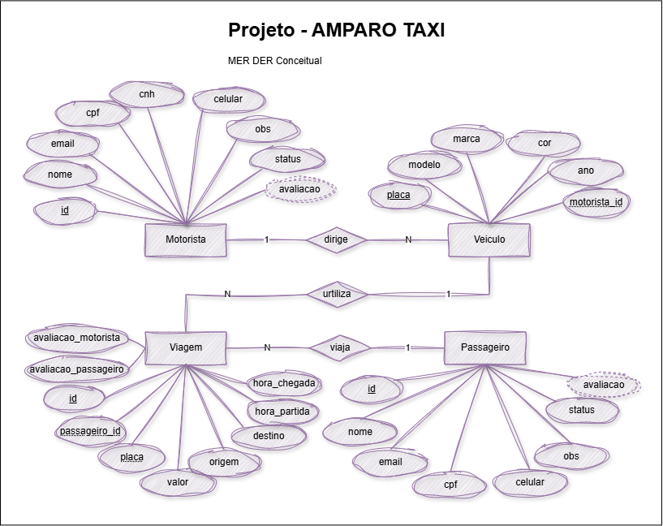
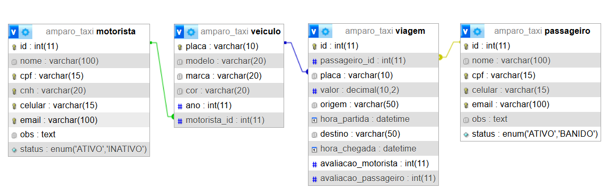

# Aula 06 - Atividades
## Conhecimentos
- Scripts SQL de criação e população
    - DDL
    - DML
- Consultas simples
## Desenvolva os Scripts para criar e popular o BD a Seguir:


|MER DER Lógico|
|-|
||
## Atividade
- 1 Crie uma pasta na área de trabalho chamada `amparo_taxi` e abra com VsCode
- 2 Crie um arquivo chamado `ddl.sql` e crie o script de criação do Banco de dados, tabelas e relacionamentos:
```sql
DROP DATABASE IF EXISTS amparo_taxi;
CREATE DATABASE amparo_taxi;
USE amparo_taxi;
CREATE TABLE ...
```
- 3 Copie o script e cole no Shell do XAMPP ou MySQL WorkBanck
## Atividade 02 - DML
- 1 Crie um arquivo chamado `dml.sql` nesta mesma pasta.
- 2 Crie um script que cadastre pelo menos 3 registros em cada tabela.
```sql
USE amparo_taxi;
INSERT INTO motorista(...) values (),(),();
```
- Preferencialmente três viagens para cada passageiro.
