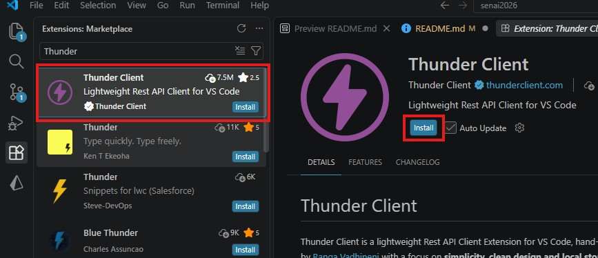
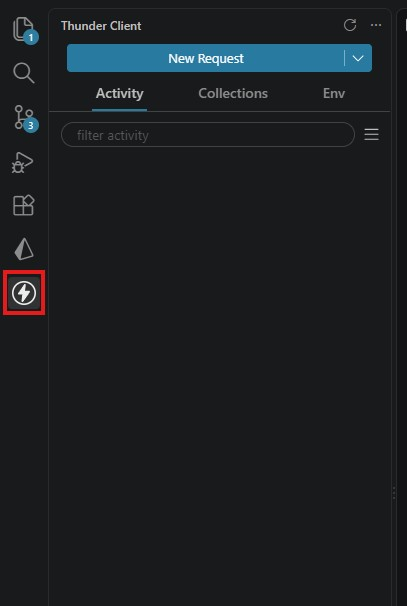
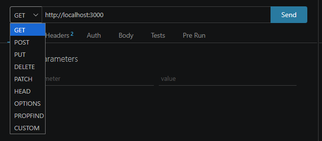
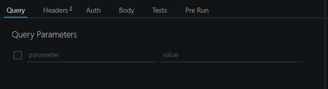
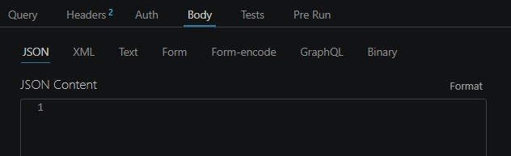

# Aula 04

## Requisições e Dados

### Request

Uma **requisição (Request)** é a comunicação realizada pelo cliente para solicitar ou enviar informações para o servidor.

No desenvolvimento Backend, precisamos saber **como os dados chegam ao servidor** para conseguir utilizá-los no processamento.

Nesta aula, trabalharemos principalmente com três formas de receber dados:

- **BODY**
- **PARAMS**
- **QUERY**

---

### Dados

#### BODY

O **BODY** é utilizado para enviar dados dentro da requisição.

É comum utilizar o BODY quando precisamos enviar informações para o servidor, por exemplo, ao realizar um cadastro ou atualizar um registro.

Alguns formatos que podem ser enviados no BODY:

- JSON
- XML
- FORM
- FORM-ENCODED

No Express, acessamos os dados enviados no BODY através de:

```javascript
req.body
```

Exemplo:

```javascript
const dados = req.body;
```

Se o cliente enviar:

```text
nome = João
quantidade = 2
preco = 50
```

esses dados poderão ser acessados pelo servidor através de `req.body`.

---

#### PARAMS

Os **PARAMS (parâmetros)** são informações que fazem parte da própria URL.

Exemplos:

- [http://seuhost.com.br/produtos/1](http://seuhost.com.br/produtos/1)
- [http://seuhost.com.br/produtos/inverno](http://seuhost.com.br/produtos/inverno)

Nesse caso, `1` ou `inverno` podem ser utilizados como parâmetros para identificar o que o servidor deve buscar ou processar.

No Express, os parâmetros são acessados através de:

```javascript
req.params
```

Por exemplo:

```javascript
const id = req.params.id;
```

Para isso, a rota precisa definir o parâmetro:

```javascript
app.delete("/:id", excluirPedido);
```

Se a requisição for:

```text
DELETE http://localhost:3000/5
```

o valor de:

```javascript
req.params.id
```

será:

```text
5
```

---

#### QUERY

Os **QUERY PARAMETERS** são informações enviadas na URL após o caractere `?`.

Exemplos:

- [http://seuhost.com/produtos?id=1](http://seuhost.com/produtos?id=1)
- [http://seuhost.com/produtos?id=1&categoria=inverno](http://seuhost.com/produtos?id=1&categoria=inverno)

Quando temos:

```text
?id=1
```

temos um parâmetro chamado `id` com o valor `1`.

Quando temos:

```text
?id=1&categoria=inverno
```

temos dois parâmetros:

```text
id = 1
categoria = inverno
```

No Express, acessamos esses valores através de:

```javascript
req.query
```

Exemplo:

```javascript
const id = req.query.id;
```

---

### Diferença entre BODY, PARAMS e QUERY

| Tipo | Express | Exemplo |
|---|---|---|
| BODY | `req.body` | dados enviados na requisição |
| PARAMS | `req.params` | `/produtos/1` |
| QUERY | `req.query` | `/produtos?id=1` |

Uma forma simples de diferenciar:

```text
BODY
└── Dados enviados no corpo da requisição

PARAMS
└── Dados que fazem parte da rota

QUERY
└── Dados enviados na URL após ?
```

---

### Métodos

Os métodos HTTP indicam qual operação o cliente deseja realizar no servidor.

- **GET**: Listar ou buscar dados.
- **POST**: Envio de dados, cadastros ou login.
- **PUT**: Atualização total de um registro.
- **PATCH**: Atualização parcial de um registro.
- **DELETE**: Remover um registro.

---

### Métodos utilizados no código da aula

No código desenvolvido em aula, temos:

```javascript
app.post("/", novoPedido)
app.get("/", listarPedidos)
app.delete("/:id", excluirPedido)
app.patch("/", atualizarPedido)
```

Podemos interpretar as rotas da seguinte maneira:

| Método | Rota | Objetivo |
|---|---|---|
| POST | `/` | Cadastrar um novo pedido |
| GET | `/` | Listar os pedidos |
| DELETE | `/:id` | Excluir um pedido pelo ID |
| PATCH | `/?id=...` | Atualizar um pedido |

Observe que cada rota pode receber os dados de uma maneira diferente.

---

### Recebendo dados no Backend

No código da aula:

#### POST

O POST recebe os dados através do BODY:

```javascript
const novoPedido = (req, res) => {
    if (req.body) {
        pedidos.push(req.body)
        res.send("Pedido recebido, em processamento")
    } else {
        res.send("Erro ao receber pedido")
    }
}
```

Os dados enviados pelo cliente são acessados através de:

```javascript
req.body
```

---

#### DELETE

O DELETE recebe o ID através de um PARAMS:

```javascript
const excluirPedido = (req, res) => {
    const id = req.params.id;
```

A rota possui:

```javascript
app.delete("/:id", excluirPedido);
```

Portanto, em uma requisição:

```text
DELETE http://localhost:3000/3
```

o servidor recebe:

```javascript
req.params.id
```

com o valor:

```text
3
```

---

#### PATCH

O PATCH utilizado na aula recebe informações através de **QUERY e BODY**.

O ID do pedido é enviado pela QUERY:

```javascript
const id = req.query.id;
```

Os novos dados do pedido são enviados pelo BODY:

```javascript
const dados = req.body;
```

Portanto, uma requisição PATCH pode ter:

```text
QUERY
└── id

BODY
├── nome
├── quantidade
├── preco
└── peso
```

---

### Instalação e utilização Thunder Client

O **Thunder Client** será utilizado para realizar testes nas requisições do nosso Backend.

Com ele podemos testar os métodos HTTP e verificar como os dados chegam ao servidor.

### Instalação

- 1º No menu de extensões no VSCode pesquise por "Thunder Client".

- 2º Selecione a extensão correspondente a print, clique em install e aguarde a instalação.



- 3º Ao final da instalação, no menu lateral esquerdo, irá aparecer o atalho para a extensão do "Thunder Client", clique nele para abrir.



---

### Configuração

- 1º Crie uma nova requisição clicando em "New Request".

- 2º Baseado na estrutura do backend e do objetivo da requisição, configure o método e a URL de destino.



- 3º Caso necessário, para enviar dados via QUERY, clique na aba "Query" e defina os campos e valores. Os dados irão aparecer na URL automaticamente.



Por exemplo:

```text
id = 1
```

resultará em uma URL semelhante a:

```text
http://localhost:3000/?id=1
```

No Backend, esse valor será recebido através de:

```javascript
req.query.id
```

- 4º Caso necessário, para enviar os dados via BODY, clique na aba "Body", selecione o formato de envio (JSON, XML, Form, Form-Encoded, ...)



---

## Testando as rotas

Com o servidor iniciado, podemos utilizar o Thunder Client para testar as rotas desenvolvidas.

O servidor da aula utiliza a porta `3000`:

```text
http://localhost:3000
```

### GET — Listar pedidos

Configure:

```text
Método: GET
URL: http://localhost:3000/
```

O servidor deverá retornar os pedidos cadastrados.

---

### POST — Criar pedido

Configure:

```text
Método: POST
URL: http://localhost:3000/
```

No **Body**, envie os dados do pedido.

Exemplo:

```text
nome       = Teclado
quantidade = 2
preco      = 150
peso       = 0.8
```

O Backend receberá essas informações através de:

```javascript
req.body
```

Resposta esperada:

```text
Pedido recebido, em processamento
```

Depois, faça uma nova requisição GET para verificar se o pedido foi adicionado.

---

### DELETE — Excluir pedido

Para excluir um pedido, precisamos informar o ID na URL.

Exemplo:

```text
Método: DELETE
URL: http://localhost:3000/3
```

O número `3` será recebido através de:

```javascript
req.params.id
```

Se o pedido existir:

```text
pedido excluido com sucesso
```

Caso o pedido não seja encontrado:

```text
Pedido não encontrado
```

---

### PATCH — Atualizar pedido

Para atualizar um pedido, o ID será enviado através da QUERY e os novos dados através do BODY.

Configure:

```text
Método: PATCH
URL: http://localhost:3000/?id=3
```

Na aba **Query**:

```text
id = 3
```

Na aba **Body**, envie os novos dados:

```text
nome       = Teclado Gamer
quantidade = 4
preco      = 200
peso       = 1
```

O Backend utilizará:

```javascript
req.query.id
```

para identificar o pedido e:

```javascript
req.body
```

para receber os novos dados.

---

## Resumo

Nesta aula aprendemos que os dados de uma requisição podem ser enviados de diferentes maneiras.

### BODY

```javascript
req.body
```

Utilizado para receber dados enviados no corpo da requisição.

### PARAMS

```javascript
req.params
```

Utilizado para receber parâmetros definidos na rota.

### QUERY

```javascript
req.query
```

Utilizado para receber parâmetros enviados na URL após `?`.

Também trabalhamos com os principais métodos HTTP:

```text
GET     → Listar ou buscar
POST    → Enviar ou cadastrar
PUT     → Atualizar completamente
PATCH   → Atualizar parcialmente
DELETE  → Remover
```

---

