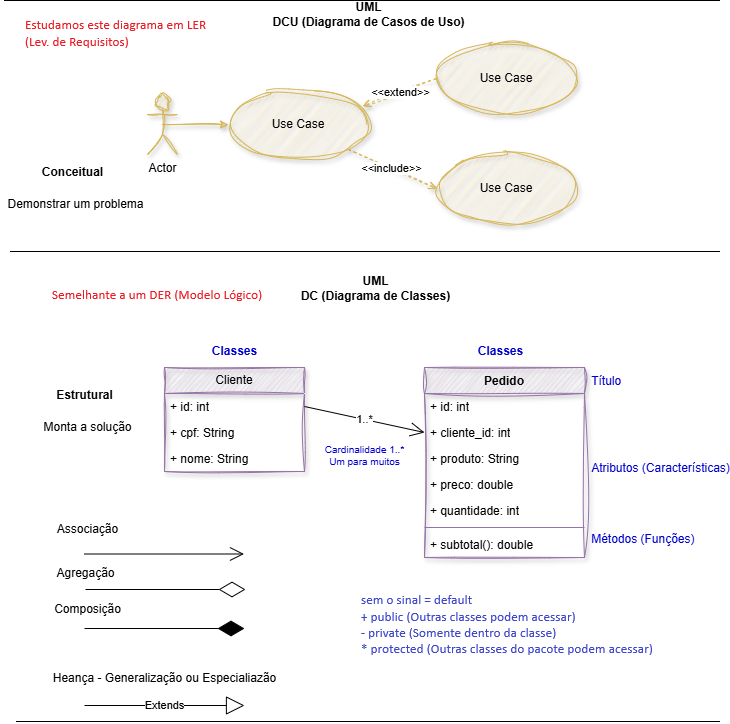
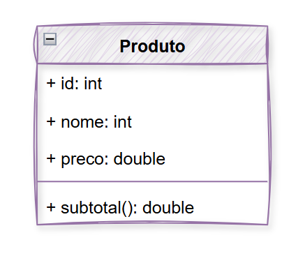
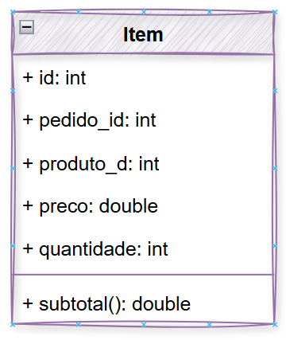
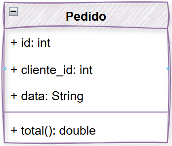
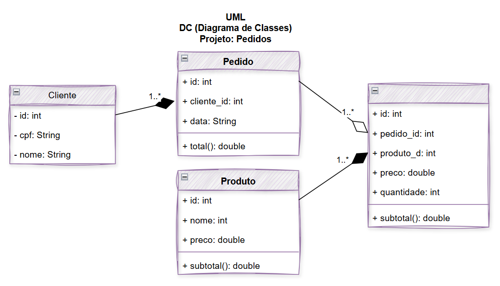

# Aula08 - UML DC (Diagrama de Classes)

### [Tutorial Novo backEnd MVC](https://github.com/wellifabio/sesi_pbe1_aula08_pedidos_mvc_uml_dc_2026/blob/main/docs/tutorial_mvc.md)

### Capacidades Técnicas
- 1 Utilizar o paradigma da programação orientada a objetos
- 2 Elaborar diagramas de classe
- 3 Aplicar técnicas de código limpo (clean code)
- 4 Identificar as características de programação back-end em ambiente web
- 5 Preparar o ambiente necessário ao desenvolvimento back-end para a plataforma web
- 6 Definir os elementos de entrada, processamento e saída para a programação da aplicação web

### Conhecimentos
- 4 Programação orientada a objetos
  - 4.1. Definição
  - 4.2. Pacotes
  - 4.3. Classes
    - 4.3.1. Abstrata
    - 4.3.2. Interna
    - 4.3.3. Anônima
    - 4.3.4. Atributos
    - 4.3.5. Métodos
    - 4.3.6. Modificadores de acesso (encapsulamento)

## UML DC (Diagrama de Classes)
- UML (Unified Modeling Language)
- DC (Diagrama de Classes)

## Relacionamento entre classes
- Associação simples
- Associação de Agregação
- Associação de Composição

### Tipos Principais de Relacionamentos
Os relacionamentos em diagramas de classe UML mostram como o código se organiza e compartilha dados:
• **Associação**: Uma conexão geral onde objetos de uma classe conhecem e usam objetos de outra classe (ex.: uma Pessoa que usa um Carro).
• **Agregação**: Um tipo de associação em que uma classe contém outra, mas elas podem existir de forma independente (ex.: um Time tem Jogadores).
• **Composição**: Uma relação de "parte-todo" mais forte, onde a parte não existe sem o todo (ex.: uma Casa tem Cômodos; se a casa acaba, os cômodos deixam de existir no contexto).

### [Exemplo: Pedidos MVC - Composição](https://github.com/wellifabio/sesi_pbe1_aula08_pedidos_mvc_uml_dc_2026.git)

## Atividades
- 1 Conclua os CRUDs de clientes e pedidos desenvolvendo os controllers e rotas **alterar** e **excluir** no exemplo visto em aula.
    - Anexe print dos testes com o Tunder no README.md do seu repositório no Github.
- 2 Acrescente uma nova coleção mockup JSON chamada `produtos.json` dentro da pasta `dados/`, desenvolva as rotas e controlers CRUD para esta coleçao ex:

<table><tr><td>

```json
[
    {
        "id":1,
        "nome":"Chia",
        "preco":30
    },
    {
        "id":1,
        "nome":"Chia",
        "preco":30
    }
]
```
</td><td>



</td></tr></table>


- 3 Acrescente uma nova coleção mockup JSON chamada `itens.json` dentro da pasta `dados/`, desenvolva as rotas e controlers CRUD para esta coleçao ex:

<table><tr><td>

```json
[
    {
        "id": 1,
        "pedido_id": 1,
        "produto_id": 1,
        "preco": 30,
        "quantidade": 2
    },
    {
        "id": 2,
        "pedido_id": 1,
        "produto_id": 2,
        "preco": 45,
        "quantidade": 2
    },
    {
        "id": 3,
        "pedido_id": 2,
        "produto_id": 1,
        "preco": 30,
        "quantidade": 1
    },
    {
        "id": 4,
        "pedido_id": 3,
        "produto_id": 2,
        "preco": 45,
        "quantidade": 3
    }
]
```

</td><td>



</td></tr></table>

- Calcule o subtotal neste controller
- 4 Altere os dados em `dados/pedidos.json` conforme o diagrama de classe a seguir:

<table><tr><td>



</td><td>

```json
[
    {
        "id": 1,
        "cliente_id": 1,
        "data":"2026-09-29"
    },
    {
        "id": 2,
        "cliente_id": 2,
        "data":"2026-09-29"
    },
    {
        "id": 3,
        "cliente_id": 3,
        "data":"2026-09-29"
    }
]
```
</td></tr></table>

- 5 Remova a função subtotais do controller `pedidos.js` e suas chamadas.
- Diagrama de Classes Completo
    - 
<br>
- O diagrama apresenta dois relacionamentos de **composição**:
    - O pedido é composto pelo cliente
    - O Ítem é composto pelo Produto
- E um relacionamento de **agregação**:
    - O pedido possui no mínimo 1 e máximo N* ítens agregados

## Programando os relacionamentos com JavaScript
- Com listas podemos utilizar o método **find** para composição e **filter** para agregação, conforme os exemplos a seguir:
- Arquivo: `src/controlles/pedido.js`
```js
const pedidos = require("../../dados/pedidos.json")
const clientes = require("../../dados/clientes.json")
const itens = require("../../dados/itens.json")

//Composição
function comporCliente() {
    pedidos.forEach(p => {
        p.cliente = clientes.find(c => c.id == p.id)
    })
}

//Agregação
function agregarItens() {
    pedidos.forEach(p => {
        p.itens = itens.filter(item => item.pedido_id == p.id)
    })
}
```
- Arquivo: `src/controlles/pedido.js`
```js
const itens = require("../../dados/itens.json")
const produtos = require("../../dados/produtos.json")

//Composição
function comporProduto() {
    itens.forEach(item => {
        item.produto = produtos.find(p => p.id == item.produto_id)
    })
}
```
### Outros exemplos de buscas e filtros
Podemos usar os métodos **find** e **filter** para buscas conforme exemplos a seguir:
```js
const clientes = require("../../dados/clientes.json")

const listar = (req, res) => {
    res.json(clientes)
}

const buscarPorId = (req, res) => {
    const filtrado = clientes.find(c => c.id == req.params.id)
    if (filtrado) res.json(filtrado)
    else res.status(404).json("Id não encontrado")
}

const buscarPorNome = (req, res) => {
    const filtrados = clientes.filter(c => c.nome.toUpperCase().includes(req.params.nome.toUpperCase()))
    if (filtrados.length > 0) res.json(filtrados)
    else res.status(404).json("Nome não encontrado")
}
```

## Desafio
Crie uma função chamada `calcTotais` que calcule o total de cada pedido e faça a chamada no CRUD listar.
    - Teste com Thunder e anexe o print no README.md
    - Faça commit com as alterações