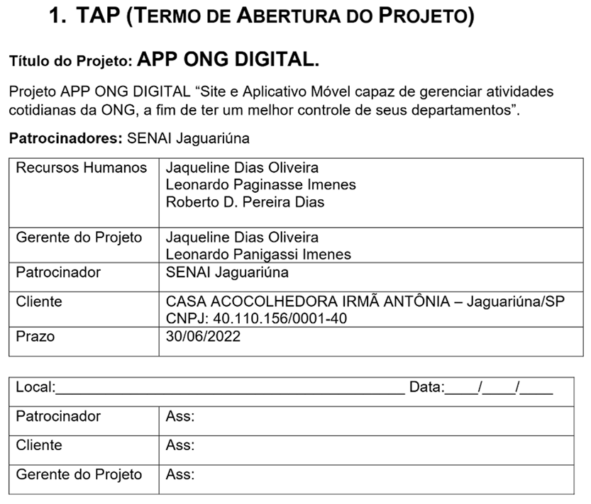

# Aula02

## Conhecimentos
- 1 Qualidade de software
  - 1.1. Definição
  - 1.2. Ferramentas
  - 1.3. Processos de trabalho
- 2 Metodologias de desenvolvimento
  - 2.1. Clássicas
    - 2.1.1. Definição
    - 2.1.2. Características
    - 2.1.3. Aplicabilidade
    - 2.1.4. Fases de desenvolvimento

## Projeto (Definição)
Um projeto é um esforço temporário, único e planejado, com começo, meio e fim definidos, criado para entregar um produto, serviço ou resultado exclusivo.

- Temporário: Tem uma data de início e de término conhecidas (Prazo).
- Exclusivo: Cria algo que ainda não existia ou traz uma solução inédita.
- Objetivo claro: Possui metas específicas a serem alcançadas com recursos limitados de tempo e orçamento.
    - Objetivo Geral
    - Objetivos específicos
    - Cronograma
    - Orçamento (Recursos)

## Qualidade (Definição)
É o grau em que um produto, serviço ou processo atende a **requisitos**, expectativas e necessidades.

### Qualidade de Software
Link da NBR (https://github.com/wellifabio/senai2022/blob/master/3des/projetos/aula02/nbr_iso_9126.pdf)

## Leis Locais (Recursos Humanos)
- CLT (Consolidação das Leis Trabalhistas)
    - CE - Experiência (90 dias)
    - PD - Prazo determinado (Máximo 2 anos)
    - PI - Prazo indeterminado
    - Encargos: (INSS, FGTS)
- PJ (Pessoa Jurídica)
    - MEI - Micro Empreendedor individual
    - ME - Micro Empresa
    - LTDA, SA

## TAP (Termo de Abertura do Projeto):
Para se criar um termo de abertura, que é uma premissa para o inicio do projeto, teremos os seguintes tópicos a serem abordados:
- Justificativa do projeto
Porque o projeto deve ser criado. Quais os problemas e situações existentes que justificam a existência do projeto.
- Objetivos
O que a se espera obter com o projeto. De prefencia usando a metodologia SMART (Específico, Mensurável, Atingível, Realista em um Tempo). Exemplo: “Se tornar a empresa número 1 do mercado, no prazo de 1 ano após a implantação.”
- Produtos e principais requisitos (Escopo)
O produto é o que vai ser entregue quando o projeto for concluído até o fim. São as saidas (outputs). E os requisitos são os detalhes que o produto deve atender no projeto.
- Marcos
São os momentos importantes no projeto (milestones) ou marcos de etapa, que são as entregas (outputs) mais importantes.
- Premissas
São os pontos nos quais acreditamos ser verdade no projeto. Exemplo: “Estamos planejando a construção de uma casa, supondo que será alugada após 1 mês da construção”
- Equipe (Stakeholders)
Profissionais envolvidos no projeto na etapa de planejamento.
- Restrições
Limites que já são conhecidos e impactarão no projeto em termos de prazo e orçamento (Budget).
- Riscos
O mapeamento de riscos é muito importante, principalmente sob o ponto de vista de negócio, no termo de abertura de projeto, exemplo: “Caso a loja virtual retire clientes da loja física, poderá não compensar financeiramente”.
- Orçamento
Ideia do custos envolvidos no projeto, desde o seu inicio, até a finalização.

## Cronograma
Um cronograma é uma ferramenta visual em forma de tabela, lista ou gráfico que organiza atividades e prazos em ordem de tempo.
- Organização temporal: Mostra a data de início e de término de cada tarefa.
- Sequência lógica: Define a ordem em que as coisas devem acontecer (o que vem antes e o que vem depois).
- Gestão de prazos: Ajuda a cumprir o prazo final de um projeto ou rotina

### [Gráfico de Gantt](https://wellifabio.github.io/gantt/)
O gráfico de Gantt é uma ferramenta visual de gerenciamento de projetos que mostra o cronograma, as tarefas e os prazos de um projeto em formato de barras horizontais ao longo de uma linha do tempo.

## Orçamento
Um orçamento é um plano financeiro que calcula os ganhos e os gastos em um período determinado.
### inicadores
- Hora x Recurso (Programador)

## Atividade
- Em grupos de até três pessoas
- Defina um tema criativo para um projeto fictício
- Crie um TAP, um CRonograma e um Orçamento

## Entregas
- Um elemento do grupo crie um repositório no gitub chamado `projetos_aula02_2026`
- Coloque os documentos criados e crie um README.md com o título e o resumo do projeto