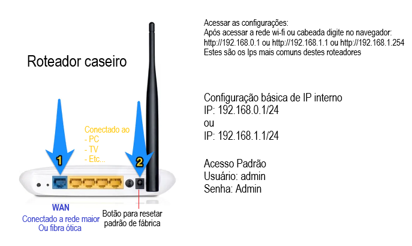

# Aula04 - Subredes de Computadores

## Exemplo:
- Comando ipconfig no meu computador retornou:
```
Endereço IPv4. . . . . . . .  . . . . . . . : 10.0.0.118/24
Máscara de Sub-rede . . . . . . . . . . . . : 255.255.255.0
```
- Compreendendo o retorno
```
Gateway . . . . . . . . . . . . . . . . . . : 10.0.0.1 - Primeiro host válido (Roteador)
Broadcast . . . . . . . . . . . . . . . . . : 10.0.0.255 - Ultimo host válido (Todos)
Escopo  . . . . . . . . . . . . . . . . . . : 10.0.0.0 até 10.0.0.255 total 256 hosts
```
- Máscara IPv4: Binário:11111111.11111111.11111111.00000000

## Máscaras de subrede
```
Máscara IPv4: Binária:11111111.11111111.11111111.00000000 /24
Máscara IPv4: Decimal:255.255.255.0 /24 -> 256 hosts

Máscara IPv4: Binária:11111111.11111111.11111111.10000000 /25
Máscara IPv4: Decimal:255.255.255.128 /25 -> 128 hosts

Máscara IPv4: Binária:11111111.11111111.11111111.11000000 /26
Máscara IPv4: Decimal:255.255.255.192 /26 -> 64 hosts

Máscara IPv4: Binária:11111111.11111111.11111111.11100000 /27
Máscara IPv4: Decimal:255.255.255.224 /27 -> 32 hosts

Máscara IPv4: Binária:11111111.11111111.11111111.11110000 /28
Máscara IPv4: Decimal:255.255.255.240 /28 -> 16 hosts

Máscara IPv4: Binária:11111111.11111111.11111111.11111000 /29
Máscara IPv4: Decimal:255.255.255.248 /29 -> 8 hosts
```

## Subredes
- Uma subrede é uma divisão lógica de uma rede IP maior em partes menores e mais gerenciáveis.
- Permite organizar e segmentar a rede para melhorar a eficiência, segurança e gerenciamento.


## Exercícios com máscadas de subredes - Lista02
A partir dos endereços IP a seguir informe: Gateway, Broadcast e Escopo/Range (Total de hosts)

-1 192.168.0.0/24
```
Máscara:
Gateway:
Broadcast:
Escopo:
```
- 2 192.168.3.0/25
```
Máscara:
Gateway:
Broadcast:
Escopo:
```

- 3 10.0.0.128/25
```
Máscara:
Gateway:
Broadcast:
Escopo:
```

- 4 172.16.0.192/26
```
Máscara:
Gateway:
Broadcast:
Escopo:
```

- 5 172.10.0.0/16
```
Máscara:
Gateway:
Broadcast:
Escopo:
```

- 6 172.16.0.0/17
```
Máscara:
Gateway:
Broadcast:
Escopo:
```
- 7 10.0.0.0/8
```
Máscara:
Gateway:
Broadcast:
Escopo:
```

- 8 10.0.128.0/17
```
Máscara:
Gateway:
Broadcast:
Escopo:
```

- 9 10.128.0.0/9
```
Máscara:
Gateway:
Broadcast:
Escopo:
```

- 10 10.0.0.0/10
```
Máscara:
Gateway:
Broadcast:
Escopo:
```

