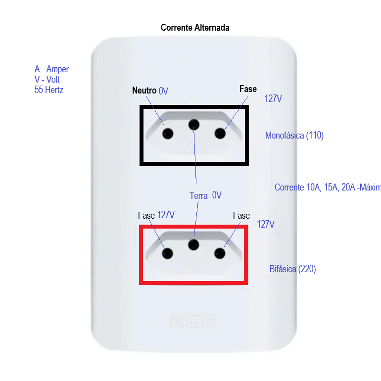
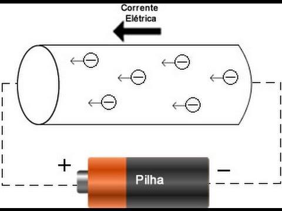
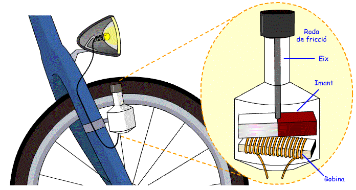
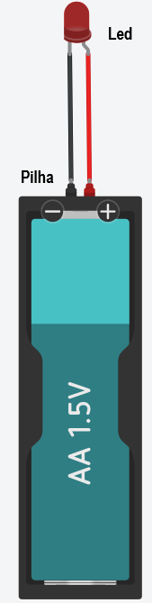
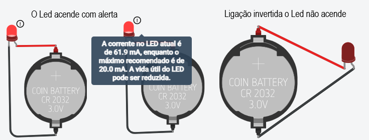
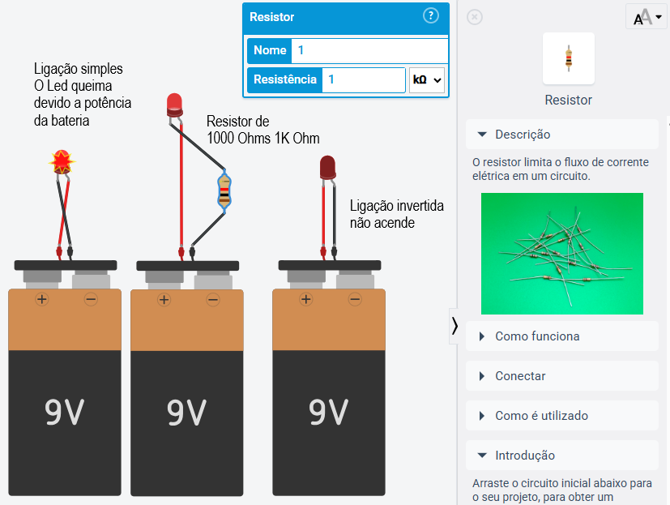
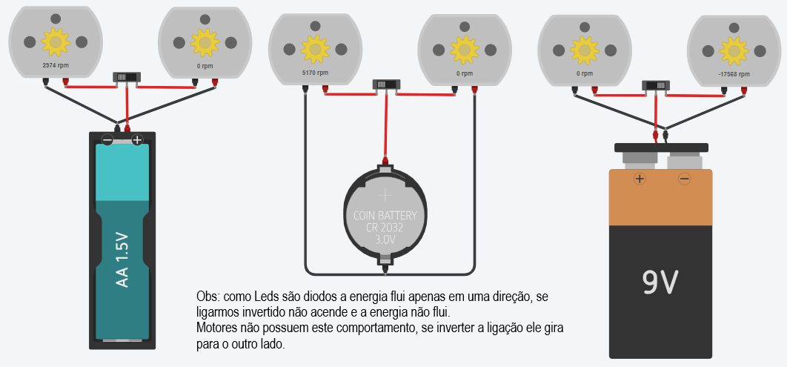
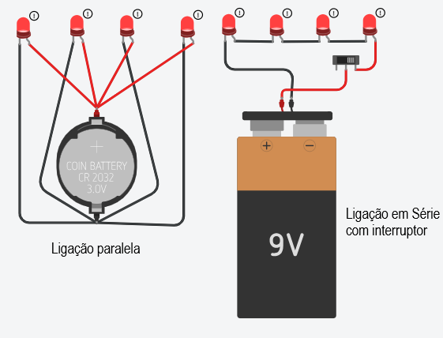

# Aula05 - Iot (internet of things - internet das coisas)
## [ThinkerCad](https://www.tinkercad.com/)
- Eletricidade
- Microcontroladores
- Sensores
- Atuadores

## Eletricidade
- Corrente elétrica: fluxo de elétrons em um circuito.
- Tensão elétrica: diferença de potencial elétrico entre dois pontos.
- Resistência elétrica: oposição ao fluxo de corrente em um circuito.

### Lei de Ohm
- V = I * R
- V: tensão (Volts)
- I: corrente (Amperes)
- R: resistência (Ohms)

#### Eletromagnetismo
- Campo elétrico: região ao redor de uma carga elétrica onde outra carga elétrica experimenta uma força.
- Campo magnético: região ao redor de um ímã ou de um condutor elétrico onde outra carga elétrica em movimento experimenta uma força.
- Força eletromagnética: força que atua sobre uma carga elétrica em um campo elétrico ou magnético.

##### Como gerar eletricidade
- Geradores: dispositivos que convertem energia mecânica em energia elétrica.
- Baterias: dispositivos que armazenam energia química e a convertem em energia elétrica.
- Painéis solares: dispositivos que convertem energia solar em energia elétrica.

## Microcontroladores
- Dispositivos eletrônicos programáveis que controlam outros dispositivos ou sistemas.
- Exemplos: Arduino, Raspberry Pi, ESP8266, ESP32.
### Arduino
- Plataforma de prototipagem eletrônica de código aberto.
- Composto por uma placa de circuito impresso com um microcontrolador e pinos de entrada/saída.
- Programado usando a linguagem de programação Arduino (baseada em C/C++).
- Usado para criar projetos de automação, robótica, IoT, entre outros.
### Raspberry Pi
- Computador de placa única (single-board computer) de baixo custo.
- Composto por um processador, memória, armazenamento e interfaces de entrada/saída.
- Programado usando várias linguagens de programação, como Python, C/C++, Java, entre outras.
- Usado para criar projetos de automação, robótica, IoT, entre outros.
### ESP8266 e ESP32
- Microcontroladores Wi-Fi de baixo custo.
- Composto por um processador, memória, armazenamento e interfaces de entrada/saída.
- Programado usando a linguagem de programação Arduino (baseada em C/C++) ou MicroPython
- Usado para criar projetos de automação, robótica, IoT, entre outros.

### Sensores
- Dispositivos que detectam mudanças no ambiente e convertem essas mudanças em sinais elétricos
- Exemplos: sensores de temperatura, umidade, luz, movimento, entre outros.
### Atuadores
- Dispositivos que recebem sinais elétricos e realizam uma ação física.
- Exemplos: motores, relés, servomotores, entre outros.

## Corentes (Exemplos)
### Alternada

### Contínua

### Gerada com dynamo

## Experiência com ThinkerCad
- Criar um circuito simples usando led, resistor e bateria.
### Componentes eletrônicos básicos
- Fontes de energia: baterias, fontes de alimentação.
- Condutores: fios, cabos.
- Resistores: limitam a corrente em um circuito.
- Capacitores: armazenam energia elétrica temporariamente.
- Diodos: permitem a passagem de corrente em apenas uma direção.
- Transistores: amplificam ou comutam sinais elétricos.
### Montagem de circuitos
- Led - é um diodo emissor de luz que emite luz quando uma corrente elétrica passa por ele.
- Resistor - é um componente eletrônico que limita a corrente em um circuito.
- Bateria - é uma fonte de energia que fornece corrente elétrica para o circuito.
#### Experiência 01
Vamos utilizar uma pilha simples de 1,5 Volts para acender um Led.
 
- Resultado: O Led acende levemente, indicando que a corrente elétrica está fluindo através do circuito porém, a intensidade da luz é baixa devido à baixa tensão da pilha.
#### Experiência 02
Agora, vamos utilizar uma bateria de 3.0 Volts, aquelas utilizadas em chaves de automóveis, para acender o mesmo Led.
 
- Resultado: O Led acende com uma intensidade maior do que na experiência anterior, indicando que a corrente elétrica está fluindo com mais força através do circuito devido à maior tensão da bateria.
#### Experiência 03
Agora, vamos utilizar uma bateria de 9.0 Volts para acender o mesmo Led.
 
- Resultado: O Led acende com uma intensidade muito maior do que nas experiências anteriores, indicando que a corrente elétrica está fluindo com muita força através do circuito devido à alta tensão da bateria. No entanto, é importante ressaltar que o uso de uma bateria de 9.0 Volts pode danificar o Led, pois ele pode não ser capaz de suportar a alta corrente elétrica, o que pode resultar em um curto-circuito ou até mesmo na queima do componente.
- Colocando um resistor de 220 Ohms em série com o Led, podemos limitar a corrente elétrica e proteger o componente, permitindo que ele acenda com segurança mesmo com a bateria de 9.0 Volts.
- Ainda assim o simulador informa um alerta de vida útil do Led, indicando que o componente pode ser danificado com o uso prolongado da bateria de alta tensão, mesmo com o resistor em série. Portanto, é importante sempre verificar as especificações do componente e utilizar a tensão adequada para evitar danos e garantir a segurança do circuito.
- Conclusão: A tensão da fonte de energia tem um impacto direto na intensidade da luz emitida pelo Led, mas é importante utilizar a tensão adequada para evitar danos ao componente. O uso de resistores em série pode ajudar a limitar a corrente elétrica e proteger os componentes do circuito.

## Método empírico
- O método empírico é um processo de investigação baseado na observação e experimentação.
- Ele envolve a coleta de dados por meio de experimentos, testes e observações, e a análise desses dados para chegar a conclusões ou desenvolver teorias.
### Atividade
Aplique o método empírico para investigar a qual a resistência de um resistor vai emitir o máximo de luz em um circuito com um Led e uma bateria de 9.0 Volts, sem comprometer a vida útil do componente.

### Atividade02
Agora ao invés de um led mova um motor simples, e descubra qual a resistência ideal para que o motor gire com a maior velocidade possível, sem comprometer a vida útil do componente.
 
- Resultado: Anote os resultados observados utilizando baterias diferentes, interruptor e dois motores por bateria.

### Atividade03
Ligue vários leds em paralelo, utilizando uma bateria de 3.0 Volts.
Ligue vários leds em série, utilizando uma bateria de 9.0 Volts e um interruptor.
 
- Resultado: Anote os resultados observados utilizando baterias diferentes, interruptor e dois leds por bateria.