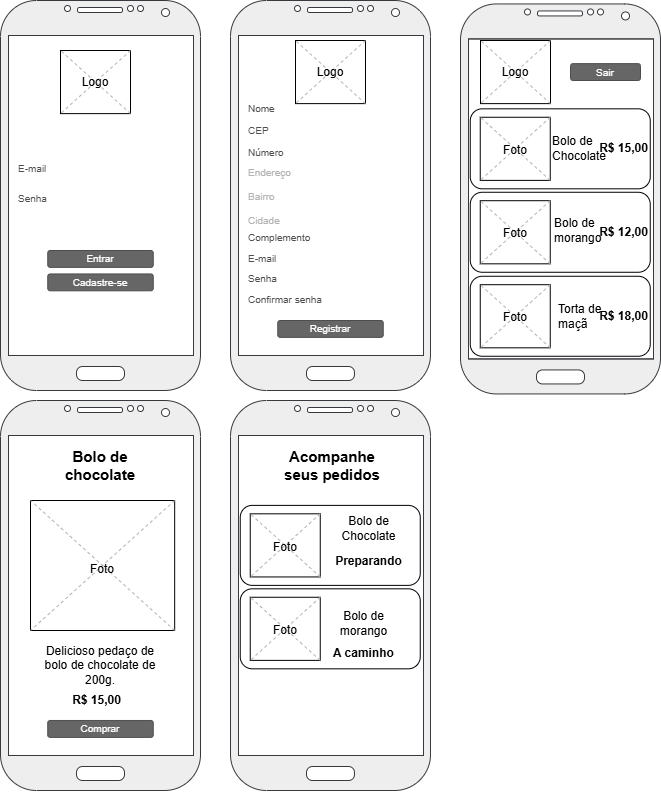

# Aplicativo: Quero bolo
Documento de requisitos do aplicativo **Quero Bolo**

### Contextualização
A Sra. Agnes é uma excelente confeiteira está abrindo na cidade uma loja fízica e precisa de um aplicativo para divulgar e vender seus deliciosos bolos e doces, contratou a consultoria XPTO para desenvolver o aplicativo, após uma análise através de entrevistas, etnografia e um levantamento orientado a pontos de vista o Gerente de projetos elaborou o seguinte documento de requisitos.

<tr>
<td>

# Documento de requisitos
## Introdução
O seguinte documento se baseia nas regras de negócio obtidas juntamente com o cliente e elenca os requisitos funcionais e não funcionais levantados. Segue a seguinte estrutura, a lista de regras de negócio está numerada no formato [RN001] a [RN0..], os requisitos funcionais [RF001] a [RF0..] e os requisitos não funcionais [NF001] a [NF0..].
 Também possui um wireframe como espoço inicial da solução que pretende ser implementada.
 Este documento servirá de base para o contrato de prestação de serviços de desenvolvimento de um aplicativo.

## Regras de negócio
### [RN001] Cadastro e login
- A administradora do estabelecimento deseja manter um cadastro de todos os usuários do aplicativo, desta forma o aplicativo deve permitir que os usuários se cadastrem e envie os dados para um banco de dados.
### [RN002] Pedidos do cliente
- O aplicativo do cliente deve listar os produtos disponíveis e permitir que o usuário escolha o produto, faça o pedido e acompanhe o status da preparação e entrega do pedido.
### [RN003] Pedidos da confeitaria
- A gerência deve receber os pedidos feitos pelos clientes através do aplicativov, preparar os produtos e enviar para entrega.
### [RN004]
- O sistema deve gerar relatório dos pedidos entregues demonstrando a eficiência do processo e as estatísticas de pedidos e entrega.
- Relatórios financeiros por período.

## Requisitos funcionais do aplicativo do cliente.

### [RF001]Tela de login
- 1.1 Logotipo e ou logomarca da loja
- 1.2 Campo para email
- 1.3 Campo para senha
- 1.4 Botão para entrar
- 1.5 Botão cadastre-se

### [RF002]Tela de Cadastro
- 2.1 Logotipo e ou logomarca da loja
- 2.2 Campo nome completo
- 2.3 Campo cep
- 2.4 Campo numero
- 2.5 Campo complemento
- 2.6 Campo para email
- 2.7 Campo para senha
- 2.8 Campo para confirmar senha
- 2.9 Botão registrar

### [RF003]Tela de listar produtos
- 3.1 Logotipo e ou logomarca da loja
- 3.2 lista contendo pelo menos 10 cards
    - 3.2.1 Nome do produto
    - 3.2.2 Foto (miniatura) do produto
    - 3.2.3 Preço do produto
- 3.2 Botão para sair do aplicativo

### [RF004]Tela de detalhes do produto
- 4.1 Nome do produto
- 4.2 Descrição do produto
- 4.3 Foto do produto em tamanho maior
- 4.4 Preço do produto
- 4.5 Botão para fazer o pedido

### [RF005]Tela de acompanhamento do pedido
- 5.1 Lista com pelo menos 3 cards de produtos
    - 5.1.1 Nome do produto
    - 5.1.2 Foto (miniatura) do produto
    - 5.1.3 Status do pedido (Em preparação, a caminho)

## Requisitos não funcionais
### [NF001] Banco de dados não relacional
- 1.1 O sistema deve manter um banco de dados com o cadastro de clientes e o registro de todos os pedidos, para menor custo o banco de dados não precisa ser relacional.
### [NF002] Framework e Linguagens de programação
- 2.1 Banco de dados, Firebase datastore, não relacional baseado em JSON
- 2.2 API back-end com framework Laravel com linguagem PHP
- 2.3 Aplicativo desenvolvido no framework Flutter com a linguagem Dart
### [NF003] Hospedagem em nuvem
- 3.1 Tanto o banco de dados como a API Back-end ficarão hospedados na AWS.
### [NF004] Loja de aplicativos
- 4.1 Aplicativo deve funcinar tanto em aparelhos android como iOS.
- 4.2 Loja PlayStore
- 4.3 Loja AppleStore

## Wireframe

</td>
</tr>