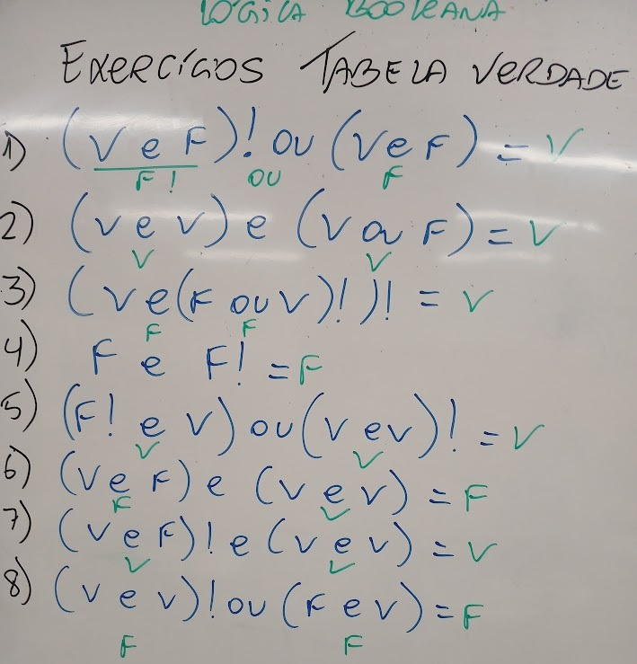
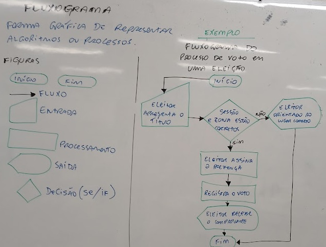

# Aula02

## Princípios da lógica de programação

### Capacidades Básicas:
- 1 Identificar a sequência lógica de passos em um algoritmo
- 2 Utilizar tomada de decisão para elaboração do algoritmo

### Conhecimentos:
- 1 Lógica e algoritmos
    - 1.1 Definição
    - 1.2 Estruturas
        - 1.2.1 Sequência
        - 1.2.2 Seleção

### Exercícios

### Algoritmos
Sequência de passos lógicos para alcançar um objetivo. 

### Atividades
1) Escreva um algoritmo que leia dois números multiplique o primeiro por dois e some o quadrado do segundo. Mostre o resultado e faça o teste de mesa.

2) Escreva um algoritmo que calcule a área de um **retângulo**. Mostre o resultado e faça o teste de mesa.

3) Escreva um algoritmo que calcule a área de um **círculo**. Mostre o resultado e faça o teste de mesa.

4) Escreva um algoritmo que calcule uma **expressão de segundo grau**. Mostre os resultados das raízes se o delta for positivo ou a mensagem "Esta expressão não possui valores reais" **se** o delta for negativo. Faça o teste de mesa.

## Fluxograma

