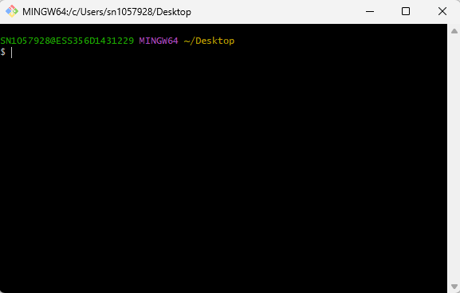
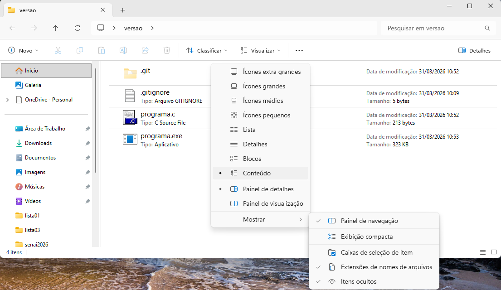

# Aula08 - Introdução ao Github
- Crie uma conta no Github, utilize um e-mail pessoal, pois após o término do curso a conta será sua e o histórico pode ser importante para futuros processos seletivos.

- Enquanto aguarda seus colegas criar suas contas no github, treine seu raciocínio lógico resolvendo o problema a seguir:

## Conjectura de Collatz
Recebeu este nome em referência ao matemático alemão Lothar Collatz.
A Conjectura de Collatz, ou problema, é um enigma matemático simples: para qualquer inteiro positivo, se par, divida por 2; se ímpar, multiplique por 3 e some 1. A conjectura afirma que, repetindo o processo, todos os números chegam ao ciclo que é 1.
- Apesar de testada até números altíssimos, nunca foi provada.
### Desafio:
- Crie um programa em **C** que teste esta conjuctura e informe quantos passos são necessários para chegar a 1, a partir de um número inteiro positivo informado pelo usuário.
- O programa deve retornar o número de passos e a sequência de números gerada.

## Baixe o git bash (Git for Windows) em seu computador

### Principais comandos git

| Comando | Descrição |
|-|-|
|git init|Inicia um repositório git|
|git add .|Adiciona os arquivos para o stage|
|git commit -m "mensagem"|Realiza o commit dos arquivos|
|git log|Exibe o histórico de commits|
|git checkout <código do commit>|Permite voltar para um commit específico|
|git remote add origin <url>|Adiciona o repositório remoto|
|git push -u origin master|Envia os arquivos para o repositório remoto|

## Atividade prática
- Crie uma pasta em seu computador com o nome "versoes" e dentro dela crie um arquivo programa.c com o seguinte programa:
```c
#include <stdio.h>
#include <windows.h>
void main(){
	SetConsoleOutputCP(CP_UTF8);
	int x, y;
	printf("Digite um número inteiro\n");
	scanf("%d", &x);
	y = x * x;
	printf("%d ao quadrado é %d", x, y);
}
```
- Execute o programa e teste com diferentes números.
- Crie um outro arquivo chamado .gitignore e adicione a extensão .exe para que os arquivos executáveis não sejam enviados para o repositório remoto.
```
*.exe
```
- Inicie um repositório git na pasta "versoes", adicione os arquivos para o stage, realize o commit e envie para o repositório remoto.
- Clique com o botão direito do mouse na pasta versoes aberta e selecione "Git Bash Here" para abrir o terminal do git bash.
- No terminal, digite os seguintes comandos:
```bash
git init
git add .
git commit -m "Primeira versão do programa"
```
- Pronto, o programa já está versionado.
- 
- Perceba que apenas dois arquivos foram adicionados para o stage, o programa.c e o .gitignore, o arquivo programa.exe não foi adicionado, pois está no .gitignore.
- Vamos alterar o programa para calcular o cubo do número, ou seja, y = x * x * x; e realizar um novo commit.
```c
#include <stdio.h>
#include <windows.h>
void main(){
    SetConsoleOutputCP(CP_UTF8);
    int x, y;
    printf("Digite um número inteiro\n");
    scanf("%d", &x);
    y = x * x * x;
    printf("%d ao cubo é %d", x, y);
}
```
- Após alterar o programa, execute os seguintes comandos no terminal do git bash:
```bash
git add .
git commit -m "Segunda versão do programa"
```
- Agora temos duas versões do programa, a primeira versão calcula o quadrado do número e a segunda versão calcula o cubo do número.
- Para visualizar o histórico de commits, execute o comando:
```bash
git log
```
- Para voltar para a primeira versão do programa, execute o comando:
```bash
git checkout <código do commit da primeira versão>
```
- Para voltar para a segunda versão do programa, execute o comando:
```bash
git checkout <código do commit da segunda versão>
```

## Enviando para o github
- Para enviar os arquivos para o repositório remoto, execute o comando:
```bash
git remote add origin <url do repositório remoto>
git push -u origin master
```
- Porém antes de enviar, é necessário criar um repositório no github, para isso, acesse o github e clique em "New repository", informe o nome do repositório e clique em "Create repository".
- Após criar o repositório, copie a url do repositório e execute os comandos acima para enviar os arquivos para o repositório remoto.
- Pronto, agora os arquivos estão no github e você pode acessar o repositório para visualizar os arquivos e o histórico de commits.