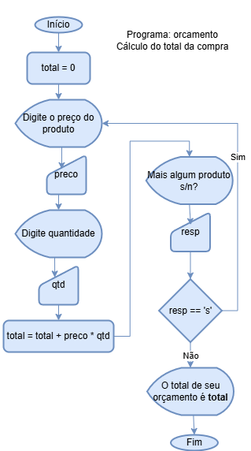
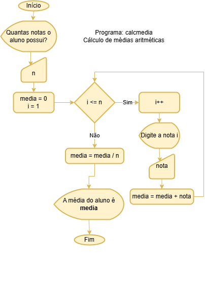

# Aula09 - Situações desafiadoras formativas (VPF01)
Para cada programa a seguir sedenvolva o **algoritmo** e o **fluxograma**.
- O algoritmo pode ser em português estruturado ou um programa em **linguagem C**.
- O fluxograma pode ser desenhado em papel ou preferencialmente no computador com o auxílio do **draw.io**
## 01 - Calculadora de IMC (Índice de massa corpórea)
Faça um programa que calcule o índice de massa corpórea de uma pessoa, obtendo o nome, peso e altura e retornando o IMC e a classificação segundo a tabela a seguir:

|IMC|Classificação|
|-|:-:|
|Abaixo de 18.5|Abaixo do peso|
|Entre 18.6 e 24.9|Peso normal|
|Entre 25 e 29.9|Sobrepeso|
|Entre 30 e 34.9|Obesidade grau I|
|Entre 35 e 39.9|Obesidade grau II|
|Acima de 40|Obesidade grau III|

- A fórmula para calcular o IMC é: imc = peso / altura * altura

## 02 - João pescador
### Contextualização
João Papo-de-Pescador, homem de bem, comprou um microcomputador para controlar o rendimento diário de seu trabalho.<br>Toda vez que ele traz um peso de peixes maior que o estabelecido pelo regulamento de pesca do estado de São Paulo (50 quilos) deve pagar uma multa de R$ 4,00 por quilo excedente.
### Desafio
João precisa que você faça um programa que leia a variável peso (peso de peixes) e calcule o excesso.<br>Gravar na variável excesso a quantidade de quilos além do limite e na variável multa o valor da multa que João deverá pagar. Imprima os dados do programa com as mensagens adequadas.
## 03 - Orçamento

### Desafio
A partir do fluxograma acima, desenvolva o programa em **C** que calcule o total.
- Ao concluir, solicite ao usuário que informe uma porcentagem de desconto e calcule o valor do desconto e o total a pagar.
## 04 - Calculando o salário
Faça um Programa que pergunte quanto você ganha por hora e o número de horas trabalhadas no mês.
<br>Calcule e mostre o total do seu salário no referido mês, sabendo-se que são descontados 11% para o Imposto de Renda, 8% para o INSS e 5% para o sindicato, O programa deve retornar o salário bruto. quanto pagou ao INSS. quanto pagou ao sindicato. o salário líquido.<br>Calcule os descontos e o salário líquido, conforme a tabela abaixo:
```
+ Salário Bruto : R$
- IR (11%) : R$
- INSS (8%) : R$
- Sindicato ( 5%) : R$
= Salário Liquido : R$
```
Obs.: Salário Bruto - Descontos = Salário Líquido.

## 05 Calculadora de média

### Desafio
A partir do fluxograma acima, desenvolva o programa em **C** que calcule a média de um aluno e informe se ele foi aprovado, reprovado ou ficou de recuperação.
- A média para aprovação é 7, para recuperação é entre 5 e 6.9 e para reprovação é abaixo de 5.

## 06 Loja de tintas
### Contextualização
Sandro, dono de uma loja de tintas precisa de um programa que auxilie seus vendedores a oferecer as melhores condições e economia a seus clientes.

### Desafio
Desenvolva um programa que peça o tamanho em metros quadrados da área a ser pintada e informe ao usuário as quantidades de latas de tinta a serem compradas e os respectivos preços em 3 situações:

```
1 comprar apenas latas de 18 litros;
2 comprar apenas galões de 3,6 litros;
3 misturar latas e galões, de forma que o preço seja o menor.
```
### Regras de negócio
- Acrescente 10% de folga e sempre arredonde os valores para cima, isto é, considere latas cheias.
- Considere que a cobertura da tinta é de 1 litro para cada 6 metros quadrados e que a tinta é vendida em latas de 18 litros, que custam R$ 80,00 ou em galões de 3,6 litros, que custam R$ 25,00.

## 07 Suspeitos
### Contextualização
O departamento de polícia do País das Maravilhas precisa de um programa para identificar suspeitos através da inteligência artificial.

### Desafio
Faça um programa que faça 5 perguntas para uma pessoa sobre um crime. As perguntas são: "Telefonou para a vítima?" "Esteve no local do crime?" "Mora perto da vítima?" "Devia para a vítima?" "Já trabalhou com a vítima?"
- O programa deve no final emitir uma classificação sobre a participação da pessoa no crime.
- Se a pessoa responder positivamente a 2 questões ela deve ser classificada como "Suspeita", entre 3 e 4 como "Cúmplice" e 5 como "Assassino". Caso contrário, ele será classificado como "Inocente".
- Ao concluir as perguntas o programa deve perguntar se há mais algum suspeito se a resposta for sim, deve refazer todas as perguntas e classificar novamente.

