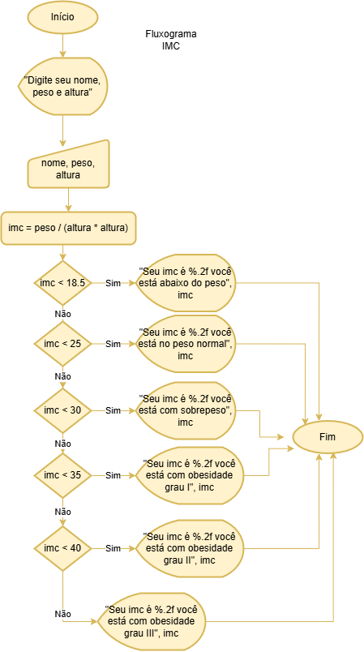
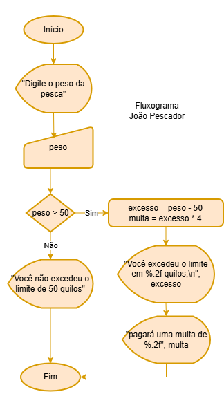
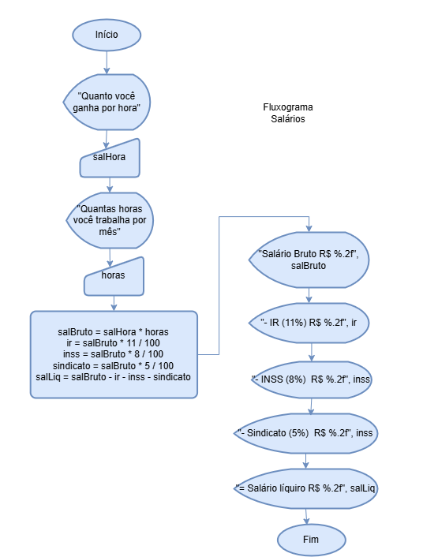
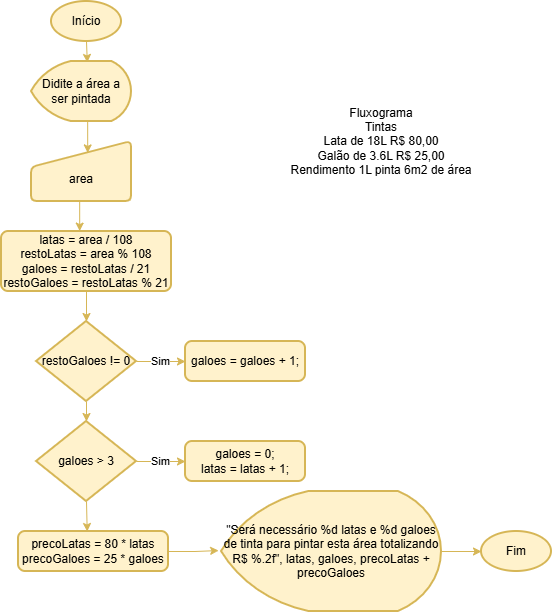
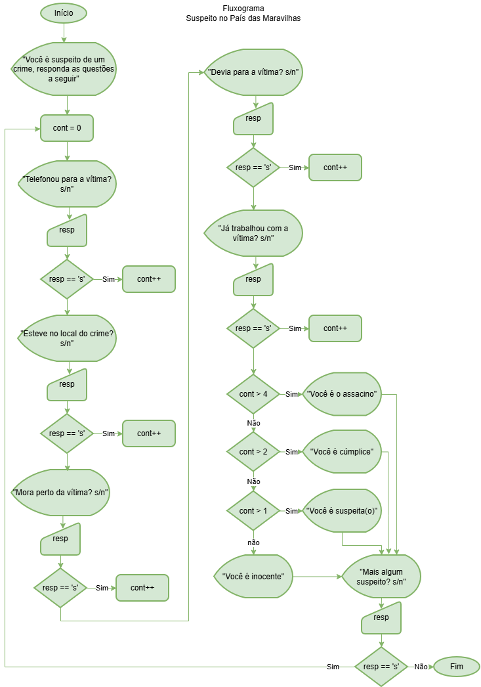

# Correções
## 01 IMC (índice de massa corpórea)
```c
#include<stdio.h>
#include<windows.h>
void main(){
	SetConsoleOutputCP(CP_UTF8);
	char nome[20]; //String
	float peso, altura, imc;
	printf("Digite seu nome, peso e altura\n");
	scanf(" %s %f %f", &nome, &peso, &altura);
	imc = peso / (altura * altura);
	if(imc < 18.5){
		printf("Seu imc é %.2f você está abaixo do peso", imc);
	}else if(imc < 25){
		printf("Seu imc é %.2f você está no peso normal", imc);
	}else if(imc < 30){
		printf("Seu imc é %.2f você está com sobrepeso", imc);
	}else if(imc < 35){
		printf("Seu imc é %.2f você está com obesidade grau I", imc);
	}else if(imc < 40){
		printf("Seu imc é %.2f você está com obesidade grau II", imc);
	}else{	
		printf("Seu imc é %.2f você está com obesidade grau III", imc);
	}
	getch();
}
```

## 02 João pescador
```c
#include<stdio.h>
#include<windows.h>
void main(){
	SetConsoleOutputCP(CP_UTF8);
	float peso, excesso, limite = 50, multa;
	printf("Digite o peso da pesca:\n");
	scanf("%f", &peso);
	if(peso > 50){
		excesso = peso - limite;
		multa = excesso * 4;
		printf("Você excedeu o limite em %.2f quilos,\n", excesso);
		printf("pagará uma multa de %.2f", multa);
	}else{
		printf("Você não excedeu o limite de 50 quilos.");
	}
	getch();
}
```

## 03 Orçamento
```c
#include<stdio.h>
#include<windows.h>
void main(){
	SetConsoleOutputCP(CP_UTF8);
	float total = 0, preco, desconto;
	int quantidade;
	char resp;
	do{
		printf("Digite o preço do produto:\n");
		scanf("%f", &preco);
		printf("Digite a quantidade:\n");
		scanf("%d", &quantidade);
		total = total + preco * quantidade;
		printf("mais algum produtos s/n:\n");
		scanf(" %c", &resp);
	}while(resp == 's');
	printf("O seu orçamento é %.2f\n", total);
	printf("Informe a porcentagem de desconto\n");
	scanf("%f", &desconto);
	desconto = total * desconto / 100;
	total = total - desconto;
	printf("O desconto é %.2f, preço final %.2f", desconto, total);
	getch();
}
```
## 04 Salários
```c
#include<stdio.h>
#include<windows.h>
void main(){
	SetConsoleOutputCP(CP_UTF8);
	float salHora, horas;
	float salBruto, ir, inss, sindicato, salLiquido;
	printf("Digite quanto você ganha por hora\n");
	scanf("%f", &salHora);
	printf("Digite quantas horas trabalhadas\n");
	scanf("%f", &horas);
	salBruto = salHora * horas;
	ir = salBruto * 11 / 100;
	inss = salBruto * 8 / 100;
	sindicato = salBruto * 5 / 100;
	salLiquido = salBruto - ir - inss - sindicato;
	printf("+ Salário Bruto : R$ %.2f\n", salBruto);
	printf("- IR (11%%) : R$ %.2f\n", ir);
	printf("- INSS (8%%) : R$ %.2f\n", inss);
	printf("- Sindicato (5%%) : R$ %.2f\n", sindicato);
	printf("= Salário Líquido : R$ %.2f\n", salLiquido);
	getch();
}
```

## 05 Média de um aluno
```c
#include<stdio.h>
#include<windows.h>
void main(){
	SetConsoleOutputCP(CP_UTF8);
	int n;
	float nota, media;
	printf("Quantas notas o aluno possui?\n");
	scanf("%d", &n);
	media = 0;
	for(int i = 1; i <= n; i++){
		printf("Digite a %dª nota: ", i);
		scanf("%f", &nota);
		media = media + nota;
	}
	media = media / n;
	printf("A média do aluno é %.1f", media);
	getch();
}
```
## 06 Loja de tintas
```c
#include<stdio.h>
#include<windows.h>
void main(){
	SetConsoleOutputCP(CP_UTF8);
	int area, latas, galoes;
	int restoLatas, restoGaloes;
	//Para dar uma folga de 10% basta alterar a areaGalao = 18 e a areaLata =97
	int areaGalao = 21, areaLata = 108;
	float precoGaloes, precoLatas;
	//Galão 3.6 litros, Lata 18 litros
	//1 litro pinta 6m2
	printf("Informe a área em m2(inteiro) a ser pintada:\n");
	scanf("%d", &area);
	//Resolvendo matematicamente
	latas = area / areaLata;
	restoLatas = area % areaLata;
	galoes = restoLatas / areaGalao;
	restoGaloes = restoLatas % areaGalao;
	if(restoGaloes != 0){
		galoes = galoes + 1;
	}
	if(galoes > 3){
		galoes = 0;
		latas = latas + 1;
	}
	precoLatas = latas * 80.0;
	precoGaloes = galoes * 25.0;
	printf("%d latas de 18 litros R$ 80.00 cada R$ %.2f\n",latas, precoLatas);
	printf("%d galões de 3.6 litros a R$ 25.00\n", galoes, precoGaloes);
	printf("Total do orçamento R$ %.2f\n", precoLatas + precoGaloes);
	getch();
}
```

## 07 Suspeito
```c
#include<stdio.h>
#include<windows.h>
void main(){
	SetConsoleOutputCP(CP_UTF8);
	char resp;
	int cont;
	printf("Você é suspeito de um crime, responda as questões a seguir\n");
	do{
		cont = 0;
		
		printf("Telefonou para a vítima? s/n\n");
		scanf(" %c", &resp);
		if(resp == 's')	cont++;
		printf("Esteve no local do crime? s/n\n");
		scanf(" %c", &resp);
		if(resp == 's') cont++;
		printf("Mora perto da vítima? s/n\n");
		scanf(" %c", &resp);
		if(resp == 's') cont++;
		printf("Devia para a vítima? s/n\n");
		scanf(" %c", &resp);
		if(resp == 's') cont++;
		printf("Já trabalhou com a vítima? s/n\n");
		scanf(" %c", &resp);
		if(resp == 's') cont++;
		
		if(cont > 4) printf("Você é o assacino! s/n\n");
		else if(cont > 2) printf("Você é cúmplice! s/n\n");
		else if(cont > 1) printf("Você é suspeito! s/n\n");
		else printf("Você é inocente! s/n\n");
		
		printf("Mais algum suspeito! s/n\n");
		scanf(" %c", &resp);
	}while(resp == 's');
	getch();
}
```
