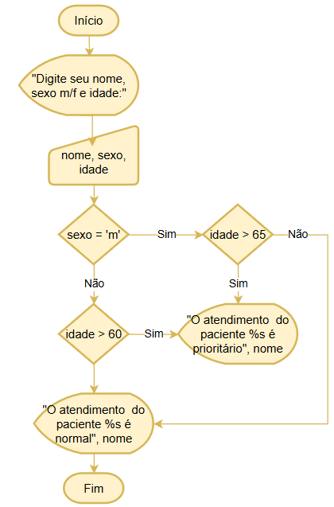

# Aula10 - VPS01 (Verificação Prática Somativa)

## Contextualização:
A Empresa ACME SA localizada na cidade de Amparo atendendo a população como um laboratório de coleta de exames de medicina do trabalho, exames adminicionais, demicionais, periódicos e outros. Precisa de alguns softwares para resolver problemas cotidianos de sua equipe, utilizando lógica de programação você como desenvolvedor júnior deverá auxiliar o time de **devs** (desenvolvedores) cumprindo as seguintes **tasks** (tarefas)

## Desafios:
### Task 01 - Fluxograma
Elabore um fluxograma que oriente o processo de atendimento da fila de pacientes no período da tarde. o atendimento segue o seguinte fluxo:
- 1 O paciente chega e entrega seu pedido de exame no cetor de triagem, todos os pacientes possuem um pedido de exame expedido pela sua empresa, caso não possua deve ser orientado a voltar para a sua empresa e solicitar.
- 2 Todos os pacientes com o pedido de exame OK recebem uma senha e se o exame descrito for admissional o paciente é direcionado para a sala 1, se for demicional vai para a sala 2, se for periódico para a sala 3 e caso seja outro tipo de exame é direcionado para a sala 04.
- 3 Ao concluir seus exames os pacientes retornam para a recepção/triagem e recebem o resultado do exame impresso em duas vias, uma para ele próprio e outra para entregar na sua empresa.

### Task 02
|Fluxograma|Tarefa|
|-|:-:|
||A partir do fluxograma ao lado desenvolva o programa em linguagem C ou portugol|

### Task 03
Para resolver o problema da distribuição de senha e contagem de atendimentos, desenvolva um algoritmo e um fluxograma onde o paciente informe o primeiro nome e sexo 'm' ou 'f' e deverá ser contado quantos atendimentos ocorreram no dia,

- Exemplo:
```cmd
Qual o seu nome? André
Qual o sexo 'm' ou 'f': m
Você é o paciente número 1
Mais algum paciente 's' ou 'n': s
Qual o seu nome? Ana
Qual o sexo 'm' ou 'f': f
Você é a paciente número 2
Mais algum paciente 's' ou 'n': s
Qual o seu nome? Maria
Qual o sexo 'm' ou 'f': f
Você é a paciente número 3
Mais algum paciente 's' ou 'n': n
Hoje foram atendidos 3 pacientes, 1 do sexo masculino e 2 do sexo feminino
```

## Entregas
Faça os algoritmos e fluxogramas em uma folha de caderno e entregue ao instrutor, com o seu nome, data e turma.

## [Recuperação](https://forms.gle/cXyt51URHqW9uYjq8)

## Autoavaliação
|Criticidade|Fundamentos e Capacidades|Critérios|Sim ou Não|
|-|-|:-:|-|
||1 Identificar a sequência lógica de passos em um algoritmo|Escreve algoritmos ou fluxogramas||
||2 Utilizar tomada de decisão para elaboração do algoritmo|Expressa uma condição SE() em um algoritmo ou fluxograma||
||3 Criar estruturas de repetição para executar um conjunto de instruções várias vezes|Escreveu ao menos uma estrutura de código com laço FOR ou WHILE||
||4 Representar algoritmos por meio de fluxogramas, seguindo as convenções de símbolos e conexões|Desenvolveu o fluxograma solicitado na entrega||
||5 Utilizar variáveis para armazenar valores durante a execução de um programa|Definiu as variáveis de acordo com a linguagem de programação escolhida||
||6 Utilizar operadores aritméticos para realizar cálculos em expressões numéricas|Realizou ao menos um dos cálculos solicitados no desafio||
||7 Aplicar operadores lógicos para avaliar e combinar condições booleanas|Utilizou IF() em algum trecho de código||
||8 Utilizar estruturas condicionais para executar instruções com base em uma condição|Utilizou IF() para seguimentar dados direcionando o fluxo da programação||
||9 Utilizar lógica de programação para a resolução de problemas|Desenvolveu de forma completa e eficaz ao menos um dos requisitos||
||11 Aplicar técnicas de código limpo (clean code)|Removeu comentários desnecessários, redundâncias e códigos não utilizados||
||12 Manipular os diferentes tipos de dados na elaboração de programas|Utilizou strings, ints e outros tipos de dados||
||13 Utilizar o ambiente integrado de desenvolvimento (IDE)|Utilizou VsCode, ou devC ou outra IDE estudada||
||1 Demonstrar autogestão|Compreendeu a situação problema e tirou dúvidas se necessário com o instrutor||
||2 Demonstrar pensamento analítico |Relacionou os conceitos de lógica estudado ao desafio proposto||
||3 Demonstrar inteligência emocional|Desenvolveu todos os requisitos solicitados mesmo que apresente alguns erros durante a execução||
||4 Demonstrar autonomia|Pesquisou nas prórpias bases de conhecimento ou documentos externos oficiais da linguagem.||

||TABELA DE NÍVEIS DE DESEMPENHO|EQUIVALÊNCIA<br>DE NOTAS|
|:-:|-|:-:|
|12|Acertou todos os critérios críticos e desejáveis.|100|
|11|Acertou todos os critérios críticos e pelo menos 9 dos 10 desejáveis|95|
|10|Acertou todos os critérios críticos e pelo menos 8 dos 10 desejáveis|90|
|9|Acertou todos os critérios críticos e pelo menos 7 dos 10 desejáveis|85|
|8|Acertou todos os critérios críticos e pelo menos 6 dos 10 desejáveis|80|
|7|Acertou todos os critérios críticos e pelo menos 5 dos 10 desejáveis|75|
|6|Acertou todos os critérios críticos e pelo menos 4 dos 10 desejáveis|70|
|5|Acertou todos os critérios críticos e pelo menos 3 dos 10 desejáveis|65|
|4|Acertou todos os critérios críticos e pelo menos 2 dos 10 desejáveis|60|
|3|Acertou todos os critérios críticos e pelo menos 1 dos 10 desejáveis|55|
|2|Acertou todos os critérios críticos |50|
|1|Não acertou todos os critérios críticos |30|