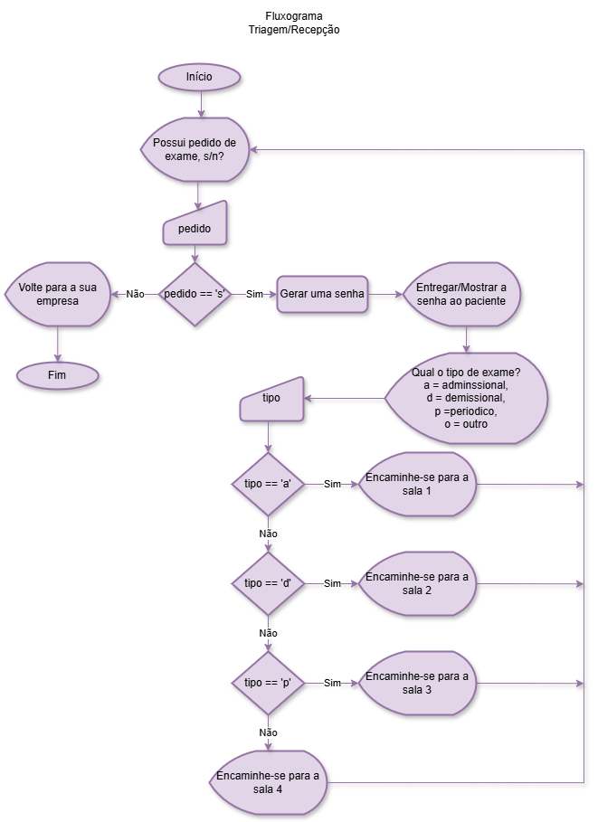
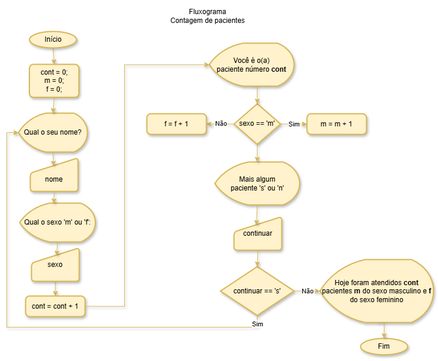

# Correção da avaliação
### Task 01 - Fluxograma

- Não era necessário algoritmo, porém segue para tirar dúvidas:
```
INICIO
	SENHA = 0;
	FAÇA
		ESCREVA("Possui pedido de exame? s/n: ");
		LEIA(pedido);
		SE(pedido == 's')
		ENTÃO
			SENHA = SENHA + 1;
			ESCREVA("Sua senha é SENHA");
			ESCREVA("Qual o tipo de exame?");
			ESCREVA("a = Admnissional");
			ESCREVA("d = demissional");
			ESCREVA("p = Periódico");
			ESCREVA("o = Outro");
			LEIA(tipo);
			SE(tipo == 'a')
			ENTÃO
				ESCREVA("Encaminhe-se para a sala 1");
			SENÃO SE(tipo == 'd')
			ENTÃO
				ESCREVA("Encaminhe-se para a sala 2");
			SENÃO SE(tipo == 'p')
			ENTÃO
				ESCREVA("Encaminhe-se para a sala 3");
			SENÃO
				ESCREVA("Encaminhe-se para a sala 4");
			FIMSE
		FIMSE
	ENQUANTO(pedido == 's');
	ESCREVA("Volte para a sua empresa.")
FIM
```
- triagem.c
```c
#include<stdio.h>
#include<windows.h>
void main(){
	SetConsoleOutputCP(CP_UTF8);
	char pedido, tipo;
	int senha = 0;
	do{
		printf("\nPossui pedido de exame? s/n: ");
		scanf(" %c", &pedido);
		if(pedido == 's'){
			senha++;
			printf("Sua senha é %d\n", senha);
			printf("Qual o tipo de exame?\n");
			printf("a = Admnissional\n");
			printf("d = demissional\n");
			printf("p = Periódico\n");
			printf("o = Outro\n");
			scanf(" %c", &tipo);
			if(tipo == 'a') printf("Encaminhe-se a sala 1\n");
			else if(tipo == 'd') printf("Encaminhe-se a sala 2\n");
			else if(tipo == 'p') printf("Encaminhe-se a sala 3\n");
			else printf("Encaminhe-se a sala 4\n");
		}
	}while(pedido == 's');
	printf("Volte para a sua empresa.\n");
	getch();
}
```
### Task 02
- atendimento.txt
```
INICIO
   ESCREVA("Digite seu nome, sexo m/f e idade");
   LEIA(nome, sexo, idade);
   SE(sexo == 'm')
   ENTÃO
      SE(idade > 65)
      ENTÃO
         ESCREVA("O atendimento do paciente %s é prioritário", nome);
      SENÃO
	 ESCREVA("O atendimento do paciente %s é normal", nome);
      FIMSE
   SENÃO
      SE(idade > 60)
      ENTÃO
         ESCREVA("O atendimento do paciente %s é prioritário", nome);
      SENÃO
	 ESCREVA("O atendimento do paciente %s é normal", nome);
      FIMSE
    FIMSE
FIM
```
- atendimento.c
```c
#include<stdio.h>
#include<windows.h>
void main(){
	SetConsoleOutputCP(CP_UTF8);
	char nome[20], sexo;
	int idade;
	printf("Digite seu nome, sexo m/f e idade\n");
	scanf(" %s %c %d", &nome, &sexo, &idade);
	if(sexo == 'm'){
		if(idade > 65){
			printf("O atendimento do paciente %s é prioritário", nome);
  		}else{
		  	printf("O atendimento do paciente %s é normal", nome);
  		}
   }else{
      if(idade > 60){
	  	printf("O atendimento do paciente %s é prioritário", nome);
      }else{
      	printf("O atendimento do paciente %s é normal", nome);
	  }
    }
    getch();
}
```
## Task 03

- contagem.txt
```
INICIO
	cont = 0;
	m = 0;
	f = 0;
	FAÇA
		ESCREVA("Qual o seu nome? ");
		LEIA(nome);
		ESCREVA("Qual o sexo 'm' ou 'f': ");
		LEIA(sexo);
		cont = cont + 1;
		ESCREVA("Você é o paciente número cont");
		SE(sexo == 'm') ENTÃO
			m = m + 1;
		SENÃO
			f = f + 1;
		FIMSE
		ESCREVA("Mais algum paciente 's' ou 'n': ");
		LEIA(continuar);
	ENQUANTO(continuar == 's');
	ESCREVA("Hoje foram atendidos %d pacientes,", cont);
	ESCREVA(" %d do sexo masculino e %d do sexo feminino\n", m, f);
FIM
```
- contagem.c
```c
#include<stdio.h>
#include<windows.h>
void main(){
	SetConsoleOutputCP(CP_UTF8);
	char nome[20], sexo, continuar;
	int cont = 0, m = 0, f = 0;
	do{
		printf("Qual o seu nome? ");
		scanf(" %s", &nome);
		printf("Qual o sexo 'm' ou 'f': ");
		scanf(" %c", &sexo);
		cont++;
		printf("Você é o paciente número %d\n", cont);
		if(sexo == 'm') m++;
		else f++;
		printf("Mais algum paciente 's' ou 'n': ");
		scanf(" %c", &continuar);
	}while(continuar == 's');
	printf("Hoje foram atendidos %d pacientes,", cont);
	printf(" %d do sexo masculino e %d do sexo feminino\n", m, f);
	getch();
}
```