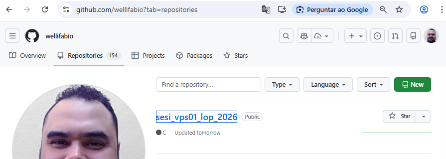
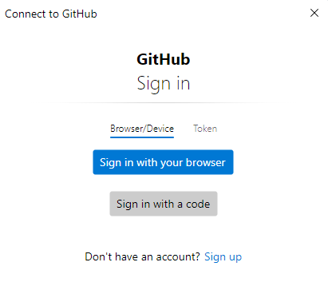
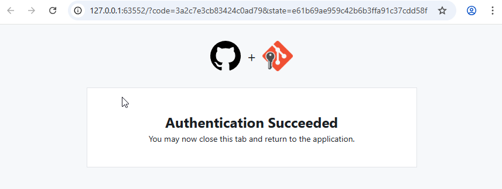
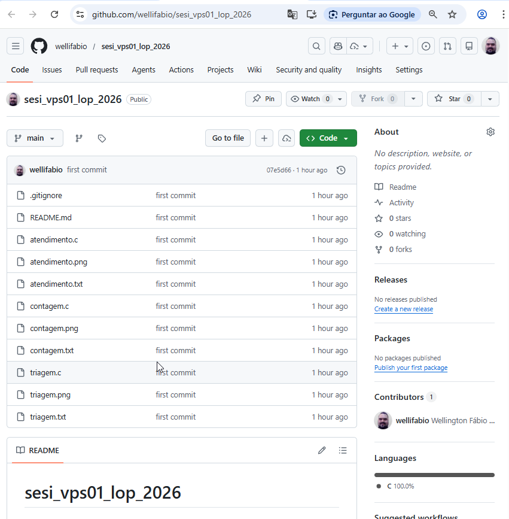
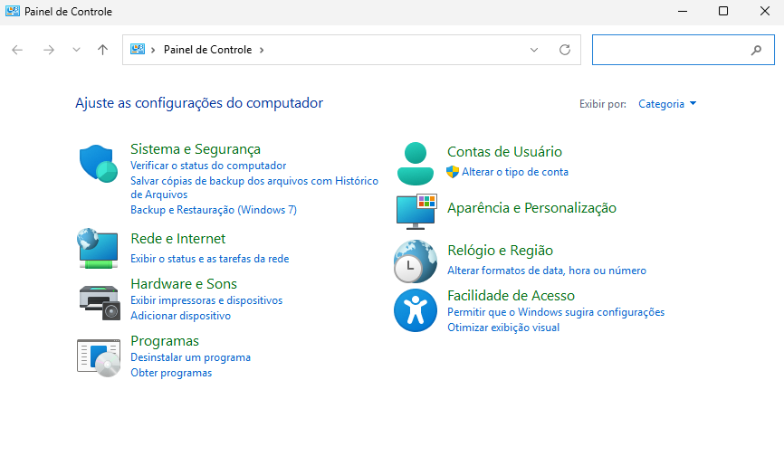
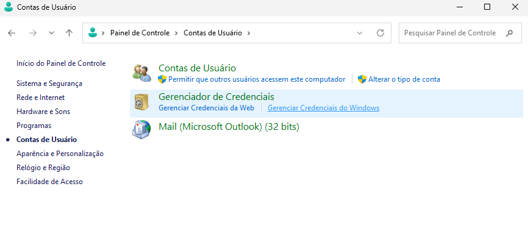
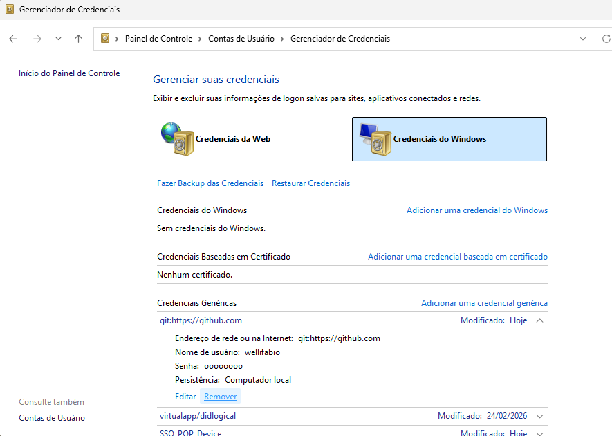
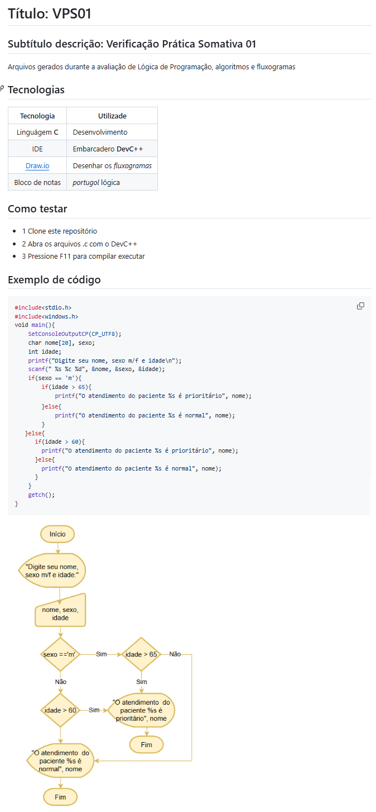

# Aula11 - GitHub
## Enviar o projeto ou pasta para o repositório remoto

### Passo 01
Precisamos ter uma pasta do projeto em nosso computador, com o projeto pronto ou em andamento
### Passo 02
Criar um repositório remoto no Github, para isso, acesse o site do Github, coloque seu e-mail e senha, e clique em "Sign in". Depois de logar, clique no ícone "+" no canto superior direito da tela, e selecione "New repository". Preencha o nome do repositório, a descrição (opcional), escolha se o repositório será público ou privado, e clique em "Create repository".

Ao cloncluir a criação do repositório, você verá uma tela com as instruções para enviar o projeto para o repositório remoto. Copie o link do repositório remoto, que estará no formato:
```bash
echo "# nome_do_repositorio_remoto" >> README.md
git init
git add README.md
git commit -m "first commit"
git branch -M main
git remote add origin https://github.com/wellifabio/nome_do_repositorio_remoto.git
git push -u origin main
```
### Passo 03
Copie o script **do seu repositório remoto**, não este script acima e cole em um bloco de notas para alterar a linha 3 onde aparece README.md para ponto assim adicionando todo o conteúdo da pasta do projeto, e não apenas o arquivo README.md. O script ficará assim:
```bash
echo "# nome_do_repositorio_remoto" >> README.md
git init
git add .
git commit -m "first commit"
git branch -M main
git remote add origin https://github.com/wellifabio/nome_do_repositorio_remoto.git
git push -u origin main
```

### Passo 04 - Opcional
Na primeisa vez que for enviar o projeto para o repositório remoto, é necessário configurar o nome de usuário e o e-mail do Git, para isso, execute os seguintes comandos no terminal:
```bash
git config --global user.name "Seu Nome"
git config --global user.email "Seu E-mail"
```
Cole novamente o script do repositório remoto, que agora está com a linha 3 alterada para git add ., e/ou execute os comandos no terminal, um por um, para enviar o projeto para o repositório remoto. Irá aparecer a tela a seguir, clique em **Sign in with browser**
- 
 Faça login com seu e-mail e senha do Github se necessário.
 - 
### Passo 05
Atualize a tela do seu repositório remoto no Github, e você verá que o projeto foi enviado com sucesso.
- 

## Caso o computador seja compartilhado com outras pessoas,
As crendenciais do Git são salvas no computador, então pode não aparecer a tela com o botão "Sign in with browser", e o projeto será enviado para o repositório remoto de outra pessoa e apresentará erro.
Para resolver esse problema, é necessário limpar as credenciais do Git, para isso, execute o seguinte comando no terminal:
```bash
git credential-manager clear
```
Se for Windows, acesse o painel de controle, e procure por "Gerenciador de Credenciais", clique em "Gerenciar credenciais do Windows", e procure por "git:https://github.com"
- 
- 
clique em "Remover" para limpar as credenciais do Git. Depois disso, execute novamente o script para enviar o projeto para o repositório remoto, e agora irá aparecer a tela com o botão "Sign in with browser" para você fazer login com seu e-mail e senha do Github.
- 

## Editando o README.md do repositório remoto
Para editar utilizamos a linguágem de marcação Markdown, que é uma linguagem de formatação de texto simples, que permite criar títulos, listas, links, imagens, tabelas, entre outros elementos de formatação. Para editar o README.md do repositório remoto, basta clicar no arquivo README.md no repositório remoto, e clicar no ícone de lápis para editar o arquivo. Depois de editar o arquivo, clique em "Commit changes" para salvar as alterações no repositório remoto.
```md
# Título: VPS01
## Subtítulo descrição: Verificação Prática Somativa 01
Arquivos gerados durante a avaliação de Lógica de Programação, algoritmos e fluxogramas

## Tecnologias

|Tecnologia|Utilizade|
|:-:|-|
|Linguágem **C**|Desenvolvimento|
|IDE|Embarcadero **DevC++**|
|[Draw.io](https://app.diagrams.net/)|Desenhar os *fluxogramas*|
|Bloco de notas|*portugol* lógica|

## Como testar
- 1 Clone este repositório
- 2 Abra os arquivos .c com o DevC++
- 3 Pressione F11 para compilar executar

## Exemplo de código
    ```c
    #include<stdio.h>
    #include<windows.h>
    void main(){
        SetConsoleOutputCP(CP_UTF8);
        char nome[20], sexo;
        int idade;
        printf("Digite seu nome, sexo m/f e idade\n");
        scanf(" %s %c %d", &nome, &sexo, &idade);
        if(sexo == 'm'){
            if(idade > 65){
                printf("O atendimento do paciente %s é prioritário", nome);
            }else{
                printf("O atendimento do paciente %s é normal", nome);
            }
    }else{
        if(idade > 60){
            printf("O atendimento do paciente %s é prioritário", nome);
        }else{
            printf("O atendimento do paciente %s é normal", nome);
        }
        }
        getch();
    }
    ```


## Expressões matemáticas

|Operação|Código Markdown|Visão|
|-|-|-|
|Multiplicação|`$2 \times 3 = 6$`|$2 \times 3 = 6$|
|Divisão|`$6 \div 2 = 3$`|$6 \div 2 = 3$|
|Fração|`$\frac{1}{2}$`|$\frac{1}{2}$|
|Raiz quadrada|`$\sqrt{4} = 2$`|$\sqrt{4} = 2$|
|Exponenciação|`$2^3 = 8$`|$2^3 = 8$|
|Logaritmo|`$\log_{10} 100 = 2$`|$\log_{10} 100 = 2$|

```
- A visualização do arquivo README.md no repositório remoto ficará assim:
- 

## Boas práticas
- Escrever um README.md claro e objetivo, com as informações necessárias para entender o projeto, preferencialmente em inglês, para alcançar um público maior.
### Ítens obrigatórios para um README.md de qualidade:
    - Título do projeto
    - Descrição do projeto
    - Tecnologias utilizadas
    - Como testar o projeto
### Ítens opcionais para um README.md de qualidade:
    - Exemplo de código
    - Imagens do projeto
    - Link para o repositório remoto

## Comandos git para controle de versão
- Para criar um repositório git local, basta executar o comando `git init` no
terminal, dentro da pasta do projeto.
- Para adicionar os arquivos para o stage, execute o comando `git add .` para adicionar todos os arquivos, ou `git add nome_do_arquivo` para adicionar um arquivo específico.
- Para realizar o commit, execute o comando `git commit -m "mensagem do commit"` para adicionar uma mensagem ao commit, que deve ser clara e objetiva, descrevendo as alterações realizadas.
- Para visualizar o histórico de commits, execute o comando `git log` para visualizar o histórico de commits, com o código do commit, a mensagem do commit, o autor do commit e a data do commit.
- Para voltar para uma versão anterior do projeto, execute o comando `git checkout código_do_commit` para voltar para a versão do projeto correspondente ao código do commit.
- Para voltar para a versão mais recente do projeto, execute o comando `git checkout main` para voltar para a versão mais recente do projeto, que é a branch main.

## Comandos para envier o projeto para o repositório remoto
- Para adicionar o repositório remoto, execute o comando `git remote add origin link_do_repositório_remoto` para adicionar o link do repositório remoto.
- Para enviar os arquivos para o repositório remoto, execute o comando `git push -u origin main` para enviar os arquivos para a branch main do repositório remoto.

## Comandos para enviar qualquer nova atualização do projeto para o repositório remoto
- Para adicionar os arquivos para o stage, execute o comando `git add .` para adicionar todos os arquivos, ou `git add nome_do_arquivo` para adicionar um arquivo específico.
- Para realizar o commit, execute o comando `git commit -m "mensagem do commit"` para adicionar uma mensagem ao commit, que deve ser clara e objetiva, descrevendo as alterações realizadas.
- Para enviar os arquivos para o repositório remoto, execute o comando `git push` para enviar os arquivos para a branch main do repositório remoto.
- Resumo
```bash
git add .
git commit -m "mensagem do commit"
git push
```
- Para baixar atualizações do repositório remoto, execute o comando
```bash
git pull   
```
para baixar as atualizações do repositório remoto para o repositório local.

## Clonar um repositório remoto
- Para clonar um repositório remoto, execute o comando `git clone link_do_repositório_remoto` para clonar o repositório remoto para o repositório local.
```bash
git clone
```
## [Atividade](./atividade.md)