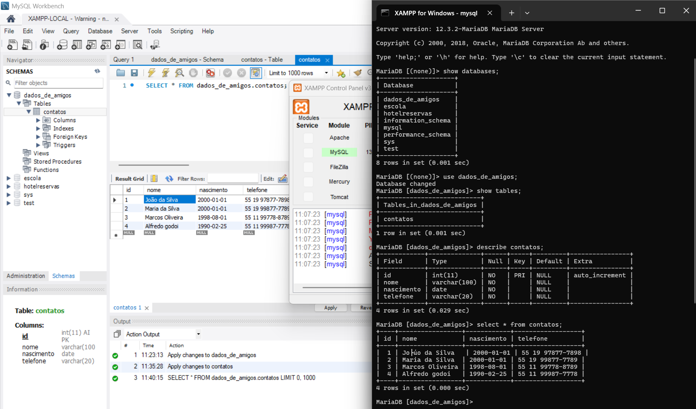

# Aula01 - Banco de dados

### Capacidades Técnicas
- 1 Identificar as características de banco de dados relacionais e não-relacionais
- 2 Configurar o ambiente para utilização de banco de dados relacional

## Conhecimentos
- 1 Sistema Gerenciador de Banco de Dados (SGBD)
  - 1.1 Definição
  - 1.2 Tipos
    - 1.2.1 Relacional
    - 1.2.2 Não relacional

## Atividade 01 - Coleta de dados
### Contextualização:
O objetivo desta atividade é coletar dados de diferentes fontes e formatos, para que possamos analisar e compreender a importância da estruturação dos dados.
### Desafio A:
Colete dados de três colegas de turma e anote em um bloco de notas, ou word, ou excel, ou qualquer outro formato que desejar, salve e envie para o professor
### Entrega
Envie os dados para este formulário: [Formulário de coleta de dados](https://forms.gle/4LLZpbvsPoDqPcSC6)

### Evolução dos dados
- Dados
- Informação
- Conhecimento
- Inteligência

### Exemplo
| Dado                        | Informação        | Conhecimento                | Inteligência         |
| --------------------------- | ----------------- | --------------------------- | -------------------- |
| Nome, Nascimento            | Idade             | Fórmula para calcular idade | Classificação        |
| Ana Maria Silva, 01/01/1980 | 43                | Hoje - Nascimento           | Pessoa de meia idade |
| **Dados Brutos**            | **Tomar decisão** | **Fórmula e=mc2**           | **Chat GPT**         |

### Previsão de Evolução

- Dados - Apenas registros brutos
- Informações - Faz sentido para a pessoa que os utiliza
- Conhecimento - Faz sentido para outras pessoas
- Inteligência Artificial - Capacidade de aprender, decidir
- Consciência - Autoconhecimento
- Sabedoria - Saber o que fazer com tudo isso

## Tipos de dados
- Não Estruturados
- Semi Estruturados
- Estruturados

#### Exemplo de tipos de dados
#### Não estruturados
- PDF
- DOCX (Word)
- XLSX (Excel)
- TXT
- Imagens

```txt
Poema do Cume

No alto daquele cume,
Plantei uma roseira.
O vento no cume bate,
A rosa no cume cheira.

Quando vem a chuva fina,
Salpicos no cume caem.
Formigas no cume entram,
Abelhas do cume saem.

Quando cai a chuva grossa,
A água do cume desce.
O barro do cume escorre,
O mato no cume cresce.

Então, quando cessa a chuva,
No cume volta a alegria.
Pois torna a brilhar de novo,
O Sol que no cume ardia. 
```

##### Semi Estruturados
- XML
- JSON
###### Exemplos
```xml
<possoas>
    <pessoa1>
        <id>1</id>
        <nome>Ana Maria</nome>
        <nascimento>2000-01-01</nascimento>
    </pessoa1>
    <pessoa2>
        <id>2</id>
        <nome>Maria silva</nome>
        <nascimento>2002-03-18</nascimento>
    </pessoa2>
    <pessoa3>
        <id>3</id>
        <nome>Marcos Paulo</nome>
        <nascimento>2003-04-25</nascimento>
    </pessoa3>
    <pessoa4>
        <id>4</id>
        <nome>Mariana Lima</nome>
        <nascimento>2001-01-13</nascimento>
    </pessoa4>
</pessoas>
```
```json
[
    {   
        "id": 1,
        "nome": "Ana Maria",
        "nascimento": "2000-01-01"
    },
    {   
        "id": 2,
        "nome": "Maria silva",
        "nascimento": "2002-03-18"
    },
    {   
        "id": 3,
        "nome": "Marcos Paulo",
        "nascimento": "2003-04-25"
    },
    {   
        "id": 4,
        "nome": "Mariana Lima",
        "nascimento": "2001-01-13"
    }
]
```
#### Por que JSON é Semi estruturado?
Porque permite modificações nos campos
```json
[
    {   
        "id": 1,
        "nome": "Ana Maria",
        "nascimento": "2000-01-01"
    },
    {   
        "id": 2,
        "nome": "Maria silva",
    },
    {   
        "id": 3,
        "nome": "Marcos Paulo",
        "nascimento": "2003-04-25",
        "telefone": "19 44577-7897"
    },
        {   
        "id": 4,
        "nome": "Mariana Lima",
        "pedidos":[
            {
                "data":"2023-01-02",
                "valor":5000.00
            },
            {
                "data":"2023-01-20",
                "valor":505.50
            },
        ]
    }
]
```

##### Estruturados
- CSV - Não relacional, Linguagem de estruturação universal de dados sem (SGBD)
- SQL - Relacional, Linguagem de Banco de dados (SGBD)
###### Exemplos
- CSV, Linguagem de estruturação universal de dados sem (SGBD)
```csv
id,nome,nascimento
1,Ana Maria,2000-01-01
2,Maria silva,2002-03-18
3,Marcos Paulo,2003-04-25
4,Mariana Lima,2001-01-13
```
- SQL, Linguagem de Banco de dados relacional (SGBD)
```sql
CREATE TABLE(
    id int primary key,
    nome varchar(100),
    nascimento date
);
INSERT INTO tabela (id, nome, nascimento) VALUES
(1, 'Ana Maria', '2000-01-01'),
(2, 'Maria silva', '2002-03-18'),
(3, 'Marcos Paulo', '2003-04-25'),
(4, 'Mariana Lima', '2001-01-13');
```

### Desafio B:
 - Estruture os dados coletados de seus colegas em um arquivo **JSON** e envie para o professor.
 - Exemplo: nome, nascimento, idade, musica_favorita, time_de_futebol:
 ```json
[
    {   
        "nome": "Ana Maria",
        "nascimento": "2000-01-01",
        "idade": 23,
        "musica_favorita": "Imagine",
        "time_de_futebol": "Palmeiras"
    },
    {   
        "nome": "Maria silva",
        "nascimento": "2002-03-18",
        "idade": 21,
        "musica_favorita": "Bohemian Rhapsody",
        "time_de_futebol": "Corinthians"
    },
    {   
        "nome": "Marcos Paulo",
        "nascimento": "2003-04-25",
        "idade": 20,
        "musica_favorita": "Stairway to Heaven",
        "time_de_futebol": "Santos"
    }
]
 ```
 - Estruture os dados coletados de seus colegas em um arquivo **CSV** e envie para o professor.
 - Exemplo: nome, nascimento, idade, musica_favorita, time_de_futebol:
 ```csv
nome,nascimento,idade,musica_favorita,time_de_futebol
Ana Maria,2000-01-01,23,Imagine,Palmeiras
Maria silva,2002-03-18,21,Bohemian Rhapsody,Corinthians
Marcos Paulo,2003-04-25,20,Stairway to Heaven,Santos
 ```

### Entrega
Envie os dados para este formulário: [Formulário de coleta de dados](https://forms.gle/gqxfHr3bA8AiacH97)

## Configurar o ambiente para utilização de banco de dados relacional
- Baixe e instale o XAMPP: [XAMPP](https://www.apachefriends.org/pt_br/download.html) ou MariaDB: [MariaDB](https://mariadb.org/download/)
- Baixe e instale o MySQL Workbench: [MySQL Workbench](https://dev.mysql.com/downloads/workbench/)
- Baixe e instale o VsCode: [VsCode](https://code.visualstudio.com/download)

### SGBD - Sistema Gerenciador de Banco de Dados
- É um software que permite a criação, manutenção e manipulação de bancos de dados.
### Exemplos de SGBD
- **MySQL** - Relacional, Open Source, Gratuito
- **PostgreSQL** - Relacional, Open Source, Gratuito
- **Oracle** - Relacional, Proprietário, Pago
- **Microsoft SQL Server** - Relacional, Proprietário, Pago
- **MongoDB** - Não relacional, Open Source, Gratuito
- **Firebase Firestore** - Não relacional, Proprietário, Pago
- **SQLite** - Não relacional, Open Source, Gratuito

### SGBD - Sistema Gerenciador de Banco de Dados
- É um software que permite a criação, manutenção e manipulação de bancos de dados.
### Exemplos de SGBD
- **MySQL** - Relacional, Open Source, Gratuito
- **PostgreSQL** - Relacional, Open Source, Gratuito
- **Oracle** - Relacional, Proprietário, Pago
- **Microsoft SQL Server** - Relacional, Proprietário, Pago
- **MongoDB** - Não relacional, Open Source, Gratuito
- **Firebase Firestore** - Não relacional, Proprietário, Pago
- **SQLite** - Não relacional, Open Source, Gratuito

## Acessando e explorando o SGBD (XAMPP - MariaDB) via linhas de código (Terminal)
- 1 Abra o XAMPP Control Panel e inicie o **Apache** e o **MySQL**
- 2 Abra o terminal (Prompt de Comando ou PowerShell) e digite o comando para acessar o MySQL:
```bash
mysql -u root -p
```
- 3 Digite a senha do usuário root (se não tiver senha, apenas pressione Enter)
- 4 Agora você está no prompt do MySQL, onde pode executar comandos SQL para criar, modificar e consultar bancos de dados.

|Comando SQL|Descrição|
|-|-|
|show databases;|Mostra todos os bancos de dados disponíveis|
|use nome_do_banco;|Seleciona um banco de dados específico|
|show tables;|Mostra todas as tabelas de um banco de dados|
|describe nome_da_tabela;|Mostra a estrutura de uma tabela|
|select * from nome_da_tabela;|Mostra todos os registros de uma tabela|

## Exploração do SGBD (MySQL Workbench)
- 1 Abra o MySQL Workbench e conecte-se ao servidor local (localhost)
- 2 Crie um novo banco de dados (schema) clicando com o botão direito em "Schemas" e selecionando "Create Schema"
    - Nome do banco de dados: "dados_de_amigos"
- 3 Crie uma nova tabela clicando com o botão direito no banco de dados criado
    - Vamos criar uma tabela chamada "contatos" com os seguintes campos:
        - id (INT, Primary Key, Auto Increment)
        - nome (VARCHAR(100))
        - nascimento (DATE)
        - telefone (VARCHAR(20))
- 4 Insira dados na tabela clicando com o botão direito na tabela e selecionando "Select Rows - Limit 1000" e depois clicando em "Apply" para salvar os dados inseridos.
    - Vamos inserir os seguintes dados:
        - Ana Maria, 2000-01-01
        - Maria Silva, 2002-03-18
        - Marcos Paulo, 2003-04-25
        - Mariana Lima, 2001-01-13
- 5 Consulte os dados da tabela clicando com o botão direito na tabela e selecionando "Select Rows - Limit 1000" para visualizar os registros inseridos.
    - Repare que os comandos SQL gerados pelo MySQL Workbench podem ser visualizados na aba "Action Output" e podem ser copiados e colados no terminal do MySQL para execução.

## Consultando os dados do banco de dados via Shell (Terminal)
- 1 Abra o terminal (Prompt de Comando ou PowerShell) e digite o comando para acessar o MySQL:
- 2 Siga o script abaixo para consultar os dados do banco de dados "dados_de_amigos" e da tabela "contatos":
```bash
c:\xampp
# mysql -u root
Welcome to the MariaDB monitor.  Commands end with ; or \g.
Your MariaDB connection id is 19
Server version: 12.3.2-MariaDB MariaDB Server

Copyright (c) 2000, 2018, Oracle, MariaDB Corporation Ab and others.

Type 'help;' or '\h' for help. Type '\c' to clear the current input statement.

MariaDB [(none)]> show databases;
+--------------------+
| Database           |
+--------------------+
| dados_de_amigos    |
| escola             |
| hotelreservas      |
| information_schema |
| mysql              |
| performance_schema |
| sys                |
| test               |
+--------------------+
8 rows in set (0.001 sec)

MariaDB [(none)]> use dados_de_amigos;
Database changed
MariaDB [dados_de_amigos]> show tables;
+---------------------------+
| Tables_in_dados_de_amigos |
+---------------------------+
| contatos                  |
+---------------------------+
1 row in set (0.001 sec)

MariaDB [dados_de_amigos]> describe contatos;
+------------+--------------+------+-----+---------+----------------+
| Field      | Type         | Null | Key | Default | Extra          |
+------------+--------------+------+-----+---------+----------------+
| id         | int(11)      | NO   | PRI | NULL    | auto_increment |
| nome       | varchar(100) | NO   |     | NULL    |                |
| nascimento | date         | NO   |     | NULL    |                |
| telefone   | varchar(20)  | NO   |     | NULL    |                |
+------------+--------------+------+-----+---------+----------------+
4 rows in set (0.029 sec)

MariaDB [dados_de_amigos]> select * from contatos;
+----+-----------------+------------+------------------+
| id | nome            | nascimento | telefone         |
+----+-----------------+------------+------------------+
|  1 | João da Silva   | 2000-01-01 | 55 19 97877-7898 |
|  2 | Maria da Silva  | 2000-01-01 | 55 19 99877-7789 |
|  3 | Marcos Oliveira | 1998-08-01 | 55 11 99778-8789 |
|  4 | Alfredo godoi   | 1990-02-25 | 55 11 99987-7778 |
+----+-----------------+------------+------------------+
4 rows in set (0.000 sec)
```
