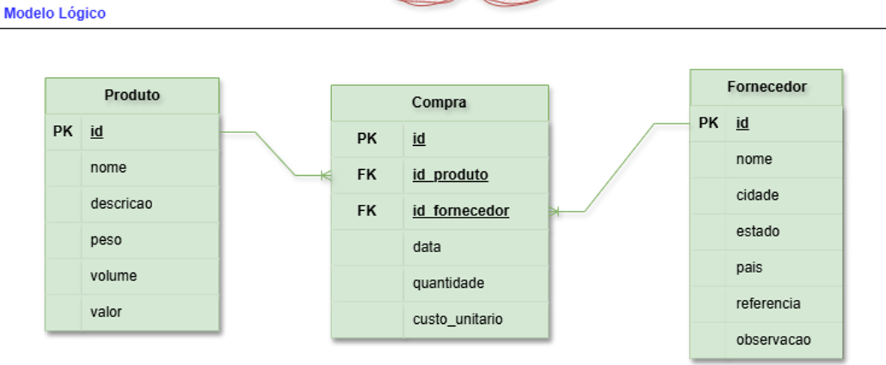
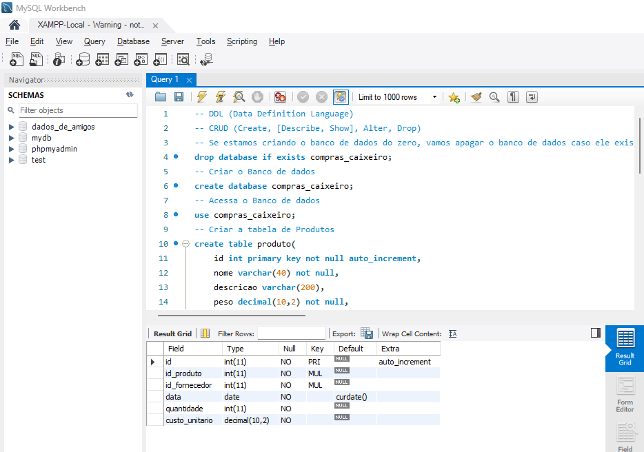
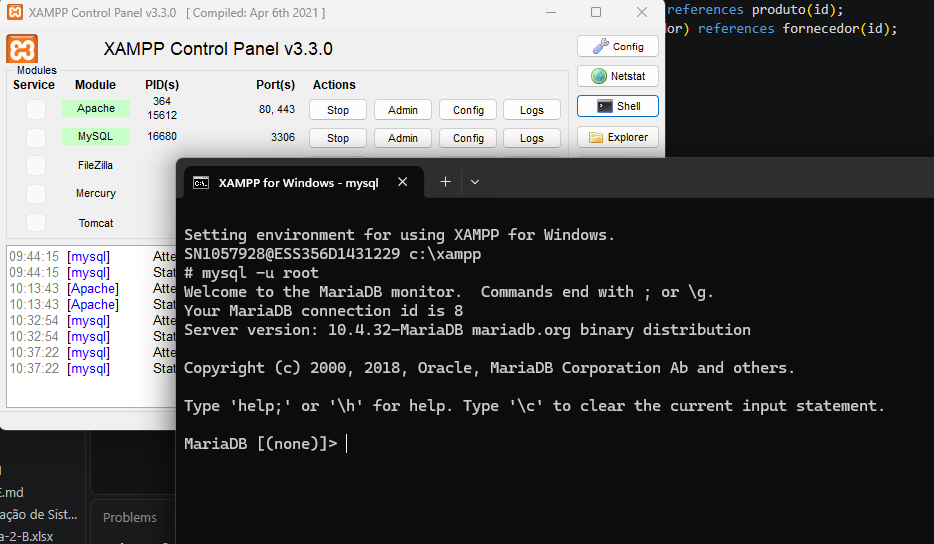
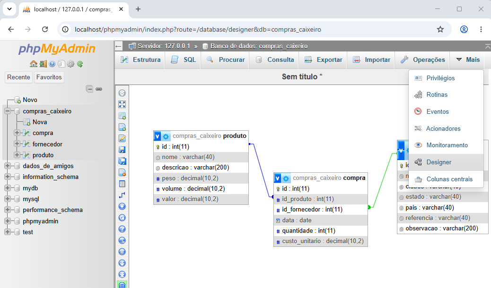

# Aula04 - SQL

### Capacidades Técnicas
- 9 Utilizar linguagem de definição de dados (DDL)
- 10 Utilizar linguagem de manipulação de dados (DML)

## Conhecimentos
  - 2.2 SQL (Structured Query Language)
  - 2.4  DDL (Data Definition Language)
    - 2.4.1 CREATE DATABASE
    - 2.4.2 DROP DATABASE
    - 2.4.3 USE
    - 2.4.4 CREATE TABLE
    - 2.4.5 ALTER TABLE
    - 2.4.6 DROP TABLE
    - 2.4.7 CREATE INDEX
    - 2.4.8 DROP INDEX

## SQL - Structured Query Language (Linguagem de Consulta Estruturada)
é a linguagem padrão usada para criar, consultar, atualizar e gerenciar dados em bancos de dados relacionais
### Divisões da linguagem SQL
- DDL - Data Definition Language (Linguagem de Definição de Dados)
- DML - Data Manipulation Language (Linguagem de Manipulação de Dados)
- DCL - Data Control Language (Linguagem de Controle de Dados)
- DQL - Data Query Language (Linguagem de Consulta de Dados)

## Prática
Vamos criar com SQL o banco de dados do: **Sistema de Compras do Caixeiro Viajante** cujo MER foi apresentado na aula anterior.
- O banco de dados será criado no SGBD MySQL Workbench.

|Entidade|Atributo|Tipo|Tamanho|Descrição|
|-|-|-|-|-|
|Produto|id|int|11|Chave primária|
|Produto|nome|varchar|40|nome do produto|
|Produto|descrição|varchar|200|descrição do produto|
|Produto|peso|decimal|10,2|peso em Kg|
|Produto|volume|decimal|10,2|volume em litros|
|Produto|valor|decimal|10,2|valor em reais|
|Produto|quantidade|int|11|Atributo derivado do cáclulo da diferença entre compra e venda|
|Fornecedor|id|int|11|Chave primária|
|Fornecedor|nome|varchar|40|nome do fornecedor|
|Fornecedor|cidade|varchar|40|endereço cidade|
|Fornecedor|estado|varchar|40|endereço estado|
|Fornecedor|pais|varchar|40|endereço pais|
|Fornecedor|referencia|varchar|40|endereço referencia|
|Fornecedor|observação|varchar|200|outros dados do fornecedor|
|Compra|id|int|11|Chave primária|
|Compra|id_produto|int|11|Chave estrangeira, referencia: Produto(id)|
|Compra|id_fornecedor|int|11|Chave estrangeira, referencia: Fornecedor(id)|
|Compra|data|Date||Data da compra|
|Compra|quantidade|int|11|Quantidade comprada|
|Compra|custo_unitario|decimal|10,2|Custo unitário da mercadoria|
|Compra|total|decimal|10,2|Atributo derivado do cálculo da quantidade vezes o custo_unitário|



## Script de criação do banco de dados DDL
Crie uma pasta chamada **bd_caixeiro** e dentro dela crie um arquivo chamado `caixeiro_ddl.sql` com o seguinte conteúdo:
```sql
-- DDL (Data Definition Language)
-- CRUD (Create, [Describe, Show], Alter, Drop)
-- Se estamos criando o banco de dados do zero, vamos apagar o banco de dados caso ele exista
drop database if exists compras_caixeiro;
-- Criar o Banco de dados
create database compras_caixeiro;
-- Acessa o Banco de dados
use compras_caixeiro;
-- Criar a tabela de Produtos
create table produto(
    id int primary key not null auto_increment,
    nome varchar(40) not null,
    descricao varchar(200),
    peso decimal(10,2) not null,
    volume decimal(10,2) not null,
    valor decimal(10,2) not null
);
-- Criar a tabela de Fornecedor
create table fornecedor(
    id int primary key not null auto_increment,
    nome varchar(40) not null,
    cidade varchar(40) not null,
    estado varchar(40) not null,
    pais varchar(40) not null,
    referencia varchar(40) not null,
    observacao varchar(200)
);
-- Criar tabela de Compra
create table compra(
    id int primary key not null auto_increment,
    id_produto int not null,
    id_fornecedor int not null,
    data Date default(curdate()) not null,
    quantidade int not null,
    custo_unitario decimal(10,2) not null
);
-- Criar as chaves estrangeiras (Relacionamentos)
alter table compra add constraint possui foreign key (id_produto) references produto(id);
alter table compra add constraint fornece foreign key (id_fornecedor) references fornecedor(id);

-- Vendo as tabelas criadas
show tables;
describe produto;
describe fornecedor;
describe compra;
```
- Para executar o script, abra o MySQL Workbench, conecte-se ao servidor, copie e cole o script na janela de consulta (query) e clique no botão de raio para executar o script.

- Ou abra o terminal do MySQL, conecte-se ao servidor e execute o script com o comando `source caminho/para/o/arquivo/caixeiro_ddl.sql`.
- Ou abra o XAMPP e clique em start no MySQL e em terminal, digite `mysql -u root`, copie e cole o script

- Ou abra o Xampp, clique no botão Admin do MySQL, abra o PhpMyAdmin, clique no banco de dados compras_caixeiro, clique na aba SQL, copie e cole o script e clique no botão Executar.
- Clique em Designer para ver o DER Lógico


# Atividades
- Crie o script ddl.sql para criar o banco de dados do **[Projeto: Gestão de Pedidos](https://github.com/wellifabio/sesi_bcd_aula03_mer_der_dd_dados_2026.git)**
- Crie o script dml.sql para inserir dados no banco de dados do sistema que você desenvolveu na aula03