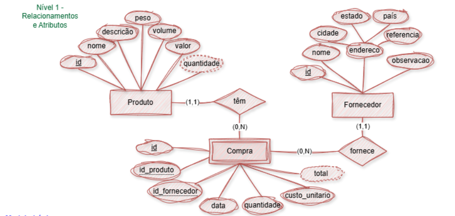

# Aula05 - Manipulação de dados com SQL

## Capacidades técnicas
- 9 Utilizar linguagem de definição de dados (DDL)
- 10 Utilizar linguagem de manipulação de dados (DML)
- 11 Utilizar funções nativas do banco de dados

## Conhecimentos
  - 2.5 Migração de dados
    - 2.5.1 Exportação de dados
    - 2.5.2 Importação de dados
  - 2.6  DML (Data Manipulation Language)
    - 2.6.1 INSERT
    - 2.6.2 UPDATE
    - 2.6.3 DELETE
    - 2.6.4 SELECT

## Capacidades Socioemocionais
- 1 Demonstrar autogestão
- 2 Demonstrar pensamento analítico
- 4 Demonstrar autonomia

## Prática
Vamos executar o script de criação do banco de dados do Caixeiro Viajante, que será utilizado para a prática de manipulação de dados com SQL.

|MER DER Conceitual - BD Caixeiro Viajante|
|-|
||

- Crie uma pasta na área de trabalho com o nome `compras_caixeiro`;
- Abra a pasta com VsCode dentro dela crie um arquivo chamado `ddl.sql`.
- Copie e cole o Script abaixo no arquivo `ddl.sql` e salve o arquivo.

```sql
-- DDL (Data Definition Language)
-- CRUD (Create, [Describe, Show], Alter, Drop)
-- Se estamos criando o banco de dados do zero, vamos apagar o banco de dados caso ele exista
drop database if exists compras_caixeiro;
-- Criar o Banco de dados
create database compras_caixeiro;
-- Acessa o Banco de dados
use compras_caixeiro;
-- Criar a tabela de Produtos
create table produto(
    id int primary key not null auto_increment,
    nome varchar(40) not null,
    descricao varchar(200),
    peso decimal(10,2) not null,
    volume decimal(10,2) not null,
    valor decimal(10,2) not null
);
-- Criar a tabela de Fornecedor
create table fornecedor(
    id int primary key not null auto_increment,
    nome varchar(40) not null,
    cidade varchar(40) not null,
    estado varchar(40) not null,
    pais varchar(40) not null,
    referencia varchar(40) not null,
    observacao varchar(200)
);
-- Criar tabela de Compra
create table compra(
    id int primary key not null auto_increment,
    id_produto int not null,
    id_fornecedor int not null,
    data Date default(curdate()) not null,
    quantidade int not null,
    custo_unitario decimal(10,2) not null
);
-- Criar as chaves estrangeiras (Relacionamentos)
alter table compra add constraint possui foreign key (id_produto) references produto(id);
alter table compra add constraint fornece foreign key (id_fornecedor) references fornecedor(id);

-- Vendo as tabelas criadas
show tables;
describe produto;
describe fornecedor;
describe compra;
```
- Execute o script no MySQL Workbench ou em outro cliente SQL, para criar o banco de dados e as tabelas.
- Vamos criar outro arquivo chamado `dml.sql` e criar um script de manipulação de dados, para inserir os dados da [planilha](./dados_caixeiro.xlsx) que criamos na aula02 que agora está atualizada neste repositório, baixe-a e coloque-a na sua pasta. 
- Iniciaremos pelos dados da tabela `fornecedor`, inserindo um por vez.
```sql
-- DML - Data Manipulation Language
-- CRUD (Create, Read, Update, Delete) DML (Insert, Select, Update, Delete)
-- Acessando o banco de dados
use compras_caixeiro;
-- inserindo um fornecedor
insert into fornecedor (nome, cidade, estado, pais, referencia, observacao)
values('Socrates', 'Atenas', 'Atenas', 'Grécia', 'Panteão', 'Fornecedor de Lã');
-- Listando os fornecedores
select * from fornecedor;
-- Excluindo o fornecedor
delete from fornecedor where nome like 'Socrates';
-- Listando os fornecedores
select * from fornecedor;

-- Inserido os quatro fornecedores de uma vez
insert into fornecedor (nome, cidade, estado, pais, referencia, observacao)
values
('Socrates', 'Atenas', 'Atenas', 'Grécia', 'Panteão', 'Fornecedor de Lã'),
('Leônidas', 'Atenas', 'Atenas', 'Grécia', 'Porto', 'Sal e especiarias'),
('Hefesto', 'Sparta', 'Sparta', 'Grécia', 'Fonte', 'Ferreiro do baum'),
('Pitágoras', 'Olímpia', 'Olímpia', 'Grécia', 'Estádio', 'Especiarias');

-- Alterando um registro de fornecedor
update fornecedor set estado = 'AT' where nome like 'Socrates';
-- Listando os fornecedores
select * from fornecedor;
```
## importação de dados
- Vamos criar um arquivo chamado `produtos.csv` com o conteúdo a seguir, retirado da planilha `dados_caixeiro.xlsx` que você baixou, e vamos importar os dados para a tabela `produto` do banco de dados `compras_caixeiro`.
```csv
Id;Nome;Descrição;Peso;Volume;Valor
1;Lã;Lã de ovelha;1;30;310
2;Lã;Lã de alpaca;1;30;1800
3;Martelo;Bellota de orelha;1;2;50
4;Martelo;Sem orelha;1;2;50
5;Alicate;Universal;0,4;0,1;40
6;Alicate;De corte;0,25;0,1;30
7;Alicate;De bico;0,25;0,1;30
8;Sal;Marinho;1;0,725;4
9;Pimenta;Preta;1;2;25,5
10;Pimenta;Branca;1;2;100
11;Páprica;Doce;1;2,5;16
12;Páprica;Picante;1;2,5;20
13;Páprica;Defumada;1;2,5;35
14;Chimichurri;Mistura indiana;1;2,5;20
15;Café;Arábico;1;2,5;80
```
- Agora vamos importar os dados do arquivo `produtos.csv` para a tabela `produto` do banco de dados `compras_caixeiro`. Para isso, execute o seguinte comando SQL no MySQL Workbench ou em outro cliente SQL:

```sql
-- Importar dados de produtos do aquivo produtos.csv
load data infile 'Caminho do arquivo produtos.csv com as barras trocadas /'
into table produto
fields terminated by ';'
lines terminated by '\n'
ignore 1 rows;

-- Listando os fornecedores
select * from produto;
```
- Vamos importar também as compras do arquivo `compras.csv` com o conteúdo a seguir, retirado da planilha `dados_caixeiro.xlsx` que você baixou, e vamos importar os dados para a tabela `compra` do banco de dados `compras_caixeiro`.
```csv
Id;Nome;Descri��o;Peso;Volume;Valor
1;L�;L� de ovelha;1;30;310
2;L�;L� de alpaca;1;30;1800
3;Martelo;Bellota de orelha;1;2;50
4;Martelo;Sem orelha;1;2;50
5;Alicate;Universal;0,4;0,1;40
6;Alicate;De corte;0,25;0,1;30
7;Alicate;De bico;0,25;0,1;30
8;Sal;Marinho;1;0,725;4
9;Pimenta;Preta;1;2;25,5
10;Pimenta;Branca;1;2;100
11;P�prica;Doce;1;2,5;16
12;P�prica;Picante;1;2,5;20
13;P�prica;Defumada;1;2,5;35
14;Chimichurri;Mistura indiana;1;2,5;20
15;Caf�;Ar�bico;1;2,5;80
```
- Agora vamos importar os dados do arquivo `compras.csv` para a tabela `compra` do banco de dados `compras_caixeiro`. Para isso, execute o seguinte comando SQL no MySQL Workbench ou em outro cliente SQL:

```sql
-- Importar dados de compras do aquivo compras.csv
load data infile 'Caminho do arquivo produtos.csv com as barras trocadas /'
into table compra
fields terminated by ';'
lines terminated by '\n'
ignore 1 rows;

-- Listando os pedidos
select * from compra;
```