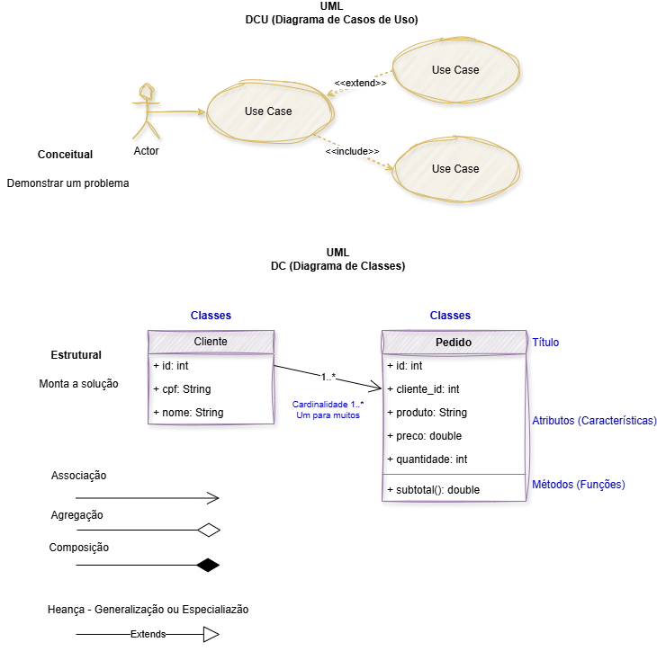

# Aula08 - UML DC (Diagrama de Classes)
- UML (Unified Modeling Language)
- DC (Diagrama de Classes)

## Relacionamento entre classes
- Associação simples
- Associação de Agregação
- Associação de Composição

### Tipos Principais de Relacionamentos
Os relacionamentos em diagramas de classe UML mostram como o código se organiza e compartilha dados:
• **Associação**: Uma conexão geral onde objetos de uma classe conhecem e usam objetos de outra classe (ex.: uma Pessoa que usa um Carro).
• **Agregação**: Um tipo de associação em que uma classe contém outra, mas elas podem existir de forma independente (ex.: um Time tem Jogadores).
• **Composição**: Uma relação de "parte-todo" mais forte, onde a parte não existe sem o todo (ex.: uma Casa tem Cômodos; se a casa acaba, os cômodos deixam de existir no contexto).

### [Exemplo: Pedidos MVC - Composição](https://github.com/wellifabio/sesi_pbe1_aula08_pedidos_mvc_uml_dc_2026.git)

### [Tutorial para iniciar um novo backEnd](https://github.com/wellifabio/sesi_pbe1_aula08_pedidos_mvc_uml_dc_2026/blob/main/docs/tutorial_mvc.md)

## Atividades
- 1 Conclua os CRUDs de clientes e pedidos desenvolvendo os controllers e rotas **alterar** e **excluir** no exemplo visto em aula.
    - Anexe print dos testes com o Tunder no README.md do seu repositório no Github.
- 2 