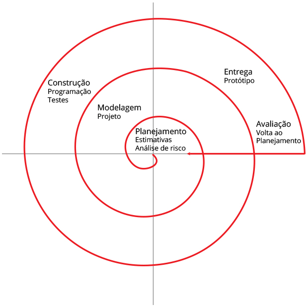

# Aula02
## Capacidades Básicas:
- 2 Registrar requisitos funcionais e não funcionais, de acordo com as informações coletadas com o cliente.
- 3 Identificar práticas ágeis de acordo com as características e requisitos do projeto

## Conhecimentos
- 3 Gerenciamento de Requisitos
    - 3.1 Definição
    - 3.2 Gestão de mudanças
    - 3.3 Validação de requisitos
- 4 Documentação de Requisitos
    - 4.1 Normas técnicas
    - 4.2 Estrutura padrão (modelos de documentação)
    - 4.3 Controle de Versões

## Metodologias
Duas são as metodologias aplicadas a engenharia de software, metodologia clássica e metodologia ágil.
### Metodologia Clássica
Pautada em etapas bem definiddas onde o produto "software" é entregue ao cliente nas etapas finais, logo apos doversos testes e é fechado um contrato de manutenção geralmente. Dentro da metodologia clpassica temos algumas abordagens
- **Cascata** (Waterfall)
- 
- **Espiral**
- 
### Metodologia ágil
O Manifesto Ágil (ou Manifesto para Desenvolvimento Ágil de Software) é um documento criado em 2001 por 17 desenvolvedores de software, que estabeleceu quatro valores fundamentais e doze princípios para guiar formas mais flexíveis, colaborativas e rápidas de desenvolver projetos

Algumas abordagens da metodologia ágil são SCRUM e KANBAN:

## Documentação de Requisitos
Tanto em metodologias clássicas ou ágeis os **requisitos** são o ponto de partida para a engenharia de software por encomenda. A correta documentação é essencial.

### UML
UML (Unified Modeling Language, ou Linguagem de Modelagem Unificada) é uma linguagem gráfica padronizada, utilizada para visualizar, especificar, construir e documentar sistemas de software orientados a objetos. Ela utiliza diagramas visuais (como de classes, casos de uso e sequência) para facilitar a comunicação entre desenvolvedores e partes interessadas, simplificando sistemas complexos.

### UML DCU (Diagrtama de Casos de Uso)
O Diagrama de Casos de Uso é uma ferramenta de modelagem visual, parte da Linguagem de Modelagem Unificada (UML), utilizada para descrever as **funcionalidades (requisitos funcionais)** de um sistema sob a perspectiva do usuário final
#### UML - DCU

#### Exemplo02
- Sistema de transporte por aplicativo 

- Sistema de controle de aulas em uma academia 

### Criticidades
- **Essencial**: Sem este requisito o sistema não funciona
- **Importante**: O sistema funciona sem, porém não resolve o problema completo
- **Desejável**: "A cereja do bolo" Melhora a UX (Experiência do Usuário), porém se não for implementado o sistema cumpre seu papel.

#### Atividades
Em seu caderno, ilustre os requisitos funcionais a seguir através de DCUs, um para cada requisito.

#### 1 - Sistema de controle de estoque de loja de roupas
- [RF001] **Tela de login**, contendo os campos email e senha e direcionando os **usuários** (Funcionários comuns e Gerência) para suas respectivas telas principais, caso suas credenciais sejam válidas, senão informa erro de login.
- [RF002] **Dashboard do estoque**, tela com um relatório de movimentações no estoque em forma de tabela e gráfico comparando os investimentos (Compras de produtos) e as vendas efetivas, acessada somente pelo **gerente** da loja.
- [RF003] **Tela de cadastro de mercadorias**, contendo os campos básicos como id (identificação para evitar produtos duplicados, gerada automaticamente pelo sistema), nome, descrição, preço e quantidade, todos os campos são obrigatórios, possui um campo de busca por nome para verificar se a mercadoria já não está cadastrada, acessada pelo **gerente** da loja.
- [RF004] **Tela de registro de Entradas (Compras)**, contendo os dados de aquisição/compra de mercadorias como quantidade, custo unitário e despesas gerais, cada compra registrada altera a quantidade de produtos no cadastro acrescentando a quantidade adquirida, acessada pelos **compradores** da loja.
- [RF005] **Tela de registro de Saídas (Vendas)**, contendo os dados do pedido de mercadorias como quantidade, preço unitário, subtotais, despesas de frete, mais impostos, valor total da venda. Cada venda registrada altera a quantidade de produtos no cadastro diminuindo a quantidade, acessada pelos **vendedores** da loja.
- [RF006] **Tela de cadastro de novo funcionário**, acessada somente pelo **gerente** da loja, onde ele preenche os dados no novo funcionário como nome, cargo, e-mail e senha provisória para que ele troque no primeiro acesso.

