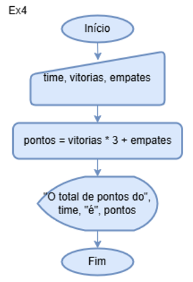
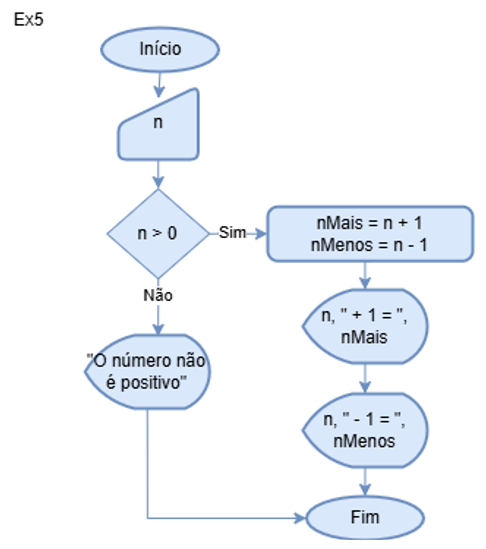
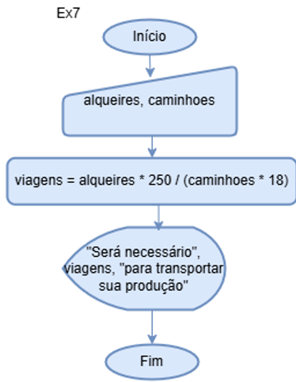
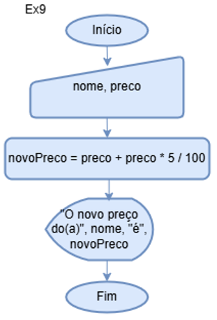
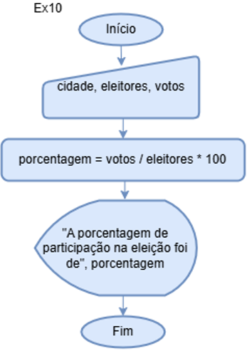

### Exercício 2
<table>
<tr>
    <th>Algoritmo</th><th>Fluxograma</th>
</tr>
<tr>
<td>

```
variáveis velocidade, distancia, tempo;
escreva("Digite a velocidade do seu carro")
leia(velocidade)
escreva("Digite a distância percorrida")
leia(distancia)
tempo = distancia / velocidade
escreva("O tempo gasto será de ", tempo, "horas")
```

</td>
<td>

</td>
</tr>
</table>

#### Teste de mesa
|Velocidade|distância|tempo|
|----------|---------|-----|
|   100    |         |     |
|          |  200    |     |
|          |         |  2  |

### Exercício 3
<table>
<tr>
    <th>Algoritmo</th><th>Fluxograma</th>
</tr>
<tr>
<td>

```
variáveis nome, salario, aumentoP, aumentoRS, novoSalario
escreva("Digite seu nome")
leia(nome)
escreva("Digite seu salário)
leia(salario)
escreva("Digite a porcentagem de aumento")
leia(aumentoP)
aumentoRS = salario * aumentoP / 100
novoSalario = salario + aumentoRS
escreva(nome, "seu novo salário é", novoSalario)
```
</td>
<td>

</td>
</tr>
</table>

#### Teste de mesa
|nome|salario|aumentoP|aumentoRS|novoSalario|
|----|-------|--------|---------|-----------|
|Ana |       |        |         |           |
|    |  3000 |        |         |           |
|    |       |   10   |         |           |
|    |       |        |  300    |           |
|    |       |        |         |   3300    |

### Exercício 4
<table>
<tr>
    <th>Algoritmo</th><th>Fluxograma</th>
</tr>
<tr>
<td>

```
variaveis time, vitorias, empates, pontos
escreva("Digite o nome do time de futebol")
leia(time)
escreva("Quantas vezes o time venceu?")
leia(vitorias)
escreva("Quantas vezes o time empatou?")
leia(empates)
pontos = vitorias * 3 + empates
escreva("O time", time," possui ", pontos, "pontos")
```
</td>
<td>

</td>
</tr>
</table>

#### Teste de mesa
|time|vitorias|empates|pontos|
|-|-|-|-|
|Corinthians||||
||5|||
|||3||
||||18|

### Exercício 5
<table>
<tr>
    <th>Algoritmo</th><th>Fluxograma</th>
</tr>
<tr>
<td>

```
variaveis n, nMais, nMenos
escreva("Digite um número inteiro positivo")
leia(n)
se(n > 0)
    nMais = n + 1
    nMenos = n - 1
    escreva("n + 1 = ", nMais)
    escreva("n - 1 = ", nMenos)
senão
    escreva("O número digitado não é positivo")
```
</td>
<td>

</td>
</tr>
</table>

#### Teste de mesa
|n|nMais|nMenos|
|-|-|-|
|10|||
||11||
|||9|

### Exercício 6
<table>
<tr>
    <th>Algoritmo</th><th>Fluxograma</th>
</tr>
<tr>
<td>

```
variáveis velocidade = 900, distancia, tempo;
escreva("Digite a distância percorrida pelo avião")
leia(distancia)
tempo = distancia / velocidade
escreva("O tempo gasto será de ", tempo, "horas")
```
</td>
<td>

</td>
</tr>
</table>

#### Teste de mesa
|Distancia|tempo|
|-|-|
|9000||
||10|

### Exercício 7
<table>
<tr>
    <th>Algoritmo</th><th>Fluxograma</th>
</tr>
<tr>
<td>

```
variáveis caminhoes, alqueires, viagens;
escreva("Digite quantos alqueires sua fazenda possui:")
leia(alqueires)
escreva("Digite quantos caminhões você possui:")
leia(caminhoes)
viagens = alqueires * 250 / (caminhoes * 18)
escreva("Será necessário ", viagens,
"para transportar sua produção")
```
</td>
<td>

</td>
</tr>
</table>

#### Teste de mesa
|alqueires|caminhoes|viagens|
|-|-|-|
|2|||
||2||
|||13.9|

### Exercício 8
<table>
<tr>
    <th>Algoritmo</th><th>Fluxograma</th>
</tr>
<tr>
<td>

```
variáveis raio, altura, area, volume;
escreva("Digite o raio de um cilindro:")
leia(raio)
escreva("Digite a altura do cilindro:")
leia(altura)
area = 2 * 3.14 * raio * (raio + altura)
volume  = 3.14 * raio * raio * altura
escreva("A área do cilindro é ", area,
", e o volume é", volume)
```
</td>
<td>

</td>
</tr>
</table>

#### Teste de mesa
|raio|altura|area|volume|
|-|-|-|-|
|2||||
||6|||
|||100.48||
||||75,36|

### Exercício 9
<table>
<tr>
    <th>Algoritmo</th><th>Fluxograma</th>
</tr>
<tr>
<td>

```
variáveis nome, preco, novoPreco;
escreva("Digite o nome da mercadoria:")
leia(nome)
escreva("Preço da mercadoria:")
leia(preco)
novoPreco = preco + preco * 5 / 100
escreva("O novo preco de ", nome, "é", novoPreco)
```
</td>
<td>

</td>
</tr>
</table>

#### Teste de mesa
|nome|preco|novoPreco|
|-|-|-|
|Bermuda|||
||100||
|||105|

### Exercício 10
<table>
<tr>
    <th>Algoritmo</th><th>Fluxograma</th>
</tr>
<tr>
<td>

```
variáveis cidade, eleitores, votos, porcentagem;
escreva("Digite o nome da cidade:")
leia(cidade)
escreva("Digite quantos eleitores esta cidade possui:")
leia(eleitores)
escreva("Digite quantos votos teve a última eleição:")
leia(votos)
porcentagem = votos / eleitores * 100
escreva("A porcentagem de votos da cidade", cidade, "
na última eleição foi de", porcentagem)
```
</td>
<td>

</td>
</tr>
</table>

#### Teste de mesa
|cidade|eleitores|votos|Porcentagem|
|-|-|-|-|
|Amparo||||
||30000|||
|||26532||
||||88,44|