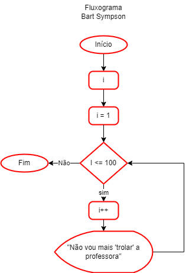
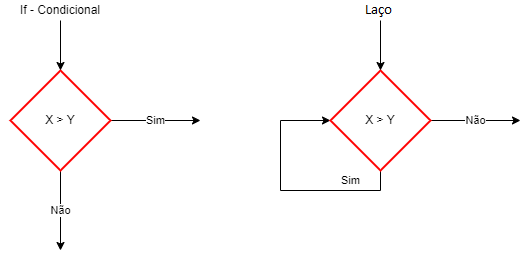

# Aula07 - Laços de repetição
## Laço "para/for"
O laço for em C é uma estrutura de repetição ideal para quando se sabe o número exato de iterações. Sua sintaxe unifica inicialização, condição e incremento: for(inicialização; condição; incremento) { ... }. Ele testa a condição antes de executar o bloco, sendo ideal para percorrer vetores ou contagens.
## Laço "Enquanto/while"
O laço while em C é uma estrutura de repetição que executa um bloco de código repetidamente enquanto uma condição especificada for verdadeira. A condição é testada antes da execução do bloco, significando que, se a condição for falsa inicialmente, o código dentro do laço nunca será executado.

## Exemplos
Programa do Bart Sympson que escreve uma fraze 100 vezes
- bart.c
```c
#include<stdio.h>
void main(){
	//Laço "para", utilizado quando sabemos quantas vezes queremos repetir
	for(int i = 0; i < 100; i++){
		printf("Não vou trolar a professora %d \n", i);
	}
}
```

- O programa a seguir repete até que o usuário digite o número 10
- repete.c
```c
#include<stdio.h>
void main(){
	//Laço "enquanto", utilizado quando não sabemos quantas vezes queremos repetir 		
	int i = 0;
	while(i != 10){
		printf("Digite um número qualquer, ou 10 para terminar");
		scanf("%d", &x);
	}
    printf("Fim.");
	getch();
}
```
### Laços mais comuns em C
```c
for(;;){}
while(){}
do{}while()
```
## Algoritmo contador
|abreviação|tipo|
|-|-|
|++|Conta mais um|
|--|Conta menos um|
|+=|Mais escolher **passo**|
|-=|Menos escolher **passo**|
|*=|Vezes escolher **passo**|
|/=|Dividido escolher **passo**|
## Fluxograma


## Exercícios
- 01 Crie um programa que escreva as 10 primeiras colocações, ex:
```bash
1º colocada(o)
2º colocada(o)
3º colocada(o)
4º colocada(o)
5º colocada(o)
6º colocada(o)
7º colocada(o)
8º colocada(o)
9º colocada(o)
10º colocada(o)
```
- 02 Escreva um programa que faça o mesmo que o anterior só que de dois em dois. Exemplo:
```bash
1º colocada(o)
3º colocada(o)
5º colocada(o)
7º colocada(o)
9º colocada(o)
```
- 03 Faça um programa que escreva os numerais de 1 a 20;
- 04 Faça um programa que escreva os numerais de 20 a 1;
- 05 Faça um programa que escreva na tela os numerais de 0 a 20 de 2 em 2;
- 06 Faça um programa que escreva na tela os numerais de 20 a 0 de 4 em 4;
- 07 Faça um programa que peça para o usuário digitar um número qualquer porém só termine quando o usuário digitar o número 4;
- 08 Faça um programa que funcione como o anterior porém mostre o quadrado do número digitado;
- 09 Faça um programa que imprima todas as tabuadas do 1 ao 10;
- 10 Faça um programa que solicite que o usuário digite um valor inteiro, positivo e imprima todos os valores entre 0 e o número digitado de 2 em 2;
- 11 Faça um programa que solicite que o usuário digite um valor inteiro, positivo e imprima todos os valores ímpares entre 0 e o número digitado;
- 12 Faça um programa que imprima na tela a soma dos valores inteiros entre 0 e 100;
- 13 Faça um programa que peça para o usuário digitar um número inteiro positivo e calcule o fatorial deste número;

## Correções
- ex01.c
```c
#include<stdio.h>

void main(){
	for(int i = 1; i <= 10; i++){
		printf("%d colocada(o)\n",i);
	}
	getch();
}
```
- ex02.c
```c
#include <stdio.h>
#include <windows.h>

void main(){
	SetConsoleOutputCP(CP_UTF8);
	for(int i = 1; i < 10; i+=2){
		printf("%dº colocada(o)\n", i);
	}
	getch();
}
```
- ex07.c
```c
#include <stdio.h>
#include <windows.h>

void main(){
	SetConsoleOutputCP(CP_UTF8);
	int n;
	do{
		printf("Digite o número 4:\n");
		scanf("%d", &n);
	}while(n != 4);
	printf("Até que emfim, obrigado!");
	getch();
}
```
- ex08.c
```c
#include <stdio.h>
#include <windows.h>

void main(){
	SetConsoleOutputCP(CP_UTF8);
	int n;
	do{
		printf("Digite o número 4:\n");
		scanf("%d", &n);
		printf("O quadrado de %d é %d\n", n, n * n);
	}while(n != 4);
	printf("Até que emfim, obrigado!");
	getch();
}
```
- ex09.c
```c
#include <stdio.h>
#include <windows.h>

void main(){
	SetConsoleOutputCP(CP_UTF8);
	for(int x = 0; x <= 10; x++){
		for(int y = 1; y <= 10; y++){
			printf("%d x %d = %d\t", y, x, x * y);
		}
		printf("\n");
	}
	getch();
}
```
- ex11.c
```c
#include <stdio.h>
#include <windows.h>

void main(){
	SetConsoleOutputCP(CP_UTF8);
	int n;
	printf("Digite um número inteiro positivo:\n");
	scanf("%d", &n);
	for(int i = 1; i < n; i+=2){
		printf("%d, ",i);	
	}
	getch();
}
```
- ex12.c
```c
#include <stdio.h>
#include <windows.h>

void main(){
	SetConsoleOutputCP(CP_UTF8);
	int acumulador = 0;
	for(int i = 1; i <= 100;i++){
		acumulador += i;
	}
	printf("A soma dos números entre 0 e 100 é %d", acumulador);
	getch();
}
```