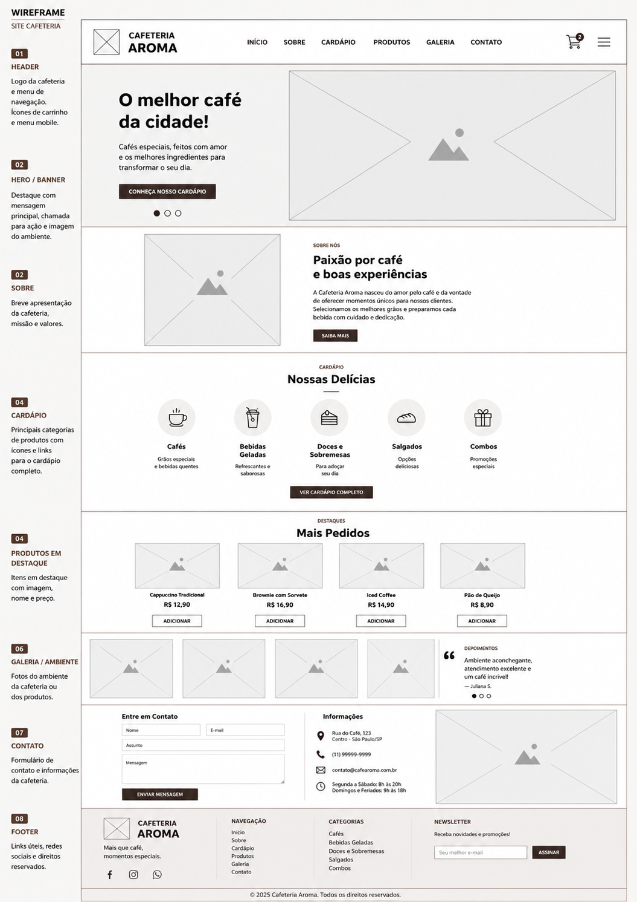

# Aula 01  - Revisão

Para realizarmos uma revisão sobre frontend, crie o site conforme wireframe abaixo

<div assign = "center">

</div>

# Paleta de Cores - Cafeteria Aroma

Esta paleta foi criada para transmitir uma sensação de **aconchego, elegância e sofisticação**, utilizando tons inspirados em café, madeira e creme.

---

## Cores Principais

| Nome        | Hex       | Uso                                     |
| ----------- | --------- | --------------------------------------- |
| Café Escuro | `#4A2F21` | Cabeçalho, rodapé e títulos importantes |
| Marrom Café | `#6F4E37` | Botões, links e elementos de destaque   |
| Caramelo    | `#D9B382` | Botões principais, detalhes e ícones    |
| Creme       | `#FFFAF5` | Fundo principal do site                 |
| Branco      | `#FFFFFF` | Cards, formulários e áreas de conteúdo  |

---

## Cores de Texto

| Nome             | Hex       | Uso                         |
| ---------------- | --------- | --------------------------- |
| Texto Principal  | `#2F241F` | Títulos e textos principais |
| Texto Secundário | `#6F625B` | Parágrafos e descrições     |
| Branco           | `#FFFFFF` | Texto sobre fundos escuros  |

---

## Cores de Apoio

| Nome             | Hex       | Uso                            |
| ---------------- | --------- | ------------------------------ |
| Borda Clara      | `#EADFD5` | Bordas dos cards e formulários |
| Fundo Secundário | `#F7EDE4` | Seções alternadas              |
| Destaque Claro   | `#FFE0B8` | Tags e pequenos detalhes       |
| Hover do Botão   | `#E5C49D` | Estado hover dos botões        |

---

## Variáveis CSS

```css
:root{
    --primary: #6F4E37;
    --primary-dark: #4A2F21;
    --secondary: #D9B382;

    --background: #FFFAF5;
    --surface: #FFFFFF;

    --text: #2F241F;
    --muted: #6F625B;

    --border: #EADFD5;
    --section: #F7EDE4;

    --highlight: #FFE0B8;
    --hover: #E5C49D;
}
```

---

## Aplicação da Paleta

| Elemento          | Cor                      |
| ----------------- | ------------------------ |
| Header            | `#4A2F21`                |
| Menu              | `#FFFFFF`                |
| Hero (Overlay)    | `rgba(47, 36, 31, 0.62)` |
| Fundo Geral       | `#FFFAF5`                |
| Seções Alternadas | `#F7EDE4`                |
| Cards             | `#FFFFFF`                |
| Títulos           | `#2F241F`                |
| Texto             | `#6F625B`                |
| Botão Principal   | `#D9B382`                |
| Hover do Botão    | `#E5C49D`                |
| Rodapé            | `#4A2F21`                |
| Texto do Rodapé   | `#FFFFFF`                |

---

