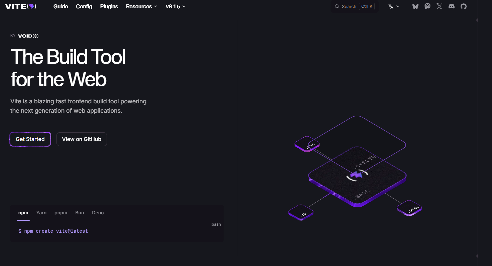
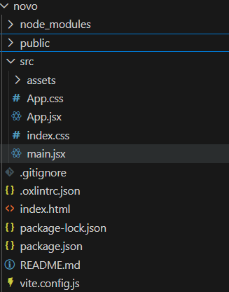

# Aula 02 - Vite com React

Para conhecer o framework acesse: https://vite.dev/



Criando o projeto

No terminal, execute:

```bash
npm create vite@latest
```

O assistente fará algumas perguntas.

## Nome do projeto

Digite o nome do projeto.

Exemplo:

```text
✔ Project name:
teste
```

---

## Framework

Selecione:

```text
React
```

---

## Variante

Selecione:

```text
JavaScript + React Compiler
```

---

# Entrando na pasta do projeto

Após a criação:

```bash
cd nomedoprojeto
```

---

# Instalando as dependências

Execute:

```bash
npm install
```

Esse comando instalará todas as bibliotecas necessárias para o funcionamento do projeto.


Desta forma no Visual Studio o projeto vai aparecer assim


---

# Executando o projeto

Execute:

```bash
npm run dev
```

O terminal exibirá uma saída semelhante a esta:

```text
VITE v7.x.x

Local:   http://localhost:5173/
Network: http://192.168.x.x:5173/
```

Abra o navegador e acesse:

```text
http://localhost:5173
```

---