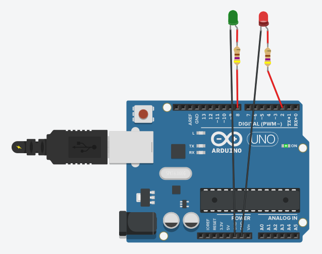

# Aula02 - Componentes eletrônicos básicos

## [ThinkerCad](https://www.tinkercad.com/)

### Capacidades Técnicas
- 1 Identificar as diferenças entre as aplicações do IoT e IIoT 
- 2 Identificar os tipos de hardwares e soluções disponíveis 

### Conhecimentos
- 1 Automação em IoT 
  - 1.1 Residencial  
  - 1.2 Pessoal 
  - 1.3 Industriais  
  - 1.4 Aplicações 
- 2 Requisitos para Instalação 
  - 2.1 Hardware 
    - 2.1.1 Conectividade 
    - 2.1.2 Periféricos 
  - 2.2 Sensores e Atuadores 
    - 2.2.1 Interfaces de I/O 
    - 2.2.2 Analógica
## Simulação 01 - Cricuito simples com interruptor e dois leds
### Componentes
- 1 Bateria de 9 V
- 1 Interruptor
- 2 LEDs (vermelho e verde)
- 2 resistores de 470 Ω (para os LEDs)


## Simulação 02 - Circuito com atraso na troca dos LEDs
Simule um sinalizador de saída de garagem que usa um transistor NPN como chave e um capacitor para criar um atraso na troca dos LEDs e utiliza apenas componentes básicos.

### Componentes
- 1 transistores NPN (BC548, BC547 ou 2N2222)
- 2 LEDs (vermelho e verde)
- 2 resistores de 470 Ω (para os LEDs)
- 1 resistor de 10 kΩ (polarização da base)
- 1 capacitor eletrolítico de 470 µF a 1000 µF
- Bateria de 9 V

### Esquema de ligação


## Funcionamento
- Ao ligar a alimentação:
- O capacitor inicialmente está descarregado.
- A base do transistor demora alguns instantes para atingir a tensão de - condução.
- O LED verde permanece aceso.
- Após alguns segundos:
- O capacitor carrega.
- O transistor satura.
- O LED vermelho acende também.
- O tempo aproximado é dado por:
```
Tempo ≈ R × C
```
- Por exemplo:
```
10 kΩ + 470 µF → cerca de 4 a 5 segundos
10 kΩ + 1000 µF → cerca de 10 segundos
```

## Com arduino UNO piscando as luzes
### Componentes
- 1 Arduino UNO
- 2 LEDs (vermelho e verde)
- 2 resistores de 470 Ω (para os LEDs)

## Código
```cpp
int verde = 8;
int vermelho = 2;

void setup()
{
  pinMode(verde, OUTPUT);
  pinMode(vermelho, OUTPUT);
}

void loop()
{
  digitalWrite(verde, 1);
  digitalWrite(vermelho, 0);
  delay(1000);
  digitalWrite(verde, 0);
  digitalWrite(vermelho, 1);
  delay(1000);
}
```
O led verde está ligado na porta digital 8 e o led vermelho na porta digital 2 do Arduino. O código faz com que os dois leds acendam alternadamente, com um atraso de 1 segundo entre cada troca.
## Atividade
Replique o circuito do sinalizador de garagem utilizando o Arduino UNO e os componentes listados acima. Teste o código fornecido e observe o funcionamento dos LEDs.
## Desafio
Faça o mesmo circuito porém sem o uso do Arduino, utilizando apenas componentes eletrônicos básicos.