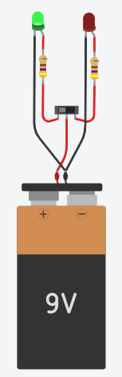

# Aula02 - Componentes eletrônicos básicos
## [ThinkerCad](https://www.tinkercad.com/)

### Capacidades Técnicas
- 1 Identificar as diferenças entre as aplicações do IoT e IIoT 
- 2 Identificar os tipos de hardwares e soluções disponíveis 

### Conhecimentos
- 1 Automação em IoT 
  - 1.1 Residencial  
  - 1.2 Pessoal 
  - 1.3 Industriais  
  - 1.4 Aplicações 
- 2 Requisitos para Instalação 
  - 2.1 Hardware 
    - 2.1.1 Conectividade 
    - 2.1.2 Periféricos 
  - 2.2 Sensores e Atuadores 
    - 2.2.1 Interfaces de I/O 
    - 2.2.2 Analógica
## Cricuito simples com interruptor e dois leds
### Componentes
- 1 Bateria de 9 V
- 1 Interruptor
- 2 LEDs (vermelho e verde)
- 2 resistores de 470 Ω (para os LEDs)


## Desafio01
Simule um sinalizador de saída de garagem que usa um transistor NPN como chave e um capacitor para criar um atraso na troca dos LEDs e utiliza apenas componentes básicos.

### Componentes
- 2 transistores NPN (BC548, BC547 ou 2N2222)
- 2 LEDs (vermelho e verde)
- 2 resistores de 220 Ω (para os LEDs)
- 1 resistor de 10 kΩ (polarização da base)
- 1 capacitor eletrolítico de 470 µF a 1000 µF
- Bateria de 9 V

### Esquema de ligação
```
              +5V
               |
      +--------+---------+
      |                  |
    220Ω              220Ω
      |                  |
 LED Verde          LED Vermelho
      |                  |
      |             Coletor
      |                  |
      |             Transistor NPN
      |             Emissor
      |                  |
     GND-----------------+

Base do transistor
      |
     10kΩ
      |
     +5V
      |
   Capacitor
  (+)      (-)
  +5V     Base
  ```

## Funcionamento
- Ao ligar a alimentação:
- O capacitor inicialmente está descarregado.
- A base do transistor demora alguns instantes para atingir a tensão de - condução.
- Durante esse tempo o LED verde permanece aceso.
- Após alguns segundos:
- O capacitor carrega.
- O transistor satura.
- O LED vermelho acende e o verde apaga.
- O tempo aproximado é dado por:
```
Tempo ≈ R × C
```
- Por exemplo:
```
10 kΩ + 470 µF → cerca de 4 a 5 segundos
10 kΩ + 1000 µF → cerca de 10 segundos
```