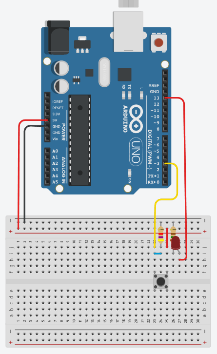
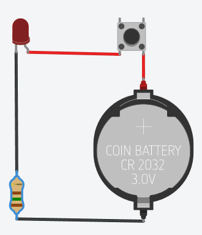
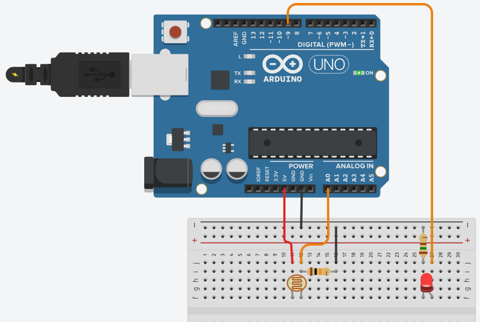
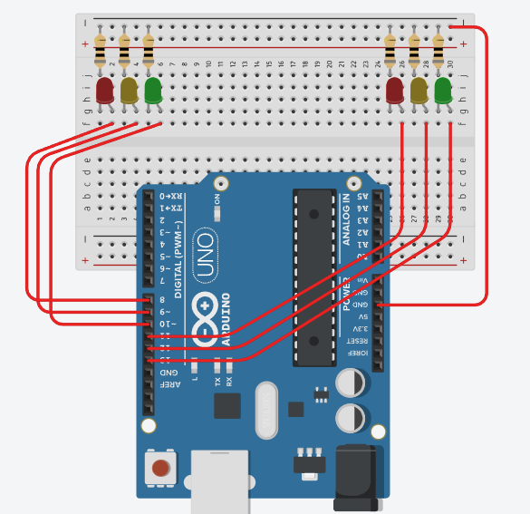
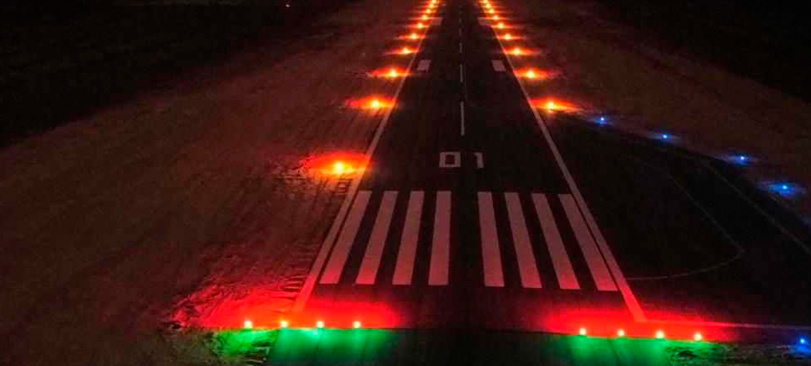
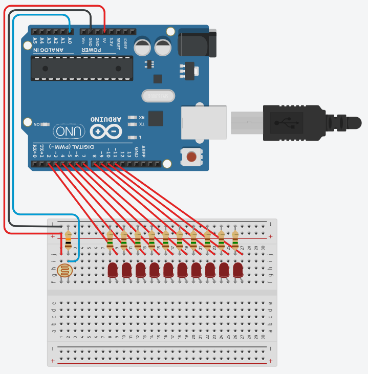
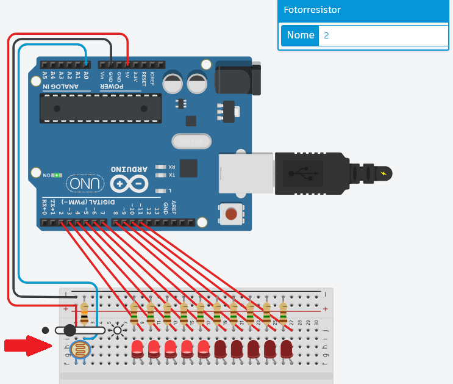

# Aula03 - Desafios com Arduíno
## [TinkerCad](https://www.tinkercad.com/)

## Capacidades Técnicas
- 1 Identificar as diferenças entre as aplicações do IoT e IIoT 
- 2 Identificar os tipos de hardwares e soluções disponíveis 
- 3 Configurar ambientes de desenvolvimento

## Conhecimentos
- 1 Automação em IoT 
  - 1.1 Residencial  
  - 1.2 Pessoal 
  - 1.3 Industriais  
  - 1.4 Aplicações 
- 2 Requisitos para Instalação 
  - 2.1 Hardware 
    - 2.1.1 Conectividade 
    - 2.1.2 Periféricos 
  - 2.2 Sensores e Atuadores 
    - 2.2.1 Interfaces de I/O 
    - 2.2.2 Analógica 
- 3 Ambiente de desenvolvimento 
  - 3.1 IDE (Integrated Development Enviroment) 
    - 3.1.1. Tipos 
    - 3.1.2. Seleção 
  - 3.2. Configuração

## Demonstrações
### Obtendo o click de um botão de comando - Arduino UNO

||Para esta demosntração, vamos montar um circuito com um Arduino UNO, uma placa de ensaios, 1 led e um botão, também precisaremos de dois resistores de 150 ohms para o led e de 4.7 khms para o botão.|
|-|-|
||O mesmo circuito pode ser montado sem a utilização do Arduino porém fica limitado apenas a pressionar o botão e segurar para acender o led|

- A programação a seguir acende o led ao clicar no botão, e se estiver aceso apaga o led ao clicar no botão, caso o botão seja mantido pressionado o led ficará piscando.

```c
/* 1 BOTAO LIGA DESLIGA LED */
int led = 13; // Variável led assume o valor do pino 3
int botao = 3; // variável recebe o valor proveniente do sensor
int status = 0; //Variável do status do led desligado
void setup(){ // Configurações - Pinos de Entrada/Saída
pinMode(led, OUTPUT); // Configura led(pino 13) como saída
pinMode(botao, INPUT); // Configura botao(pino 3) como entrada
} // Fim da configuração
void loop(){ // Início do Programa
	int click = digitalRead(botao);
	if (click == 1){ // Se pino 3 for igual a 1:
		if(!status){
			digitalWrite(led,1); // Aciona pino 13, NL=1 ou 5V na saída 13
			status = 1;
		} else { 
			digitalWrite(led,0); // Desliga a saída digital 13
			status = 0;
		}
		delay(500); // Tempo para remover flutuações ao clicar no botão
	}
} // Fim do Programa
```
A vantagem da utilização de um **microcontrolador** como o Arduino é justamente a programação e a interconectividade com a internet através de uma **shield wifi** ou ethernet.

### Acendendo um led com um sensor de luz - Arduino UNO
Esta demonstração replica o que acontece nos postes de nossas ruas todas as noites, acendem automaticamente ao anoitecer. Precisaremos de dois resistores, um de 10kohm para o sensor de luminosidade (Fotoresistor) e um de 150ohm para o led.
<br>
```c
int sensorLuminosidade = 0;
int led = 9;

void setup(){
	pinMode(led, OUTPUT);
}
void loop(){
	int nivelDeLuz = analogRead(sensorLuminosidade);
	nivelDeLuz = map(nivelDeLuz, 0, 900, 255, 0);
	nivelDeLuz = constrain(nivelDeLuz, 0, 255);
	analogWrite(led, nivelDeLuz);
}
```
O sensor de luminosidade, como a maioria dos sensores é analógico, significa que possui níveis de luminosidade, é um resistor que vai de 0 a 900 níveis diferentes, a porta número 9 configurada como saída também é analógica, fornecendo de 0 a 255 níveis de tenção, usamos a função map() para converter a escala de 0 a 900 para 0 a 255, desta forma quanto menos luz ambiente mais forte o led brilha.


## Situação Problema 01 - Semáforo de duas vias
|Contextualização|
|-|
|Sr. Adolfo é síndico de um condomínio muito grande, possui mais de 1500 casas com duas vagas na garagem cada uma. Nos horários de pico o cruzamento principal que leva a portaria fica congestionado, para resolver o problema precisa instalar um semáforo|


|Desafio|
|-|
|Construa dois semaforos controlados por um Arduíno UNO para o cruzamento da portaria, como protótipo, deixe a luz verde com 2,5 segundos, a amarela com 0,5 segundos e o vermelho com 3 segundos, garanta que não haja acidentes causados por má programação dos semáforos|

#### Protótipo
- 6 leds (2 verdes, 2 amarelos e 2 vermelhos)
- 6 resistores de 150 ohms

- Pode replicar o mesmo esquema para o seu semáforo, lembrando que os dois semáforos devem ser controlados pelo mesmo Arduíno UNO.
- Desenvolva a programação para o Arduíno UNO, garantindo que os dois semáforos funcionem de forma sincronizada, evitando que ambos fiquem verdes ao mesmo tempo.
- Acrescente mais dois leds para simular a travessia de pedestres, garantindo que o semáforo de pedestres fique verde apenas quando o semáforo de veículos estiver vermelho.

## Situação Problema 02 - Acendendo as luzes da pista de pouso
|Contextualização|
|-|
|O mesmo condomínio também possui uma pista de pouso para pequenos aviões. Ao cair da noite luzes precisam ser acendidas para garantir a segurança dos voos.|

|Desafio|
|-|
|Construa um circuito semelhante ao anterior com um Fotoresistor e 10 leds, ao simular o aumento da luminozidade os leds vão se apagando|
||
|Um sensor Fotoresistor, 1 resistor de 10kohm, 10 Leds e 10 resistores 470ohm|
||