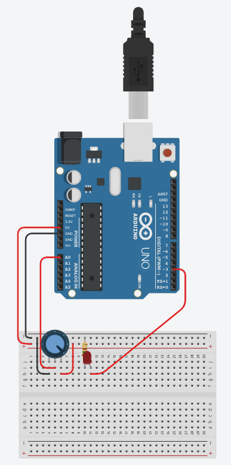
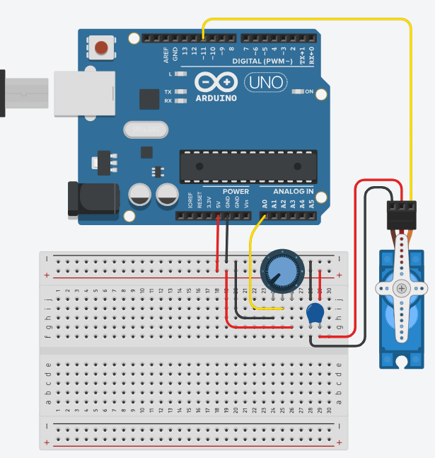
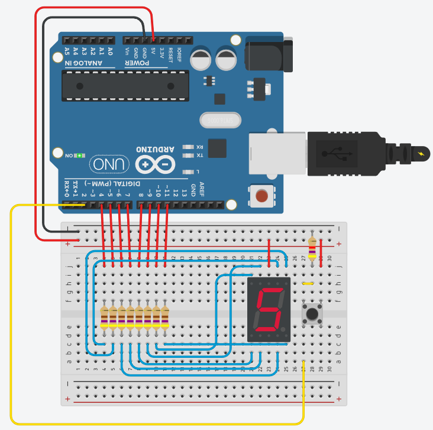
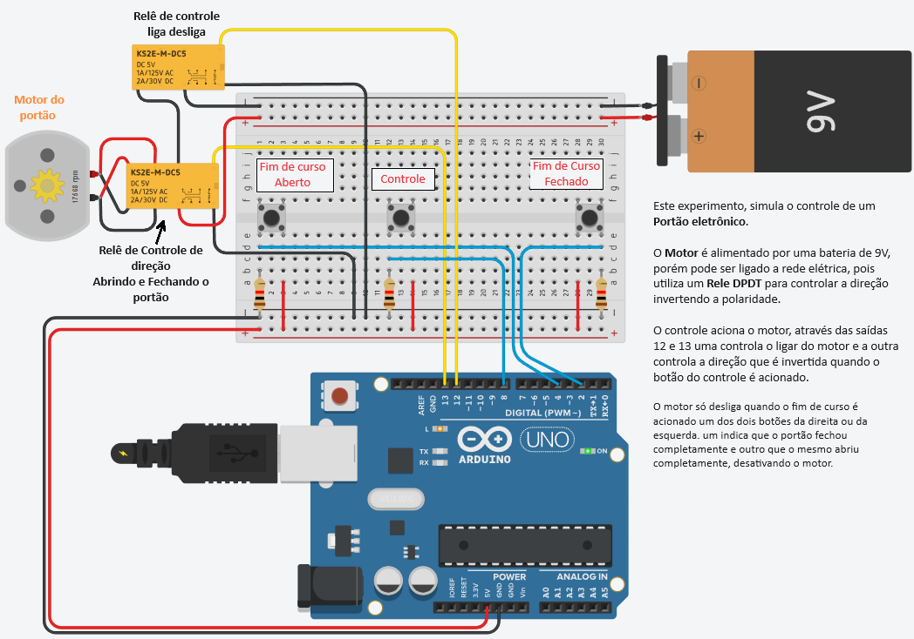
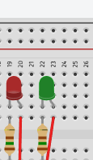
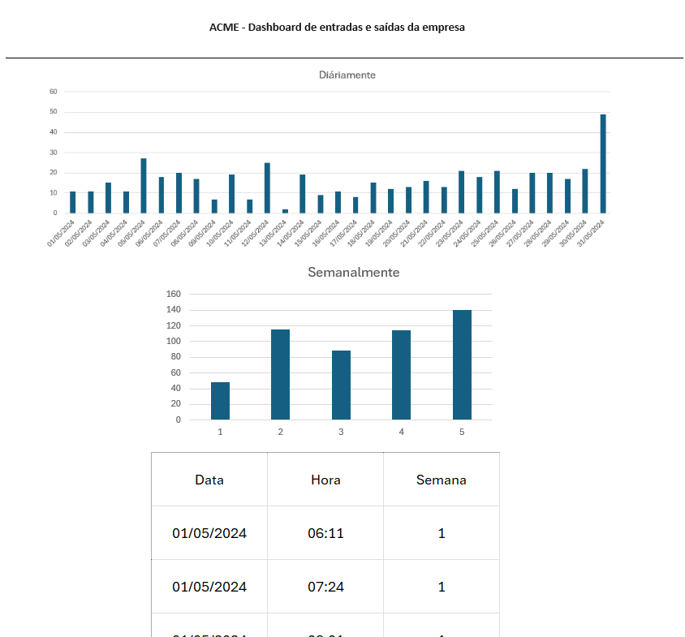

# Aula04 - Desafios com Arduíno
## [TinkerCad](https://www.tinkercad.com/)

### Capacidades Técnicas
- 1 Identificar as diferenças entre as aplicações do IoT e IIoT 
- 2 Identificar os tipos de hardwares e soluções disponíveis 
- 6 Conectar as aplicações gráficas

### Capacidades Socioemocionais
- 1 Demonstrar autogestão
- 2 Demonstrar pensamento analítico

## Conhecimentos
- 1 Automação em IoT 
  - 1.1 Residencial  
  - 1.2 Pessoal 
  - 1.3 Industriais  
  - 1.4 Aplicações 
- 2 Requisitos para Instalação 
  - 2.1 Hardware 
    - 2.1.1 Conectividade 
    - 2.1.2 Periféricos 
  - 2.2 Sensores e Atuadores 
    - 2.2.1 Interfaces de I/O 
    - 2.2.2 Analógica 
- 3 Ambiente de desenvolvimento 
  - 3.1 IDE (Integrated Development Enviroment) 
    - 3.1.1. Tipos 
    - 3.1.2. Seleção 
  - 3.2. Configuração
- 6 Interfaces com elementos visuais 
  - interativos 
  - 6.1 Linguagens 
    - 6.1.1 HTML 
    - 6.1.2 CSS  
    - 6.1.3 JavaScript 
  - 6.2 Aplicações  
    - 6.2.1 Visualização de Dados 
    - 6.2.2 Interatividade 

## Práticas com Arduino
### Demonstração: Potenciômetro
Potenciômetro é um tipo de resistor porém com um botão que aumenta e diminui a resistência, excelente para controlar o nível de sensibilidade de outros sensores, ou atuadores.
<br>A demonstração a seguir contêm um Arduino UNO, um potenciômetro de150Kohms um led vermelho e um resistor de 150 ohms.
<br>
<br>O código a seguir dmonstra o controle da potência de um led controlada por um potenciometro, através da eletrônica digital com um processador Arduino.
```c
int led = 3; // Variável led assume o valor do pino 3
int potenc = 0; // variável recebe o valor proveniente do sensor
void setup(){ // Configurações - Pinos de Entrada/Saída
pinMode(led, OUTPUT); // Configura led(pino 3) como saída
} // Fim da configuração
void loop(){ // Início do Programa
 potenc = analogRead(0); // Variável potenci recebe o valor da entrada A0
if (potenc >512){ // Se pino 2 for igual a 1:
digitalWrite(led,1); // Aciona pino 13, NL=1 ou 5V na saída 3
} else { // Senão:
digitalWrite(led,0); // Desliga a saída digital 3
} // Fim do Senão
} // Fim do Programa
```

### Experimento 01
Controlando um servo motor (Micro Servo) ao girar um potenciômetro de 1Kohm, para isso será necessário utilizar um capacitor de 100 mF para completar o circuito com o Micro servo.
<br>
<br> **Desafio:** Codifique um programa para controlar o giro do Micro servo ao girar o potenciômetro.

### Experimento 02
#### Visor de sete seguimentos
A seguir temos um Arduino UNO conectado a um display de 7 seguimentos para isso será necessário 8 resistores de 470ohms, um resistor de 4.7 Kohms ligado ao Botão de comando.
<br>
<br>O código a seguir é um contador de 0 a 9 quando o botão é pressionado
```c
int a = 4, b = 5, c = 6, d = 7, e = 8, f = 9, g = 10;
int botao = 2;
int num = 0;
int entrada[7] = {a,b,c,d,e,f,g};
int display[10][7] = {{a,b,c,d,e,f},{b,c},{a,b,d,e,g},{a,b,c,d,g},{b,c,f,g},{a,c,d,f,g},{a,c,d,e,f,g},{a,b,c},{a,b,c,d,e,f,g},{a,b,c,f,g}};
void setup() {
	for(int i=0;i<7;i++) pinMode(entrada[i],OUTPUT);
	pinMode(botao,INPUT);
}
void loop() {
	int click = digitalRead(botao);
	delay(100); //Evitar flutuaçao no clique
	if(click) num++;
	if(num < 10) numero(num); else num = 0;
}
void numero(int coluna) {
	for(int i=0;i<7;i++) digitalWrite(entrada[i],1);
	for(int linha=0;linha<7;linha++){
		digitalWrite(display[coluna][linha],0);
	}
}
```
#### Desafio:
- 1 Troque o **botão** por um **potenciômetro** que quando girado aumente de 0 a 9 e mostre no display.
- 2 Acrescente mais um **display** e amplie o escopo para de 00 a 99

## Situação desafiadora:

|Contextualização|
|-|
|Você faz parde de uma equipe de automação industrial onde aplica seus Iot com o objetivo de aumentar a segurança e eficiência de seus clientes, a indústria que vocês estão atendendo precisa de um portão eletrônico que será conectado a internet gerando um relatório de quantas vezes foi acionado durante o dia, mês, ano, ... |

|Desafios|
|-|
|1 - O experimento a seguir tem o objetivo de controlar este portão, você precisa replicá-lo otilizando os componentes a seguir: Placa de ensaio pequena, Arduino UNO R3, Bateria de 9V, Motor CC, 2 Relês DPDT, 3 Botões e 3 Resistores 1kohm.|
||
|1 - Monte no simulador o protótipo semelhante ao da imagem utilizando 1 Arduino uno, desenvolva o código de que controla o acionamento do portão |
|2 - Acrescente nesta simulação dois leds um vermelho e um verde que deverão ficar piscando alternadamente para sinalizar a saida de garagem da empresa: |

|Entregas|
|-|
|Deixe salvo na sua conta do ThinkerCad para apresentar através de Screenshots ao final desta etapa de simulações através de formulários|

## Análise de dados - WEB UI (User interfaca)

## Conhecimentos
- 6 Interfaces com elementos visuais 
  - interativos 
  - 6.1 Linguagens 
    - 6.1.1 HTML 
    - 6.1.2 CSS  
    - 6.1.3 JavaScript 
  - 6.2 Aplicações  
    - 6.2.1 Visualização de Dados 
    - 6.2.2 Interatividade 
## Situação desafiadora:

|Contextualização|
|-|
|Após concluir o protótipo do portão com Arduino, apenas controlamos o portão, porém se trocarmos pou um microcontrolador que possua conectividade com rede/internet via Wifi como ESP32, os dados de abertura e fechamento do portão podem ser enviados para um banco de dados e podem ser facilmente analizados gerando informações importantes para a Gestão|

|Desafio|
|-|
|Esta pasta de aula possui um arquivo chamado **dados.csv**, nele está uma tabela com dados que representam o histórico de quantas vezes o portão foi aberto durante o mês de maio de 2026, Crie uma UI Web com um Dashboard de pelo menos dois Gráficos:<br>- Um que mostre a atividade do portão diáriamente<br>- e um que mostre semanalmente.|
|Utilize HTML, CSS e JavaScript ou um framework a sua escolha como React Vite por exemplo|
|Os gráficos devem ficar semelhantes aos do wireframe, porém os valores são um pouco diferentes, pois a imagem é apens um esboço|

### Wireframe


|Entrega|
|-|
|Repositório do github na sua conta com git Pages Habilitado|
|Não é necessário Back-end, e os dados podem ser convertidos para JSON se necessário|

## Entregas
Tire print de todos os seus experimentos dede a aula02 até a aula04.
  - Poste com led e fotoresistor que acende a noite e apage de dia, com e sem ARDUINO
  - Semáforo de duas vias e pedestre com Arduino
  - Pista de pouso com leds e Arduino
  - Virando um servo motor com potenciômetro, capacitor e Arduino
  - Experimento com display de 7 segmentos e Arduino e Desafio de display duplo
  - Desafio do simulador de portão eletrônico com Arduino
  - Dashboard Web com gráficos de abertura do portão, publicado com github pages e preenchido o caminho em About (Sobre) do repositório
### Instruções para entrega
- 1 No mesmo repositório do Dashboard Web, crie uma pasta chamada **prints** e coloque todas as imagens dos experimentos.
- 2 No arquivo **README.md** do repositório, descreva cada experimento e coloque a imagem correspondente.
- Envie o link do repositório no **[formulário de entrega](https://forms.gle/7uiLscum4khxrV4o6)**.

### [Exemplo de entrega](https://github.com/wellifabio/sesi_iot_thinkercad_portao_dashboard_2026.git)
