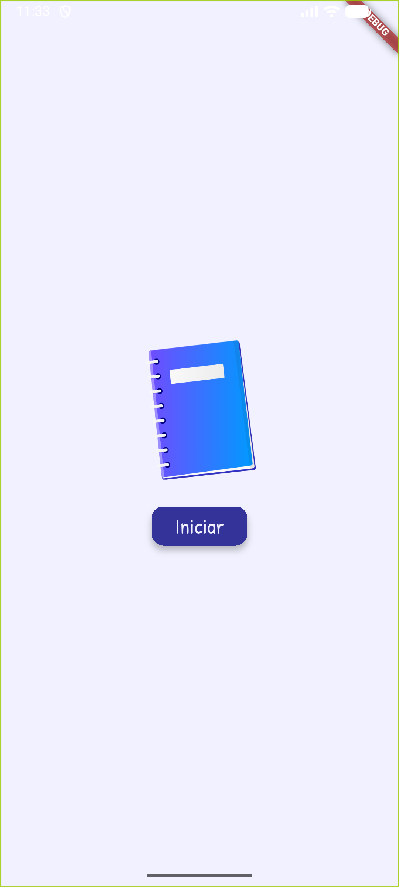
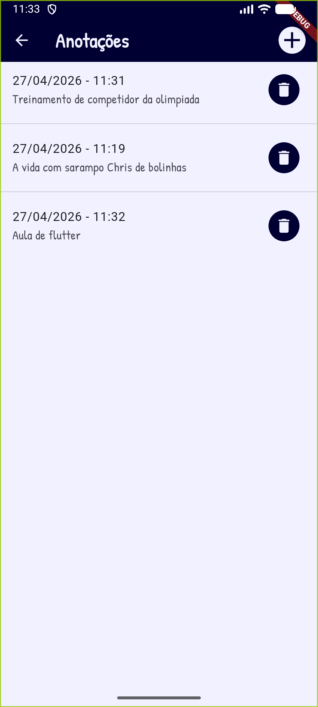
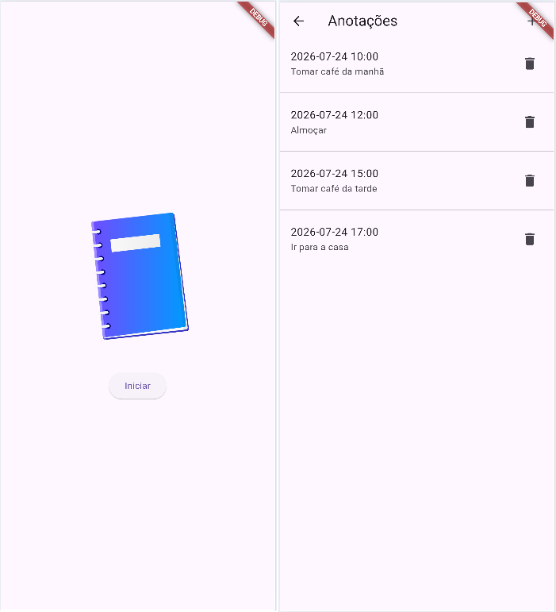

# Aula01 - Persistência de dados no celular

## Conhecimentos
- 5 Persistência de dados em dispositivos móveis 
  - 5.1 Armazenamento 
    - 5.1.1 Interno 
    - 5.1.2 Externo 
  - 5.2 Banco de dados interno
  - Temas
  - Fontes
  - Animações

## Tecnologias
- Flutter
- VsCode
- Android Studio

|Temas|WidGets|
|-|:-:|
|Tema|ThemeData.light().copyWith()|
|Imagens|Image.asset(), Icon()|
|Assincronicidade|async|
|Carregar e salvar dados em Arquivo local|path_provider|
|Conversão de dados, classe Model de MVC|CSV|
|Utilização de fontes de texto externas .ttf|assets/fonts|
|Botões de controle de conteúdos em tela|ElevatedButton()|
|Animação|Splash Screen, Transform.rotate e opacidade|

### Limpar o ambiente de desenvolvimento
- Limpar cache do flutter, abra o power shell como administrador e execute os comandos:

```bash
flutter clean
flutter doctor
flutter upgrade
# caso apresente erro no upgrade
flutter upgrade --force
```

## Atividade: App de Anotações
### Contextualização
Com o constate uso de celular, sempre precisamos anotar alguma informação e utilizamos diversos meios como alternativa
### Desafio
construir um App simples em flutter de um bloco de anotações personalizado que armazene os dados internamente
- Funcionalidade CRUD com arquivo de texto CSV
- Uma tela de Splash com alguma animação de entrada e/ou saída
- Uma tela Home com a lista de anotações contendo data, hora e texto_da_anotacao
### Telas de um App de exemplo
|Splash Screen|Home|
|-|-|
|||

## Tutoriais

- [DatePicker](./datepicker.md)
- [Calendar](./calendar.md)
- [SQLite](./sqlite.md)

## [Vamos iniciar juntos](https://meet.google.com/ifd-whhw-zyw)
- Inicie un novo projeto em flutter chamado flutter_anotacoes
- Baixe deste repositório os arquivos em Assets com imagens e fontes
- Crie a estrutura de pastas em lib e configure o pubspec.yaml da seguinte forma:
```
lib
    main.dart
    ui
        home.dart
        splash.dart
        style
            colors.dart
            theme.dart
    root
        file.dart
    models
        anotacao.dart
```
```
assets
    icone.png
    fonts
        PatrickHand-Regular.ttf
```
- pubspec.yaml
```yaml
dependencies:
  flutter:
    sdk: flutter
  path_provider: ^2.1.5
  intl: ^0.18.0

dev_dependencies:
  flutter_test:
    sdk: flutter
  flutter_lints: ^6.0.0
  flutter_launcher_icons: ^0.14.4

flutter_launcher_icons:
  android: true
  ios: true
  image_path: "assets/icone.png"
  remove_alpha_ios: true

flutter:
  uses-material-design: true
  assets:
    - assets/
  fonts:
    - family: PatrickHand
      fonts:
        - asset: assets/fonts/PatrickHand-Regular.ttf
```

### Arquivos base
- main.dart
```dart
import 'package:flutter/material.dart';

import 'ui/splash.dart';

void main() {
  runApp(MaterialApp(title: "Anotações", home: Splash()));
}
```
- ui/splash.dart
```dart
import 'package:flutter/material.dart';

import 'home.dart';

class Splash extends StatefulWidget {
  const Splash({super.key});

  @override
  State<Splash> createState() => _SplashState();
}

class _SplashState extends State<Splash> {
  @override
  Widget build(BuildContext context) {
    return Scaffold(
      body: Center(
        child: Column(
          mainAxisAlignment: MainAxisAlignment.center,
          spacing: 40,
          children: [
            Image.asset("./assets/icone.png", width: 200),
            ElevatedButton(
              onPressed: () => Navigator.push(
                context,
                MaterialPageRoute(builder: (context) => Home()),
              ),
              child: Text("Iniciar"),
            ),
          ],
        ),
      ),
    );
  }
}
```
- models/anotacao.dart
```dart
class Anotacao {
  String data;
  String texto;
  Anotacao({required this.data, required this.texto});
  String toCSV() {
    return '$data,$texto';
  }
}
```

- ui/home.dart
```dart
import 'package:flutter/material.dart';
import '../models/anotacao.dart';

class Home extends StatefulWidget {
  const Home({super.key});

  @override
  State<Home> createState() => _HomeState();
}

class _HomeState extends State<Home> {
  List<Anotacao> anotacoes = [
    Anotacao(data: "2026-07-24 10:00", texto: "Tomar café da manhã"),
    Anotacao(data: "2026-07-24 12:00", texto: "Almoçar"),
    Anotacao(data: "2026-07-24 15:00", texto: "Tomar café da tarde"),
    Anotacao(data: "2026-07-24 17:00", texto: "Ir para a casa"),
  ];
  @override
  Widget build(BuildContext context) {
    return Scaffold(
      appBar: AppBar(
        title: Text("Anotações"),
        actions: [
          GestureDetector(
            onTap: () {},
            child: Container(
              margin: EdgeInsets.only(right: 20),
              child: Icon(Icons.add),
            ),
          ),
        ],
      ),
      body: Center(
        child: ListView.separated(
          itemBuilder: (context, i) => ListTile(
            title: Text(anotacoes[i].data),
            subtitle: Text(anotacoes[i].texto),
            trailing: Icon(Icons.delete),
          ),
          separatorBuilder: (_, _) => Divider(),
          itemCount: anotacoes.length,
        ),
      ),
    );
  }
}
```
