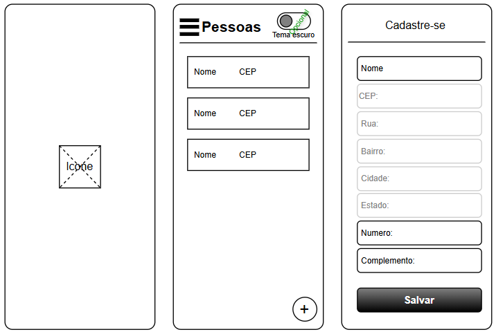
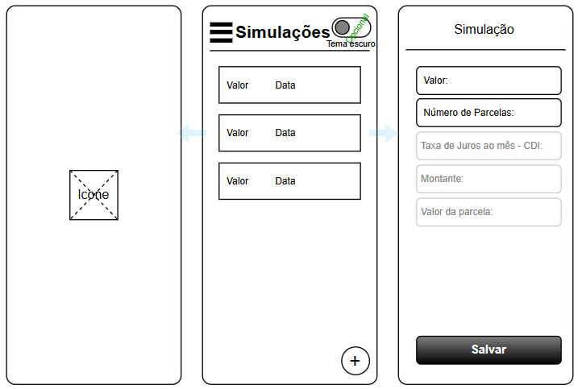
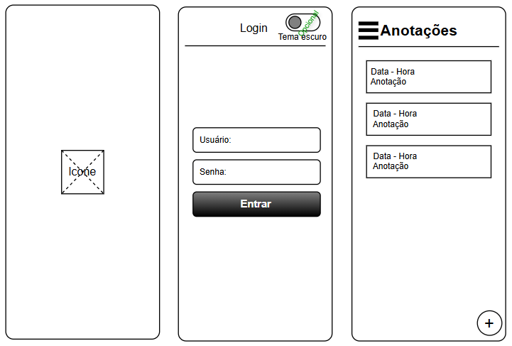

# Aula04 - Consumo de APIs externas

- API [ViaCEP](https://viacep.com.br/)
    - Exemplo com [JavaScript](https://viacep.com.br/exemplo/javascript/)
- API [Dummy JSON](https://dummyjson.com/docs/auth) Autenticação
- API [BCB - Banco Central do Brasil](https://bcb.gov.br/)
    - Exemplo de [requisição](https://api.bcb.gov.br/dados/serie/bcdata.sgs.4391/dados?formato=json), esta traz o histórico do CDI mensal desde 1986

### Capacidades Técnicas
- 7 Persistir dados em dispositivos móveis
- 8 Realizar a integração de dispositivos móveis aos serviços web
- 11 Utilizar os elementos da programação orientada a objetos em aplicações para dispositivos móveis

### Capacidades Socioemocionais
- 1 Demonstrar autogestão
- 2 Demonstrar pensamento analítico
- 3 Demonstrar inteligência emocional
- 4 Demonstrar autonomia

### Conhecimentos
- 6 Consumo de RESTfull web service 
  - 6.1 Envio de requisições
    - 6.1.1 GET 
    - 6.1.2 POST 
    - 6.1.3 PUT 
    - 6.1.4 DELETE 
  - 6.2 Manipulação de dados 
    - 6.2.1 JSON
    - 6.2.2 XML

## Exemplo de [consumo de API RESTfull - Agrotech](https://github.com/wellifabio/flutter_agrotech_api_jwt_crud_camera_2026.git)

## Situações desafiadoras
- **Escolha um** dos desafios e apresente concluído ao final da aula para o **instutor vistar**.

|Contextualização|
|-|
|Em qualquer App que possua uma tela de cadastro a utilização de uma API que consulte o CEP e preencha automaticamente os dados de endereço é essencial, também outras APIs públicas podem trazer informações importantes|

|Desafio 01|
|-|
|Desenvolva um aplicativo de cadastro de pessoas que possua os seguintes requisitos funcionais:|
|RF001 - Tela Splash com animação de entrada e saída|
|RF002 - Tela Home com cabeçalho, Menu lateral sandwish, uma lista de pessoas cadastradas e um botão [+] para adicionar novo cadastro|
 RF003 - Tela de Cadastro com os campos Nome, CEP, Número e Complemento editáveis e traga os campos (Rua:,Bairro:,Cidade:,Estado:) da API ViaCEP quando o campo CEP for preenchido, Botão para salvar o cadastro localmente no Celular|
|Wireframes|
||

|Desafio 02|
|-|
|Desenvo um aolicativo simulador de financiamentos com os seguintes requisitos funcionais:|
|RF001 - Tela Splash com animação de entrada e saída|
|RF002 - Tela Home com cabeçalho, Menu lateral sandwish, uma lista de financiamentos simulados e um botão [+] para adicionar nova simulação|
|RF003 - Tela de simulação com os campos, Valor desejado: e Número de parcelas:, O App deve obter a taxa de juros ao mês com base no DCI do mês atual obtido da API do Banco Central e calcular o Montante e o valor das parcelas, Botão para salvar a simulação localmente no celular|
|Wireframes|
||

|Desafio 03|
|-|
|Desenvo um aplicativo de bloco de anotações, semelhante ao criado na aula01 porçem com os seguintes requisitos funcionais:|
|RF001 - Tela Splash com animação de entrada e saída|
|RF002 - Tela de Loguin que utilize a API DummyJSON como autenticador, com os campos usuário [username] e senha[password], envio de dados para a API e se autenticado seguir para a proxima tela, senão exibir mensagem de acesso negado|
|RF003 - Tela Home com cabeçalho, Menu lateral sandwish, uma lista de anotações e um botão [+] para adicionar nova anotação|
|Wireframes|
||

|Mais instruções|
|-|
|Os wireframes são apenas ilustrativos para fornecer um norte ao desenvolvedor, posicione os elementos como preferir, utilize listas, ou cards ou outro tipo de UI, porém deixe a aparência intuitiva e profissional. Para qualquer um dos três desafios:  - importe uma **Fonte** a sua escolha do [google fonts](https://fonts.google.com/),  - aplique um tema com paleta de cores a sua escolha, tema **claro e escuro** com o botão para alternar (Opcional) ou obter o tema do sistema ao iniciar o aplicativo,  - desenhe um **ícone** para o aplicativo (pode utilizar IA para ajudar nesta tarefa)  - No menú coloque como item obrigatório Splash (Para o professor poder verificar a animação depois que o App já iniciou) e Sair (Que deve encerrar o aplicativo [Só funciona no emulador ou aparelho]) Caso utilize auxilio de **IA generativa no seu código**, procure entender o código gerado, pois o instrutor pode pedir sua explicação e pode ter dificuldade de te dar suporte|

|Entregas|
|-|
|O projeto escolhido deve ser entregue em um repositório **GitHub**, contendo o código-fonte completo do aplicativo, incluindo todas as dependências e instruções para execução. Além disso, deve ser incluído um arquivo README.md detalhando as funcionalidades implementadas, **Print das telas** e um link para baixar o **arquivo.APK**|