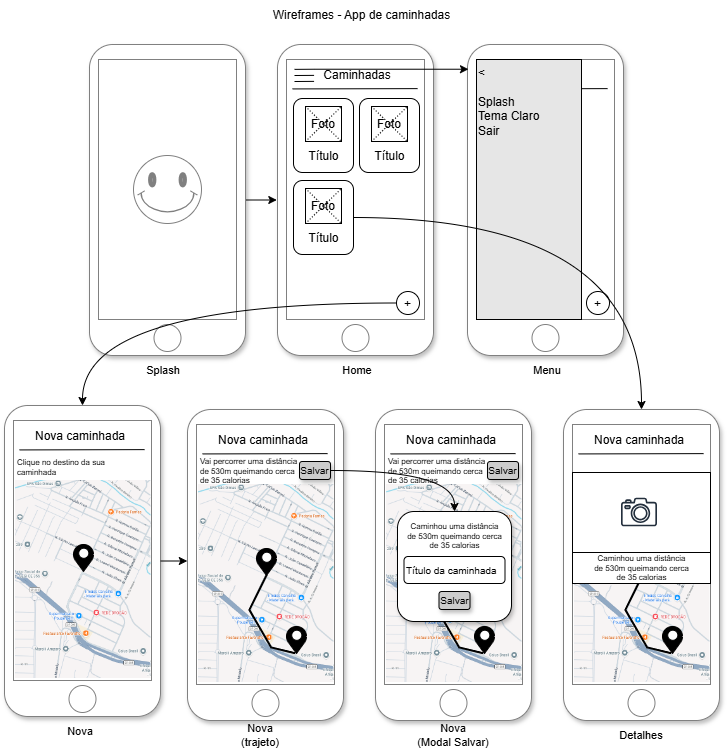

# Aula05 - Mapas

---
## Google Maps [Tutorial](./google_maps.md)
- Tutorial que mostra uum mapa e obtém a latitude e longitude ao clicar em um ponto do mapa.
### Atividade
- 1 Crie o Projeto do tutorial.
    - Teste no **Emulador** (Não funciona no navegador) e tire **print**
    - Crie um ícone para o aplicativo
    - Crie o arquivo APK e copie para a pasta `assets/`
    - Envie para um repositório do github com o print no README.md
---

## Flutter Map [Tutorial](./flutter_maps.md)
- Gratuito, Open Source e **funciona no navegador** (Google Chrome)
- Tutorial que mostra um mapa e obtém a latitude e longitude ao clicar em um ponto do mapa.
### Atividade
- 1 Crie o Projeto do tutorial.
    - Teste e tire **print**
    - Crie um ícone para o aplicativo
    - Crie o arquivo APK e copie para a pasta `assets/`
    - Envie para um repositório do github com o print no README.md
---

## Flutter GPS [Tutorial](./gps.md)
Obter dados do sensor GPS do aparelho celular, útil com mapas
### Atividade
- 1 Crie o Projeto do tutorial.
    - Apenas teste

--- 

## Traçar rotas
### Google Maps [Tutorial](google_maps_rotas.md)
- Tutorial para traçar rotas entre dois pontos no mapa com google maps, **Funciona no Emulador**
### Flutter Maps [Tutorial](flutter_maps_rotas.md)
- Tutorial para traçar rotas entre dois pontos no mapa com flutter maps, **Funciona no Navegador**

### Atividade
- 1 Crie o Projeto do tutorial (Obtendo as rotas da API OSRM)
    - Teste e tire **print**
    - Crie um ícone para o aplicativo
    - Crie o arquivo APK e copie para a pasta `assets/`
    - Envie para um repositório do github com o print no README.md
---

## Apps de Exemplo utilizando Google Maps, GPS, OSRM e Flutter Maps.

### - [Traçar trajeto Google MAPS](https://github.com/wellifabio/sesi_ppdm2_flutter_maps_tracar_trajeto_2026.git)
Aplicativo que com Google Maps, GPS e OSRM:
- traça uma linha do seu local atual até um ponto clicado no mapa
- traça um **trajeto** do seu local atual até um ponto clicado no mapa

### - [Traçar trajeto FLutter MAPS](https://github.com/wellifabio/sesi_ppdm2_flutter_maps_nativo_trajeto_2026.git)
Aplicativo que com Flutter Maps, GPS e OSRM:
- traça uma linha do seu local atual até um ponto clicado no mapa
- traça um **trajeto** do seu local atual até um ponto clicado no mapa

### - [Flutter Pedal](https://github.com/wellifabio/sesi_ppdm2_flutter_pedal_gps_2026.git)
Aplicativo de registros de passeios de bicicleta
- Obtem a origem pelo GPS (Geolocalização)
- Utiliza mapas para marcar o destino
- Tira foto e registra os passeios armazenando os dados localmente

---
# Desafio - App Caminhadas
|Contextualização|
|-|
|Com o objetivo de manter a vida saudável, vamos desafiar nosso conhecimento e criar um aplicativo para registrar e acompanhar caminhadas:|

|Desafio 01|
|-|
|Desenvolva um aplicativo que permita aos usuários registrar e acompanhar suas caminhadas, utilizando tecnologias de geolocalização, mapas, fotos e armazenamento local:|
|RF001 - Tela Splash com animação de entrada e saída|
|RF002 - Tela Home com cabeçalho, Menu lateral sandwish com as opções (Splah, tema claro/escuro e Sair), uma lista de caminhadas cadastradas e um botão [+] para adicionar nova caminhada|
|RF003 - Tela de Nova caminhada com um mapa para selecionar o destino RF003.1 Assim que o destino for selecionado, o aplicativo deve: - traçar o trajeto, - calcular a distância,  - calcular a estimativa de:  - gasto calórico  - e de tempo de caminhada. RF003.2 Deve aparecer um botão [Salvar] que abre um **Modal** pedindo o título da caminhada registrando os dados localmente|
|RF004 - Tela de Detalhes da caminhada com mapa mostrando o trajeto, distância, gasto calórico, tempo de caminhada, título e foto da caminhada. Esta tela deve ser aberta quando o usuário clicar em uma caminhada cadastrada RF004.1 para as caminhadas que ainda não possuirem foto, mostrar um ícone de câmera que ao ser clicado deve abrir a câmera, tirar a foto e salvar|
|Wireframes|
||
|Os wireframes acima são apenas uma sugestão, você pode criar o seu próprio design, mas deve manter as funcionalidades descritas nos requisitos funcionais.|

|Entregas|
|-|
|Publique em um repositório do **GitHub**, contendo o código-fonte completo do aplicativo, incluindo todas as dependências e instruções para execução. Além disso, deve ser incluído um arquivo README.md com uma breve descrição, tecnologias utilizadas, **Print das telas** e um link para baixar o **arquivo.apk**|
|Apresente o projeto ao instrutor, executando em um dos aparelhos de celular disponibilizados pelo **SESI**|
