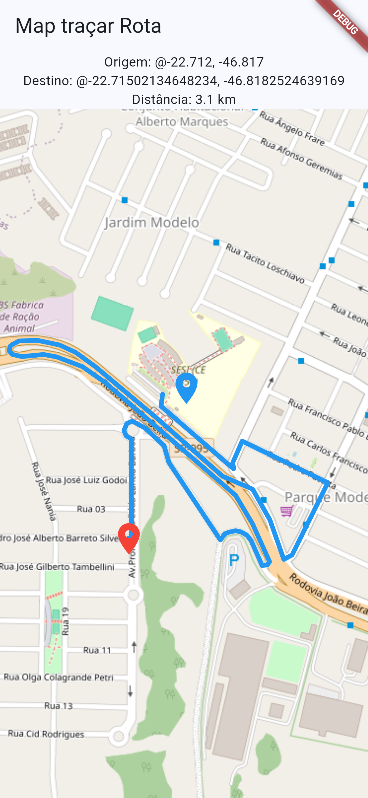

# Flutter Maps e API OSRM
Tutorial para traçar rotas entre dois pontos e calcular a distância entre eles no mapa com flutter maps, **Funciona no Navegador**
- Iniciar um novo app/projeto flutter, nome sujerido `flutter_rotas_nativo`
- Instalar as dependências necessárias:
  - Por linha de comando no terminal:
```bash
flutter pub add flutter_map
flutter pub add latlong2
flutter pub add http
flutter pub get
```
- O arquivo `pubspec.yaml` agregará um trecho semelhante ao abaixo:
```yaml
dependencies:
  flutter:
    sdk: flutter
  flutter_map: ^8.3.2
  http: ^1.6.0
  latlong2: ^0.10.1
```
- O código a seguir traça uma rota entre dois pontos no mapa quando o usuário clica em um ponto.
- O ponto de orime é o SESI Amparo
- Copie e cole no arquivo `lib/main.dart`
```dart
import 'dart:convert';

import 'package:flutter/material.dart';
import 'package:flutter_map/flutter_map.dart';
import 'package:latlong2/latlong.dart';
import 'package:http/http.dart' as http;

String formatarDistancia(double distanciaMetros) {
  if (distanciaMetros < 1000) {
    return '${distanciaMetros.round()} m';
  }

  final distanciaKm = distanciaMetros / 1000;
  final casasDecimais = distanciaKm >= 10 ? 0 : 1;
  return '${distanciaKm.toStringAsFixed(casasDecimais)} km';
}

void main() {
  runApp(MyApp());
}

class MyApp extends StatelessWidget {
  const MyApp({super.key});

  @override
  Widget build(BuildContext context) {
    return MaterialApp(
      title: 'Obter Posição no Mapa',
      theme: ThemeData(
        colorScheme: ColorScheme.fromSeed(seedColor: Colors.blue),
        useMaterial3: true,
      ),
      home: MapScreenOSM(),
    );
  }
}

class MapScreenOSM extends StatefulWidget {
  const MapScreenOSM({super.key});

  @override
  State<MapScreenOSM> createState() => _MapScreenOSMState();
}

class _MapScreenOSMState extends State<MapScreenOSM> {
  LatLng? _pontoClicado;
  final _pontoOrigem = LatLng(-22.7120000, -46.8170000); // SESI Amparo
  Set<Polyline> _Rotas = {};
  String mensagem = 'Destino: Clique em um ponto no mapa';
  String distanciaTexto = 'Distância: --';

  @override
  Widget build(BuildContext context) {
    return Scaffold(
      appBar: AppBar(title: Text("Map traçar Rota")),
      body: Center(
        child: Column(
          children: [
            Text(
              'Origem: @${_pontoOrigem.latitude}, ${_pontoOrigem.longitude}',
            ),
            Text(mensagem),
            Text(distanciaTexto),
            Expanded(
              child: FlutterMap(
                options: MapOptions(
                  initialCenter: _pontoOrigem, // SESI Amparo
                  initialZoom: 17.0,
                  onTap: (tapPosition, latLng) {
                    setState(() {
                      _pontoClicado = latLng;
                      mensagem =
                          'Destino: @${latLng.latitude}, ${latLng.longitude}';
                      distanciaTexto = 'Distância: calculando...';
                      buscarRota(_pontoOrigem, latLng);
                    });
                  },
                ),
                children: [
                  TileLayer(
                    urlTemplate:
                        'https://tile.openstreetmap.org/{z}/{x}/{y}.png',
                    userAgentPackageName:
                        'com.example.flutter_obter_posicao_map',
                  ),
                  PolylineLayer(polylines: _Rotas.toList()),
                  MarkerLayer(
                    markers: [
                      Marker(
                        point: _pontoOrigem,
                        width: 40,
                        height: 40,
                        child: Icon(
                          Icons.location_on,
                          color: Colors.blue,
                          size: 40,
                        ),
                      ),
                      if (_pontoClicado != null)
                        Marker(
                          point: _pontoClicado!,
                          width: 40,
                          height: 40,
                          child: Icon(
                            Icons.location_on,
                            color: Colors.red,
                            size: 40,
                          ),
                        ),
                    ],
                  ),
                ],
              ),
            ),
          ],
        ),
      ),
    );
  }

  Future<void> buscarRota(LatLng origem, LatLng destino) async {
    final url = Uri.parse(
      'https://router.project-osrm.org/route/v1/driving/'
      '${origem.longitude},${origem.latitude};'
      '${destino.longitude},${destino.latitude}'
      '?overview=full&geometries=geojson',
    );

    final response = await http.get(url);

    if (response.statusCode == 200) {
      final data = jsonDecode(response.body);
      final coords = data['routes'][0]['geometry']['coordinates'] as List;
      final distanciaMetros =
          (data['routes'][0]['distance'] as num?)?.toDouble() ?? 0.0;

      final pontos = coords.map((c) {
        return LatLng(c[1].toDouble(), c[0].toDouble());
      }).toList();

      setState(() {
        _Rotas = {
          Polyline(points: pontos, color: Colors.blue, strokeWidth: 5.0),
        };
        distanciaTexto = 'Distância: ${formatarDistancia(distanciaMetros)}';
      });
    } else {
      setState(() {
        distanciaTexto = 'Distância: indisponível';
      });
    }
  }
}
```
### Resultado
||Este app envia uma requisição com origem e destino para a API OSRM que responde com um vetor de ojetos com latitudes e longitudes, em seguida o google maps converte os dados e traça o trajeto nas ruas do mapa, calculando também a distância em metros, km ...|
|-|-|
