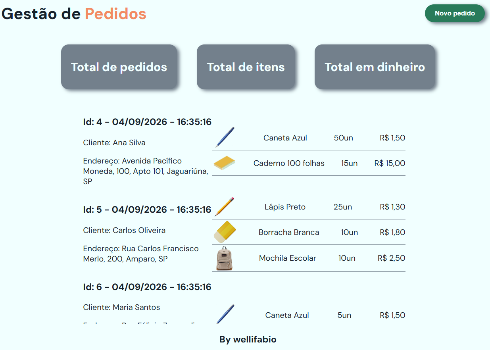

# Aula02 - Recursos avançados

## Criando Full-Stack com a dependência do prof Reenye na API
#### 1 Criar uma pasta para o Projeto e Abrir com VsCode
- Instalar globalmente a dependência backend-aula
```bash
npm i -g backend-aula
```
- 1 iniciar um novo backend
```bash
npx backend-aula backend
```
#### 2 Alterar o nome do banco de dados no arquivo **.env**
```js
PORT=3000
DATABASE_URL="mysql://root@localhost:3306/mydb"
```
de 
```js
PORT=3000
DATABASE_URL="mysql://root@localhost:3306/pedidos_exemplo"
```
#### 3 Editar o prisma/schema.prisma adicionando os models (tabelas e relacionamentos)
```js
generator client {
  provider = "prisma-client-js"
}

datasource db {
  provider = "mysql"
}

model produto {
  id        Int     @id @default(autoincrement())
  nome      String  @db.VarChar(40)
  descricao String  @db.VarChar(200)
  imagem    String? @db.VarChar(200)
  itens     item[]
}

model pedido {
  id          Int      @id @default(autoincrement())
  cliente     String   @db.VarChar(200)
  cep         String   @db.VarChar(10)
  numero      String?  @db.VarChar(10)
  complemento String?  @db.VarChar(20)
  data        DateTime @default(now())
  itens       item[]
}

model item {
  id         Int     @id @default(autoincrement())
  pedidoId   Int
  produtoId  Int
  quantidade Int
  preco      Decimal @db.Decimal(10, 2)
  pedido     pedido  @relation(fields: [pedidoId], references: [id])
  produto    produto @relation(fields: [produtoId], references: [id])
}
```
- Esquema criado com base no MER abaixo:

#### 4 Se usar o XAMPP, abrir o Control Panel e dar **start** em MySQL, se usa o MariaDB diretamente, apenas instalar as dependências do **prisma**
- Acesse a pasta API e rode os comandos abaixo:
```bash
cd backend
npx prisma generate
npx prisma migrate dev --name init
```
##### Casos de erro comuns
- Pode ser que seu já exista um banco de dados com este nome no seu computador.
```bash
npm i
npx prisma migrate reset
```
- Se o erro for de versão do prisma, atualize com o comando
```bash
npm i -g prisma
```
- ou remova e instale a versão 7
 ```bash
npm uninstall prisma @prisma/client
npm install prisma@7 @prisma/client@7
```
#### 5 Semear dados de teste no banco de dados
- Crie um arquivo chamado **seed.js** na pasta **api/prisma** com o conteúdo abaixo:
```js
const prisma = require('../src/data/prisma')

async function main() {
    await prisma.$transaction(async (transaction) => {
        await transaction.item.deleteMany()
        await transaction.pedido.deleteMany()
        await transaction.produto.deleteMany()

        const produtos = await Promise.all([
            transaction.produto.create({ data: { nome: "Caneta Azul", descricao: "Caneta esferográfica azul", imagem:"caneta.png" } }),
            transaction.produto.create({ data: { nome: "Caderno 100 folhas", descricao: "Caderno brochura 100 folhas", imagem:"caderno.webp" } }),
            transaction.produto.create({ data: { nome: "Lápis Preto", descricao: "Lápis preto nº 2", imagem:"lapis.png" } }),
            transaction.produto.create({ data: { nome: "Borracha Branca", descricao: "Borracha branca macia", imagem:"borracha.webp" } }),
            transaction.produto.create({ data: { nome: "Mochila Escolar", descricao: "Mochila escolar com compartimentos", imagem:"mochila.png" } }),
            transaction.produto.create({ data: { nome: "Estojo de Lápis", descricao: "Estojo de lápis com zíper", imagem:"estojo.png" } })
        ])
        console.log('Produtos inseridos com sucesso!');

        const pedidos = await Promise.all([
            transaction.pedido.create({ data: { cliente: "Ana Silva", cep: "13914552", numero: "100", complemento: "Apto 101" } }),
            transaction.pedido.create({ data: { cliente: "Carlos Oliveira", cep: "13905522", numero: "200" } }),
            transaction.pedido.create({ data: { cliente: "Maria Santos", cep: "13476622", complemento: "Fundos" } })
        ])
        console.log('Pedidos inseridos com sucesso!');

        await transaction.item.createMany({
            data: [
                { pedidoId: pedidos[0].id, produtoId: produtos[0].id, quantidade: 50, preco: 1.5 },
                { pedidoId: pedidos[0].id, produtoId: produtos[1].id, quantidade: 15, preco: 15.0 },
                { pedidoId: pedidos[1].id, produtoId: produtos[2].id, quantidade: 25, preco: 1.3 },
                { pedidoId: pedidos[1].id, produtoId: produtos[3].id, quantidade: 10, preco: 1.8 },
                { pedidoId: pedidos[1].id, produtoId: produtos[4].id, quantidade: 10, preco: 2.5 },
                { pedidoId: pedidos[2].id, produtoId: produtos[0].id, quantidade: 5, preco: 1.5 }
            ]
        })
        console.log('Itens inseridos com sucesso!');
    })
}

main()
    .catch(e => {
        console.error(e)
        process.exit(1)
    })
    .finally(async () => {
        await prisma.$disconnect()
    })
```
- Acrescente a referencia ao arquivo **seed: 'node prisma/seed.js'** no arquivo **prisma.config.ts**
```js
import "dotenv/config";
import { defineConfig } from "prisma/config";

export default defineConfig({
  schema: "prisma/schema.prisma",
  migrations: {
    path: "prisma/migrations",
    seed: 'node prisma/seed.js',
  },
  datasource: {
    url: process.env["DATABASE_URL"],
  },
});
```
- Acrescente o script de seed no package.json abaixo da sessão de scripts, ficando assim:
```json
  "prisma": {
    "seed": "node prisma/seed.js"
  }
```
- Execute o comando para semear os dados no banco de dados
```bash
npm install
npx prisma db seed
```
#### 6 Criar os controllers básicos (CRUD) e rotas, pare a execução do projeto, use o comando abaixo colocando o nome para cada tabela
```bash
npx backend-aula -models
# ou para criar apenas uma tabela por vez
npx backend-aula -r nometabela
```
#### 7 Criar o arquivo de testes do insomnia:
```bash
npx backend-aula -insomnia
```
#### 8 Execute o projeto e teste com insomnia
```bash
npm run dev
``` 
#### 9 Criar o arquivo **.gitignore** na raiz contendo o node_module e .env
```
node_module
.env
```

#### 10 Agora altere os controles conforme a necessidade do seu projeto, alterando os arquivos dentro da pasta **src/controllers**

Neste projeto foram alterados os arquivos:
- src/controllers/pedido.controller.js
```js
const listar = async (req, res) => {
    const lista = await prisma.pedido.findMany({
        include: {
            itens: true,
        }
    });

    res.json(lista).status(200).end();
};

const buscar = async (req, res) => {
    const { id } = req.params;

    const item = await prisma.pedido.findUnique({
        where: { id: Number(id) },
        include: {
            itens: true,
        }
    });

    res.json(item).status(200).end();
};
```
- src/controllers/item.controller.js
```js
const listar = async (req, res) => {
    const lista = await prisma.item.findMany({
        include: {
            produto: true,
        }
    });

    res.json(lista).status(200).end();
};
```
- Ao **listar** os pedidos via **Insomnia** nesta rota `http://localhost:3000/pedido/listar` retorna:
```json
[
	{
		"id": 1,
		"cliente": "Ana Silva",
		"cep": "13914552",
		"numero": "100",
		"complemento": "Apto 101",
		"data": "2026-09-02T19:05:08.548Z",
		"itens": [
			{
				"id": 1,
				"pedidoId": 1,
				"produtoId": 1,
				"quantidade": 50,
				"preco": "1"
			},
			{
				"id": 2,
				"pedidoId": 1,
				"produtoId": 2,
				"quantidade": 15,
				"preco": "1"
			}
		]
	},
	{
		"id": 2,
		"cliente": "Carlos Oliveira",
		"cep": "13905522",
		"numero": "200",
		"complemento": "Casa 2",
		"data": "2026-09-02T19:05:08.555Z",
		"itens": [
			{
				"id": 3,
				"pedidoId": 2,
				"produtoId": 3,
				"quantidade": 25,
				"preco": "1"
			},
			{
				"id": 4,
				"pedidoId": 2,
				"produtoId": 4,
				"quantidade": 10,
				"preco": "1"
			},
			{
				"id": 5,
				"pedidoId": 2,
				"produtoId": 5,
				"quantidade": 10,
				"preco": "1"
			}
		]
	},
	{
		"id": 3,
		"cliente": "Maria Santos",
		"cep": "13476622",
		"numero": "300",
		"complemento": "Fundos",
		"data": "2026-09-02T19:05:08.557Z",
		"itens": [
			{
				"id": 6,
				"pedidoId": 3,
				"produtoId": 1,
				"quantidade": 5,
				"preco": "1"
			}
		]
	}
]
```

# FrontEnd
Dentro do seu projeto crie uma pasta chamada **frontend** e dentro dela crie um arquivo chamado **index.html** com o conteúdo abaixo:
```html
<!DOCTYPE html>
<html lang="en">

<head>
    <meta charset="UTF-8">
    <meta name="viewport" content="width=device-width, initial-scale=1.0">
    <link rel="stylesheet" href="style.css">
    <link rel="shortcut icon" href="assets/icone.png" type="image/x-icon">
    <title>Gestão de Pedidos</title>
    <script src="script.js"></script>
</head>

<body onload="montarPedidos()">
    <div id="main" class="main">
        <header>
            <h1>Gestão de <span style="color:var(--c4)">Pedidos</span></h1>
            <button>Novo pedido</button>
        </header>
        <main>
            <section id="faixa">
                <div class="card">
                    <h2>Total de pedidos</h2>
                </div>
                <div class="card">
                    <h2>Total de itens</h2>
                </div>
                <div class="card">
                    <h2>Total em dinheiro</h2>
                </div>
            </section>
            <section id="conteudo">
                <p>Carregando dados...</p>
            </section>
        </main>
        <footer>
            <h3>By wellifabio</h3>
        </footer>
    </div>
</body>

</html>
```
- Crie um arquivo chamado **style.css** com o conteúdo abaixo:
```css
@import url('https://fonts.googleapis.com/css2?family=DM+Sans:wght@400;500;600;700&family=Space+Grotesk:wght@500;600;700&display=swap');

:root {
    --c1: #17212b;
    --c2: #73808c;
    --c3: #287b5a;
    --c4: #f28b62;
    --c5: #f1ffff;
}

* {
    box-sizing: border-box;
}

body {
    max-height: 100vh;
    margin: 0;
    color: var(--c1);
    background: var(--c5);
    font-family: 'DM Sans', sans-serif;
    -webkit-font-smoothing: antialiased;
}

header,
#faixa {
    width: 100%;
    height: fit-content;
    display: flex;
    align-items: center;
}

header{
    justify-content: space-around;
}

#faixa{
    justify-content: center;
}

.main {
    width: 100vw;
    height: 100vh;
    display: flex;
    flex-direction: column;
    align-items: center;
    justify-content: space-between;
}

main {
    width: 100%;
    height: 100%;
    display: flex;
    flex-direction: column;
    align-items: center;
    justify-content: space-between;
}

.card {
    width: fit-content;
    max-width: 300px;
    padding: 10px 20px;
    margin: 20px;
    border: none;
    border-radius: 15px;
    background-color: var(--c2);
    color: var(--c5);
    box-shadow: 5px 3px 7px var(--c2);
}

button {
    width: fit-content;
    max-width: 300px;
    padding: 10px 20px;
    margin: 20px;
    border: none;
    border-radius: 20px;
    background-color: var(--c3);
    color: var(--c5);
    box-shadow: 5px 3px 7px var(--c2);
    cursor: pointer;
    font-weight: bold;
}

button:hover {
    background-color: var(--c4);
}

#conteudo {
    width: 100%;
    height: 100%;
    max-height: 60vh;
    display: flex;
    flex-direction: column;
    align-items: center;
    justify-content: flex-start;
    overflow-y: auto;
}

.pedido{
    width: fit-content;
    max-width: 650px;
    height: fit-content;
    display: grid;
    grid-template-columns: 40% 60%;
    align-items: center;
}

.item{
    width: 100%;
    display: flex;
    align-items: center;
    justify-content: space-between;
    border-bottom: solid 1px var(--c2);
}
```
- Crie um arquivo chamado **script.js** com o conteúdo abaixo:
```js
const API_URL = 'http://localhost:3000';
const API_CEP = 'https://viacep.com.br/ws';
const produtos = [];
const pedidos = [];

async function montarPedidos() {
    await obterProdutos();
    await obterPedidos();
    todosPedidos = document.getElementById("conteudo");
    todosPedidos.innerHTML = "";
    pedidos.forEach(async (p) => {
        let e = await obterEndereco(p.cep);
        const pedido = document.createElement("div");
        pedido.classList.add("pedido");
        pedido.innerHTML = `
        <div>
            <h3>
                Id: ${p.id}
                - ${new Date(p.data).toLocaleDateString('pt-BR')}
                - ${new Date(p.data).toLocaleTimeString('pt-BR')}
            </h3>
            <p>Cliente: ${p.cliente}</p>
            <p>
                Endereço: ${e != "" ? e.logradouro : "CEP não encontrado"},
                ${p.numero != null ? p.numero : "sem numero"},
                ${p.complemento != null ? p.complemento + "," : ""}
                ${e != "" ? e.localidade : "CEP não encontrado"},
                ${e != "" ? e.uf : "CEP não encontrado"}
            </p>
        </div>
        <div>
            ${await montarItens(p.itens)}
        </div>
        `;
        todosPedidos.appendChild(pedido);
    });
}

async function montarItens(itens) {
    let lista = "";
    itens.forEach(i => {
        const produto = produtos.find(p => p.id == i.produtoId)
        lista += `
        <div class="item">
            
            <div>${produto.nome}</div>
            <div>${i.quantidade}un</div>
            <div>R$ ${Number(i.preco).toFixed(2).replace('.', ',')}</div>
        </div>`;
    });
    return lista;
}

async function obterProdutos() {
    await fetch(`${API_URL}/produto/listar`)
        .then(resp => resp.json())
        .then(resp => {
            resp.forEach(p => {
                produtos.push(p);
            });
        })
}

async function obterPedidos() {
    await fetch(`${API_URL}/pedido/listar`)
        .then(resp => resp.json())
        .then(resp => {
            resp.forEach(p => {
                pedidos.push(p);
            });
        })
}

async function obterEndereco(cep) {
    let endereco = "";
    await fetch(`${API_CEP}/${cep}/json`)
        .then(resp => resp.json())
        .then(resp => {
            endereco = resp;
        });
    return endereco;
}
```
- Após isso, abra o arquivo **index.html** no navegador e veja o resultado.
  - Utilize o Live server do VsCode para abrir o arquivo, ou abra diretamente no navegador.
#### Resultado


#### Estrutura de pastas do projeto
```
pedidos
-- backend
  -- src
    -- controllers
    -- data
    -- routes
-- frontend
   -- index.html
   -- script.js
   -- style.css
```
