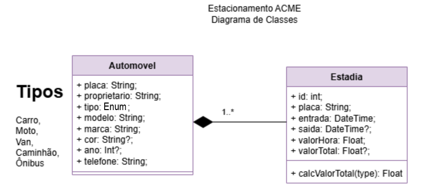
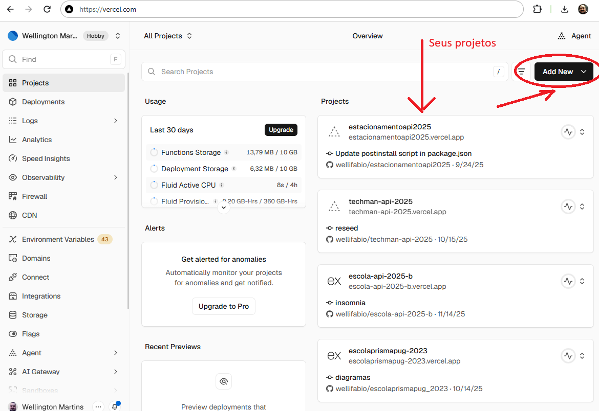
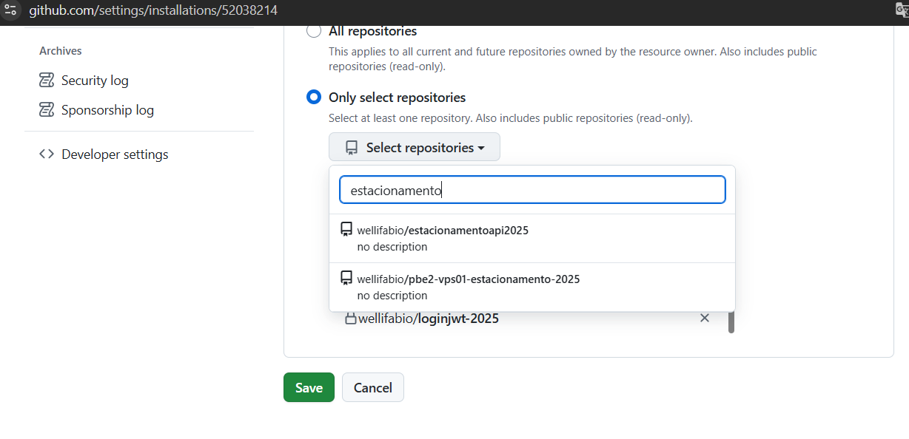
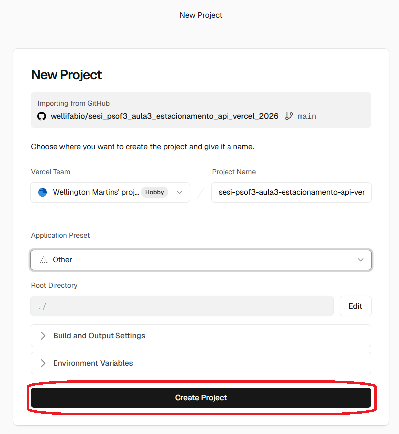
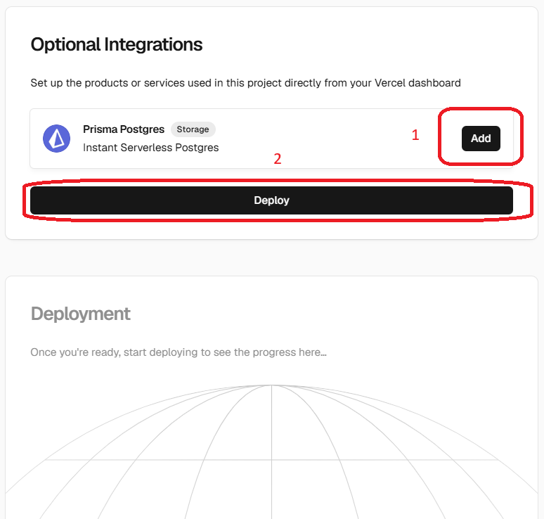
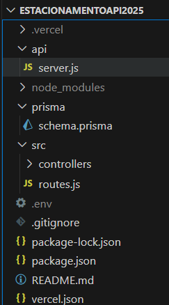
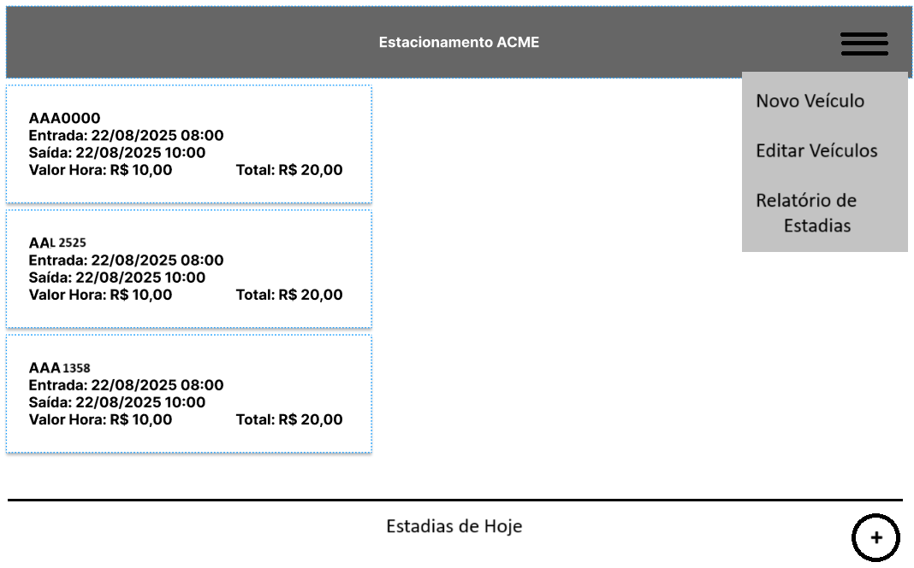
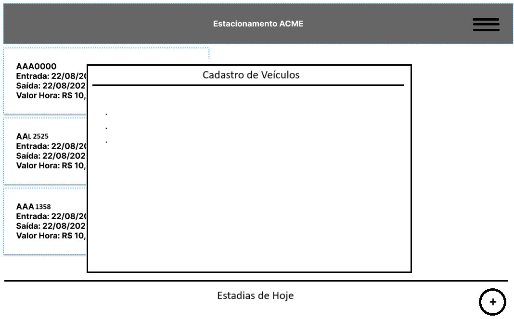

# Aula03 - Deploy (Implantação)
- Implantação de Aplicações Web (API Back-end) com a Vercel
- Para implantar front-end até o momento utilizamos o próprio github pages.
    - Porem para o back-end utilizaremos a Vercel que possui suporte para Node.js e Prisma com banco de dados Postgres.
    - Este serviço é gratuito até um limite de uso específico.
### Ambiente
- [VsCode](https://code.visualstudio.com/)
- [Node.js](https://nodejs.org/)
- [Prisma](https://www.prisma.io/)
- [Postgres](https://www.postgresql.org/)
- [Vercel](https://vercel.com/)

### Contas necessárias
- [GitHub](https://github.com/)
- [Vercel](https://vercel.com/)

## 1 Criando um novo projeto Node.Js + Prisma

A seguir temos um projeto de um simples estacionamento pronto para ser utilizado como base. basta criar a estrutura de pastas e copiar o conteúdo dos arquivos para o seu novo projeto.<br>

- A. Em sua área de trabalho abra um terminal e inicie um novo projeto back-end com a extensão backend-aula coloque o nome `estacionamentoSeuNome`
```bash
npx backend-aula estacionamentoSeuNome
```
- Se der erro após alguns minutos pare o script `CTRL + C` e siga adiante.
- B. Abra a pasta criada com **VsCode**, abra um terminal `CTRL + '` e continue a criação da API conforme shema a seguir:

```js
generator client {
  provider = "prisma-client-js"
}

datasource db {
  provider = "mysql"
}

model Veiculo {
  placa        String    @id
  tipo         Tipo
  proprietario String
  modelo       String
  marca        String
  cor          String?
  ano          Int?
  telefone     String
  estadias     Estadia[]
}

enum Tipo {
  CARRO
  MOTO
  VAN
  CAMINHAO
  ONIBUS
}

model Estadia {
  id         Int       @id @default(autoincrement())
  placa      String?
  entrada    DateTime  @default(now())
  saida      DateTime?
  valorHora  Float
  valorTotal Float?
  automovel  Veiculo?  @relation(fields: [placa], references: [placa], onUpdate: Cascade, onDelete: SetNull)
}
```
- Atualize o `package.json` para um semelhante ao a seguir:
```json
{
  "name": "backend",
  "version": "1.0.0",
  "main": "server.js",
  "scripts": {
    "dev": "node --watch server.js",
    "start":"node server.js"
  },
  "dependencies": {
    "@prisma/adapter-mariadb": "^7.10.0",
    "@prisma/client": "^7.10.0",
    "cors": "^2.8.6",
    "dotenv": "^17.4.2",
    "express": "^5.2.1",
    "prisma": "^7.10.0"
  }
}
```
- No terminal de o comando para atualizar as dependências
```bash
npm i
npx prisma generate
```
- C. Implante e teste localmente com **Insomnia**.
    - Certifique-se do **MySQL MariaDB** estar online (start)
```bash
npx prisma migrate dev --name init
npx backend-aula -models
npx backend-aula -insomnia
```
- Crie uma rota de testes no seu server.js
```js
require('dotenv').config();
const express = require('express');
const cors = require("cors");

const app = express();
app.use(express.json());
app.use(cors());

const estadiaRoutes = require('./src/routes/estadia.routes');
app.use('/estadia', estadiaRoutes);
const veiculoRoutes = require('./src/routes/veiculo.routes');
app.use('/veiculo', veiculoRoutes);

app.use('/',(req, res)=>{
  res.json("API estacionamento online");
});

const PORT = process.env.PORT || 3000;

app.listen(PORT, () => {
  console.log(`http://localhost:${PORT}`);
});

```
- Se preferir abra o **prisma studio** para testar diretamente.
```bash
npx prisma studio
```
- Este será o .env para o endereço local, será alterado para o remoto
```js
DATABASE_URL="mysql://root@localhost:3306/estacionamentoapi?schema=public&timezone=UTC"
```
## 2 Implantação
- 1. Para implantar o SGBD para **Postgre**, pois o vercel só da suporte gratuito para este **SGBD**.
```js
datasource db {
  provider = "postgresql"
}
```
- H. Criar um repositório no github e enviar o projeto, não esqueça do arquivo `.gitignore` contendo:
```
node_modules
.env
/generated/prisma
/prisma/migrations
```

### Criando o projeto na Vercel
Após criar uma conta na Vercel, acesse e crie um novo projeto, **importando** o seu projeto do **github**.
- 
- 
- 
- 
- 
- Seu projeto ainda não vai funcionar, para isso é necessário criar o serviço de banco de dados com Prisma e algumas configurações adicionais.

## 3 Criando o serviço de banco de dados com Prisma
Ainda na **Vercel**, crie um novo serviço de banco de dados com Prisma. Clique em **Storage** procure por **Neon** e clique em **Create**.
- 
- Escolha uma região e de um nome ao servidor de banco de dados, depois conecte seu projeto back-end com o **Neon**.
- 
- Todas as variáveis de ambiente necessárias serão criadas automaticamente.

## 4 Configurar o projeto para Deploy com a Vercel
Volte ao seu **projeto Node.js** no VsCode abra um terminal **CTRL + '** tipo **CMD** e instale o interpretador de comandos vercel
```bash
npm i -g vercel@latest
```
- Link o seu projeto com a vercel e baixe as variáveis de ambiente
```bash
vercel link
vercel env pull .env
```
- Altere o `package.json` para incluir o script p`"postinstall": "prisma migrate dev --name init && prisma generate"` e o prisma como devDependencies:
- Exemplo:
```json
{
  "name": "estacionamentoapi",
  "version": "1.0.0",
  "main": "api/server.js",
  "scripts": {
    "dev": "npx nodemon api/server.js",
    "postinstall": "prisma migrate dev --name init && prisma generate"
  },
  "keywords": [],
  "author": "wellifabio",
  "license": "ISC",
  "description": "Projeto de Estacionamento API, para aulas de Node.js",
  "dependencies": {
    "@prisma/client": "^6.14.0",
    "cors": "^2.8.5",
    "dotenv": "^17.2.1",
    "express": "^5.1.0",
    "prisma": "^6.14.0"
  },
  "devDependencies": {
    "prisma": "^6.14.0"
  }
}
```
- Acrescente o arquivo `vercel.json` na raiz do projeto, apontando para o `api/server.js`
```js
{
    "version": 2,
    "rewrites": [
        {
            "source": "/(.*)",
            "destination": "/api/server.js"
        }
    ]
}
```

- Para **fazer deploy**, com o ambiente configurado corretamente, basta **fazer commit das alterações** e executar o comando:
```bash
vercel --prod
```

## Pronto API Back-end implantado com sucesso

## Atividades
Desenvolva uma UI front-end para consumir sua API implantada conforme wireframes e requisitos a seguir:
### wireframes
Segue os wireframes da UI para ter como base para o desenvolvimento:



### Entregas
- Implante a API na Vercel
- Implante a UI no GitHub Pages

---
## Atualizando aplicação implantada na vercel

- Basta fazer **commit** que um novo deploy é feito automaticamente.
## Caso seja alterado o banco de dados schema.prisma
- 1 Não esquecer de voltar o **SGBD** para `postresql`
- 2 Dar **drop** em todas as tabelas no **NEON** (Excluir todas)
- 3 Dar o comando para resetar o banco e dados no script `postinstall` no aruqivo `package.json` conforme abaixo:
```json
  "scripts": {
    "dev": "npx nodemon api/server.js",
    "postinstall": "prisma migrate reset --force && prisma generate"
  },
```
- 4 Dar **commit** e en seguida implantar o banco novamente
```json
  "scripts": {
    "dev": "npx nodemon api/server.js",
    "postinstall": "prisma migrate dev --name init && prisma generate"
  },
```
- 5 Confira se as tabelas foram criadas novamente no NEON
- 6 Se tiver arquivo com dados para semente: `prisma/seed.js` e dar **commit**
```json
  "scripts": {
    "dev": "npx nodemon api/server.js",
    "postinstall": "prisma db seed && prisma generate"
  },
```
- 7 e por fim apenas `prisma generate`
```json
  "scripts": {
    "dev": "npx nodemon api/server.js",
    "postinstall": "prisma generate"
  },
```