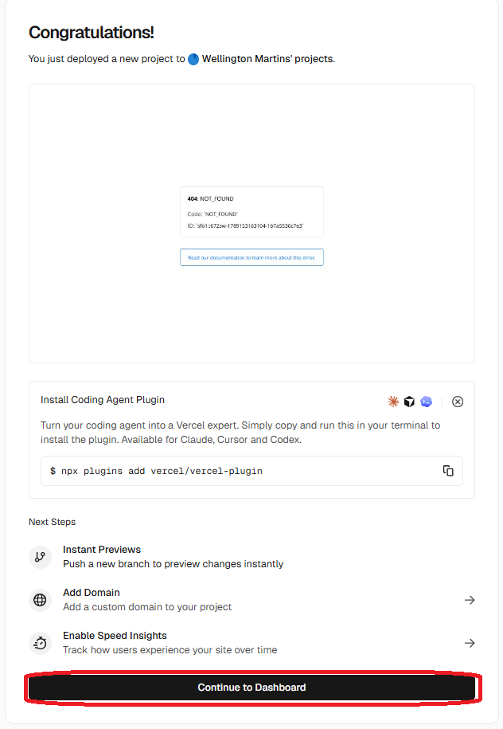

# Aula03 - Deploy (Implantação)
- Implantação de Aplicações Web (API Back-end) com a Vercel
- Para implantar front-end até o momento utilizamos o próprio github pages.
    - Porem para o back-end utilizaremos a Vercel que possui suporte para Node.js e Prisma com banco de dados Postgres.
    - Este serviço é gratuito até um limite de uso específico.
### Ambiente
- [VsCode](https://code.visualstudio.com/)
- [Node.js](https://nodejs.org/)
- [Prisma](https://www.prisma.io/)
- [Postgres](https://www.postgresql.org/)
- [Vercel](https://vercel.com/)

### Contas necessárias
- [GitHub](https://github.com/)
- [Vercel](https://vercel.com/)

## 1 Criando um novo projeto Node.Js + Prisma

A seguir temos um projeto de um simples estacionamento pronto para ser utilizado como base. basta criar a estrutura de pastas e copiar o conteúdo dos arquivos para o seu novo projeto.<br>

- A. Em sua área de trabalho abra um terminal e inicie um novo projeto back-end com a extensão backend-aula coloque o nome `estacionamentoSeuNome`
```bash
npx backend-aula estacionamentoSeuNome
```
- Se der erro após alguns minutos pare o script `CTRL + C` e siga adiante.
- B. Abra a pasta criada com **VsCode**, abra um terminal `CTRL + '` e continue a criação da API conforme shema a seguir:

```js
generator client {
  provider = "prisma-client-js"
}

datasource db {
  provider = "mysql"
}

model Veiculo {
  placa        String    @id
  tipo         Tipo
  proprietario String
  modelo       String
  marca        String
  cor          String?
  ano          Int?
  telefone     String
  estadias     Estadia[]
}

enum Tipo {
  CARRO
  MOTO
  VAN
  CAMINHAO
  ONIBUS
}

model Estadia {
  id         Int       @id @default(autoincrement())
  placa      String?
  entrada    DateTime  @default(now())
  saida      DateTime?
  valorHora  Float
  valorTotal Float?
  automovel  Veiculo?  @relation(fields: [placa], references: [placa], onUpdate: Cascade, onDelete: SetNull)
}
```
- Atualize o `package.json` para um semelhante ao a seguir:
```json
{
  "name": "backend",
  "version": "1.0.0",
  "main": "server.js",
  "scripts": {
    "dev": "node --watch server.js",
    "start":"node server.js"
  },
  "dependencies": {
    "@prisma/adapter-mariadb": "^7.10.0",
    "@prisma/client": "^7.10.0",
    "cors": "^2.8.6",
    "dotenv": "^17.4.2",
    "express": "^5.2.1",
    "prisma": "^7.10.0"
  }
}
```
- Este será o .env para o endereço local, será alterado para o remoto
```js
DATABASE_URL="mysql://root@localhost:3306/estacionamentoapi?schema=public&timezone=UTC"
```
- No terminal de o comando para atualizar as dependências
```bash
npm i
npx prisma generate
```
- C. Implante e teste localmente com **Insomnia**.
    - Certifique-se do **MySQL MariaDB** estar online (start)
```bash
npx prisma migrate dev --name init
npx backend-aula -models
npx backend-aula -insomnia
```
- Crie uma rota de testes no seu server.js
```js
require('dotenv').config();
const express = require('express');
const cors = require("cors");

const app = express();
app.use(express.json());
app.use(cors());

const estadiaRoutes = require('./src/routes/estadia.routes');
app.use('/estadia', estadiaRoutes);
const veiculoRoutes = require('./src/routes/veiculo.routes');
app.use('/veiculo', veiculoRoutes);

app.use('/',(req, res)=>{
  res.json("API estacionamento online");
});

const PORT = process.env.PORT || 3000;

app.listen(PORT, () => {
  console.log(`http://localhost:${PORT}`);
});

```
- Agora vamos testar o back-end com **Insomnia** ou
- Se preferir abra o **prisma studio** para testar diretamente.
```bash
npm run dev
npx prisma studio
```
#### Opcional, podemos alterar os controllers para mostrar mais dados
- veiculo.controller.js
```js
const listar = async (req, res) => {
    const lista = await prisma.veiculo.findMany({
        include:{
            estadias:true
        }
    });

    res.json(lista).status(200).end();
};
```
- estadia.controller.js
```js
const listar = async (req, res) => {
    const lista = await prisma.estadia.findMany({
        include:{
            automovel:true
        }
    });

    res.json(lista).status(200).end();
};
```
### Obs:
A extenção backend-aula cria id como padrão para todas as tabelas/models, a tabela **veiculo** não possui **id**, mas sim **placa** como chave, altere as rotas e controlers de id para placa somente nos modelos *veiculo*.
## 2 Implantação
- 1. Para implantar o SGBD para **Postgre**, pois o vercel só da suporte gratuito para este **SGBD**.
    - Altere o prisma/schema.prisma para `postgresql`
```js
datasource db {
  provider = "postgresql"
}
```
    - Pode remover o `"@prisma/adapter-mariadb": "^7.10.0",` do `package.json`
    - E adicionar o `"postinstall": "prisma migrate dev --name init && prisma generate"` no script
```json
{
  "name": "backend",
  "version": "1.0.0",
  "main": "server.js",
  "scripts": {
    "dev": "node --watch server.js",
    "postinstall": "prisma migrate dev --name init && prisma generate"
  },
  "dependencies": {
    "@prisma/adapter-pg": "^7.10.0",
    "@prisma/client": "^7.10.0",
    "cors": "^2.8.6",
    "dotenv": "^17.4.2",
    "express": "^5.2.1",
    "prisma": "^7.10.0"
  }
}
```
- Acrescente o arquivo `vercel.json` na raiz do projeto, apontando para o `api/server.js`
```js
{
  "version": 2,
  "rewrites": [
    {
      "source": "/(.*)",
      "destination": "/api/index"
    }
  ]
}
```
- O `server.js` passa a ter utilizade apenas para testar localmente.
- Crie o arquivo `api/index.js` que será o novo servidor que a **Vercel** vai utilizar
```js
require('dotenv').config();
const express = require('express');
const cors = require('cors');

const app = express();

app.use(express.json());
app.use(cors());

const estadiaRoutes = require('../src/routes/estadia.routes');
app.use('/estadia', estadiaRoutes);

const veiculoRoutes = require('../src/routes/veiculo.routes');
app.use('/veiculo', veiculoRoutes);

app.get('/', (req, res) => {
  res.json({ message: 'API estacionamento online' });
});

module.exports = app;
```
= Altere o adaptador no prisma em `src/data/prisma.js`, comente o MariaDB e acrescente o Postgres
```js
const { PrismaClient } = require("@prisma/client");
// const { PrismaMariaDb } = require("@prisma/adapter-mariadb");
const { PrismaPg } = require("@prisma/adapter-pg");

// const adapter = new PrismaMariaDb(process.env.DATABASE_URL);
const adapter = new PrismaPg({ connectionString: process.env.DATABASE_URL });

const prisma = new PrismaClient({ adapter });

module.exports = prisma;
```
- H. Criar um repositório no github e enviar o projeto, não esqueça do arquivo `.gitignore` contendo:
```
node_modules
.env
/generated/prisma
/prisma/migrations
```

### Criando o projeto na Vercel
Após criar uma conta na Vercel, acesse e crie um novo projeto, **importando** o seu projeto do **github**.
- 
- Copie e cole o nome do repositório, se ele não aparecer clique em `Configure GitHub App`
- Busque seu repositorio no github
- 
- 
- Clique em "Create Project"
- 
- Clique em **Add** para adicionar o SGBD PostgreSQL e confirme até o fim
- 
- 
- Clique em `Continue to Dashboard`
- Se apresentar algum erro, verifique as configurações ou refaça o processo
- Altere o `package.json` removendo p`"postinstall": "prisma generate"`:
- Exemplo:
```json
{
  "name": "backend",
  "version": "1.0.0",
  "main": "api/index.js",
  "scripts": {
    "dev": "node --watch api/index.js",
    "postinstall": "prisma generate"
  },
  "dependencies": {
    "@prisma/adapter-pg": "^7.10.0",
    "@prisma/client": "^7.10.0",
    "cors": "^2.8.6",
    "dotenv": "^17.4.2",
    "express": "^5.2.1",
    "prisma": "^7.10.0"
  }
}
```
## Pronto API Back-end implantado com sucesso
## [Exemplo do estacionamento implantado](https://github.com/wellifabio/sesi_psof3_aula3_estacionamento_api_vercel_2026.git)

## Atividades
Desenvolva uma UI front-end para consumir sua API implantada conforme wireframes e requisitos a seguir:
### wireframes
Segue os wireframes da UI para ter como base para o desenvolvimento:


### Entregas
- Implante a API na Vercel
- Implante a UI no GitHub Pages