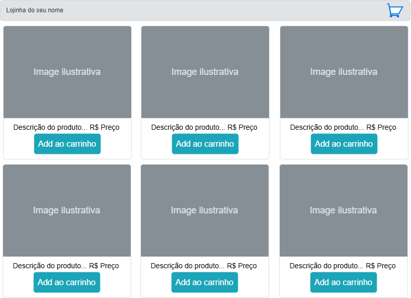
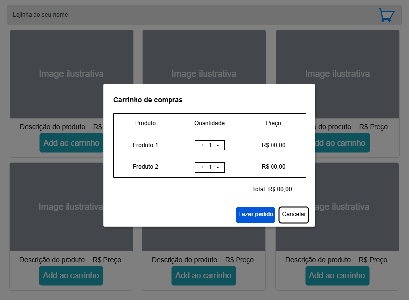

# Aula02
## Manipulação do DOM
- Modais
- Formulários

## Manipulação de dados
- Listas
    - forEach() - Laços para percorrer a lista
    - push() - Adicionar dados a lista
    - splice() - Remover dados da lista
## Salvar dados localmente
- localStorage.getItem()
- localStorage.setItem()

## Desafio
Usando os conhecimentos adquiridos nesta aula, você deve montar um carrinho de compras onde os produtos comprados devem sem apresentados em uma tabela dentro de um modal, semelhante aos wireframes a seguir.
|Wireframes|
|-|
||
|Tela com pelo menos 10 produtos dispostos em forma de cards renderizados com HTML e CSS, com responsividade, caso queira deixar os dados dos produtos em um arquivo .json fique a vontade|
|Ao clicar em "Add ao carrinho" o produto deve ser adicionado a uma lista e a lista "carrinho" deve ser armazenada localmente com **localStorage**|
||
|Ao clicar no ícone do carrinho um modal deve ser aberto e exibir a lista "carrinho" permitindo alterar as quantidades e calculando o total|
|Ao clicar em "Fazer pedido" a lista deve ser apenas limpa e excluída do **localStorage**|

- Crie um tema criativo a sua escolha.
- Deixe o código limpo com o mínimo de linhas possível como vimos em aula.

## Entregas
- Crie um repositório no gihub com o nome que preferir contendo o projeto, um README.md com o padrão estudado em nossas aulas e habilite o git pages.
