# Criando projeto com

Neste arquivo vou descrever o passo a passo de como montar com o firebase um banco de dados online para acrescentar em nosso projeto

 - ## 1. Inicialmente acesse o site

## https://console.firebase.google.com/
(utilize sua conta do Google para realizar o login)

 - ## 2. Ao acessar o console devemos clicar em Criar novo projeto

 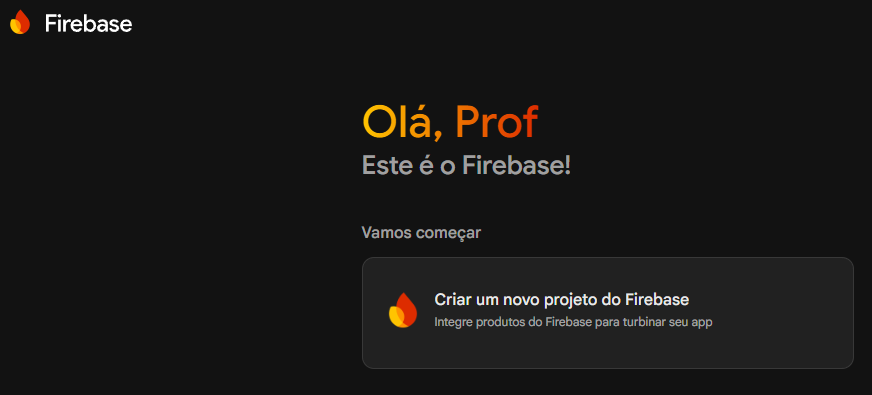

  - ##  3. Após clicar devemos nomear o nome do projeto e clicar em continuar

  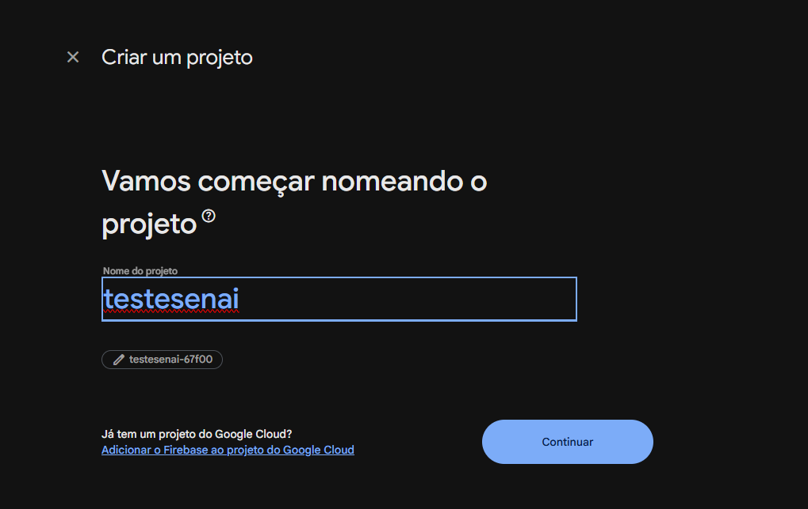

  - ## 4. Desative o assistente de IA e clique em continuar

  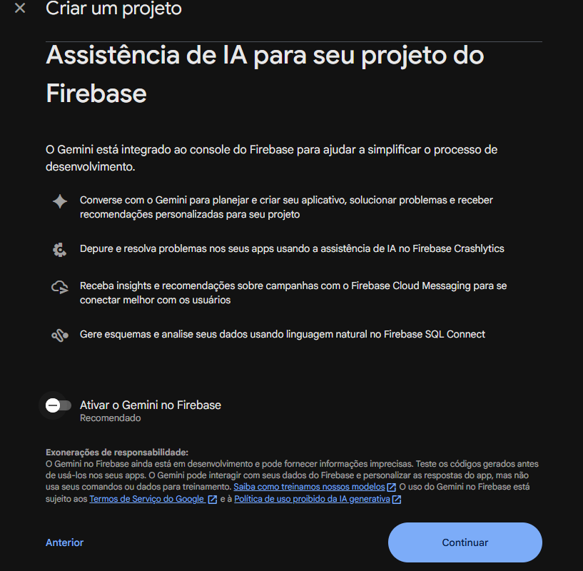
  
  - ##  5. Pode desabilitar o Google Analytics e clique em criar projeto

  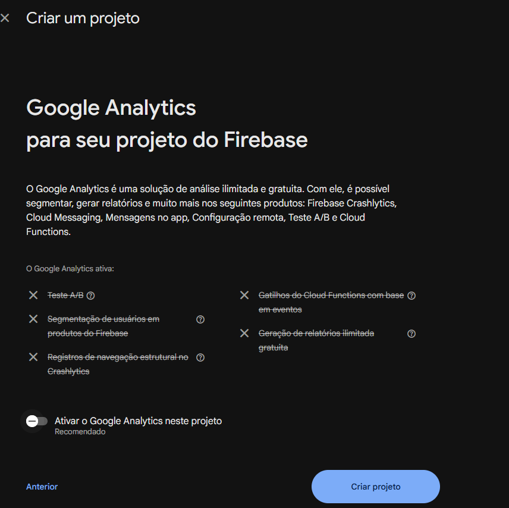 

  - ##  6. Com o projeto criado clique em Continuar

  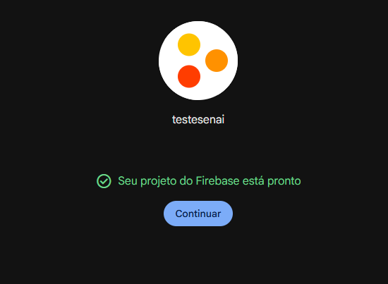

  - ## 7. Você sera direcionado para a pagina de console do projeto 

  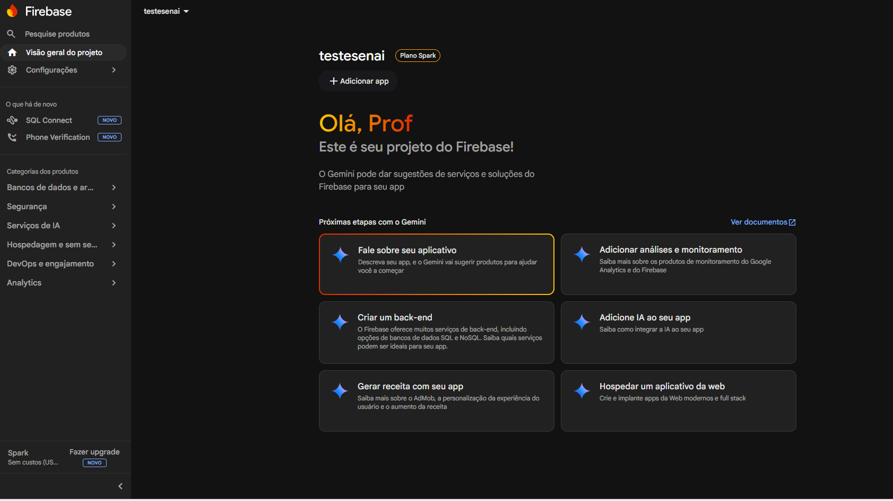

  - ## 8. Cliquem em Banco de dados e selecione o FireStore

  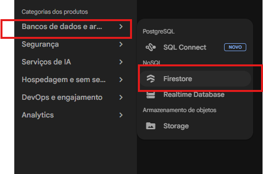

  - ## 9. Clique em criar Banco de dados

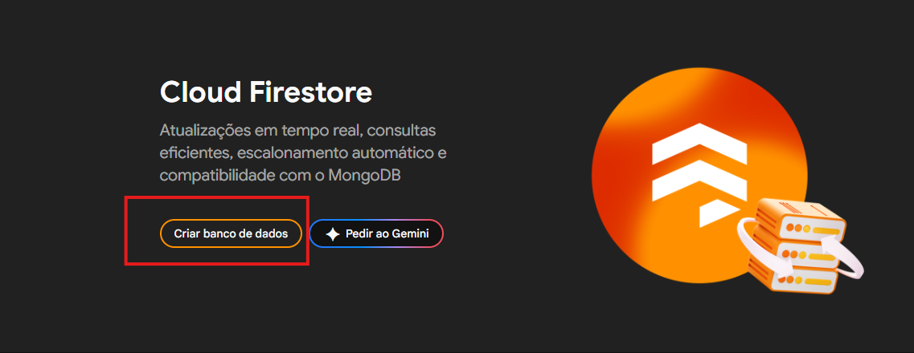

 - ## 10. Selecione a edição do banco de dados Standart e o local do banco deixe o ja listado pelo firebase e clique em avançar

 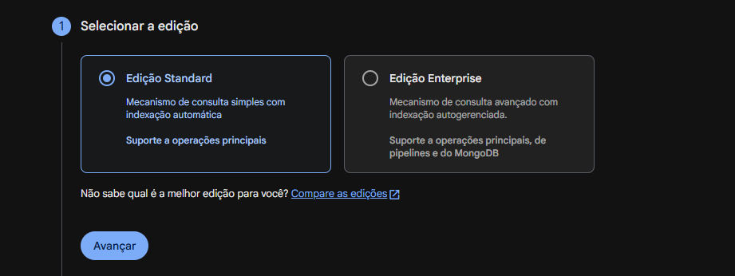

 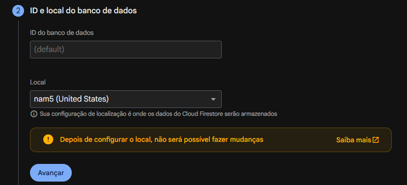

 - ## 11. Em configurar deixe o banco no modo produção e clique em criar

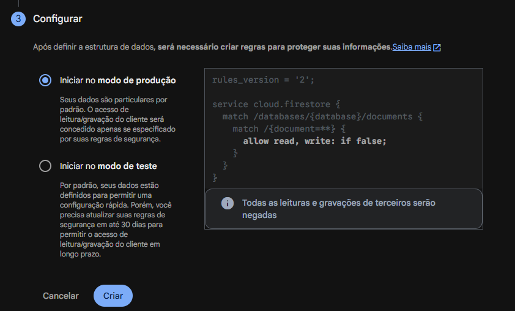

- ## 12. Agora no console do banco de dados clique em Regras

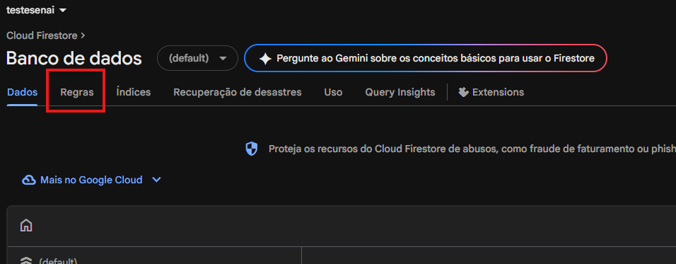

- ## 13. Muda a regra conforme a imagem abaixo depois clique em publicar

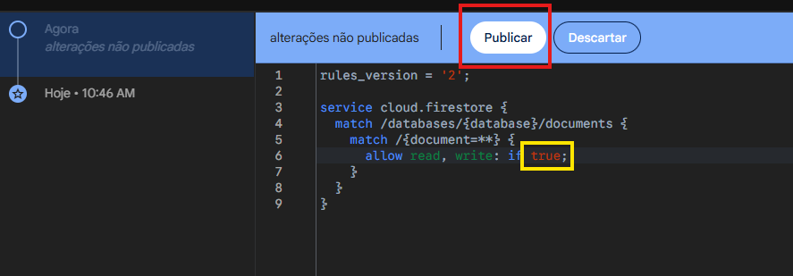

- ## 14. Volte a visão geral do projeto clicando aqui 

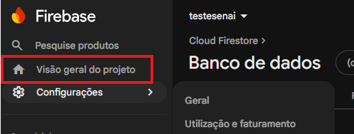

- ## 15. Agora voltando ao console clique em adicionar app e depois selecione a versão web

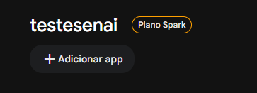
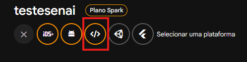

- ## 16. Registre o aplicativo colocando um nome e clique em registrar

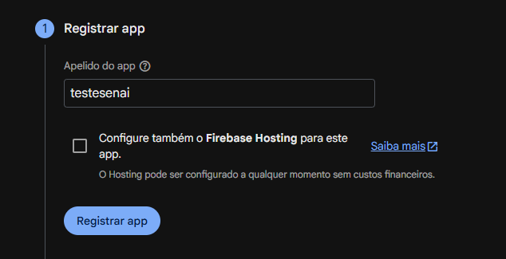

- ## 17. Ele vai gerar as conexões para utilizar o banco basta ai copiar o codigo e adaptar no seu projeto

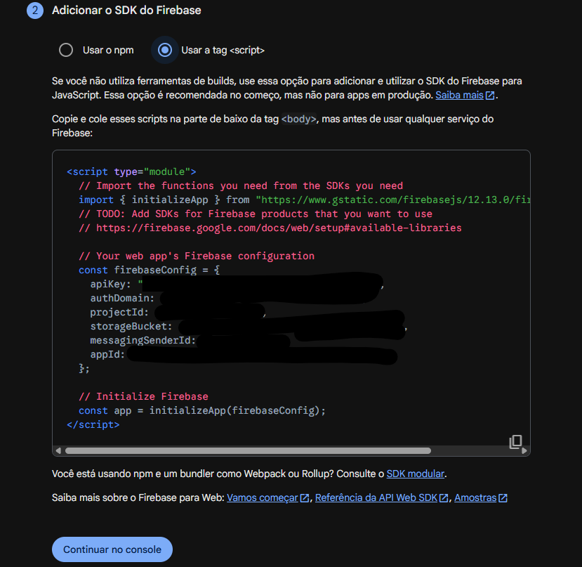

# Bora Programar!!!!!!

