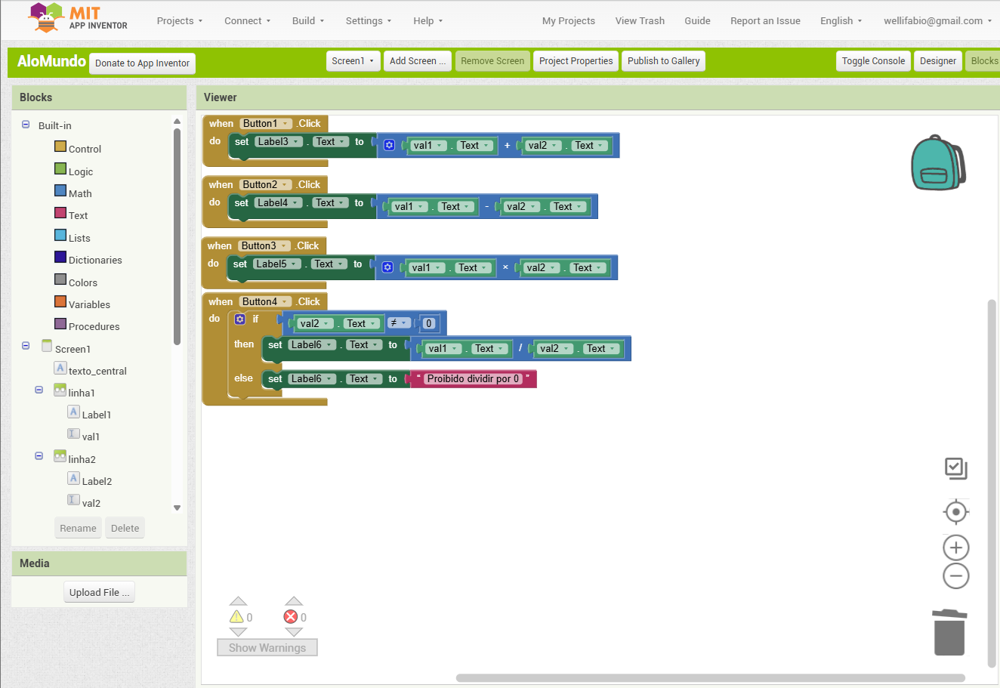

# Aula01 - Programação Mobile

## Ambientes DEV
- NoCode Low Code (web)
    - Mit App vinventor
        - Programação em blocos
    - Kodular
- Code (Local)
    - React Native com Expo
        - Node.js
        - Expo
        - Linguagens de Programação
            - JavaScript
            - TypeScript
    - Flutter
        - SDK do Flutter
        - Android Studio
        - Linguagens de Programação
            - Dart
            - Kotlin

## Conhecimentos
- 1 Dispositivos móveis 
  - 1.1 Definição 
  - 1.2 Histórico 
  - 1.3 Características 
  - 1.4 Arquitetura  
  - 1.5 Ambiente de desenvolvimento 
    - 1.5.1 Instalação e configuração 
    - 1.5.2 Gerenciamento de dependências 
    - 1.5.3 Recursos e interfaces

## Ambiente de desenvolvimento
- NoCode - Instalar o emulador **aiStarter**

### Instaladores
    - [Emulador para o App Inventor](https://appinventor.mit.edu/explore/ai2/setup-emulator) NoCode

## Mit - App inventor
Low ou No Code, criar aplicativos com programação em bloco.

### Demonstração 1
Aplicativo Calculadora Simples
- Layout
- Blocos - Ações dos botões e telas
- Botões
- Troca de telas
- Texto para Fala

|Caculadora|
|-|
||
|Blocos primeira tela|
||

### Como testar
- Instale o [emulador](https://appinventor.mit.edu/explore/ai2/setup-emulator) e clique em **Connect** > **Emulator**.
- Baixe em seu celular o aplicativo Mit AI2 Companion, clique em **Connect** > **AI Companion**, leia o QR code e teste.

### Ao concluir o aplicativo faça o Build (Construção para instalar no celular)
- Arquivo .aia (Projeto) exportar o arquivo neste formato para enviar para o professor via github
- Arquivo .apk (Aplicativo) Versão para instalar no celular do desenvolvedor
- Connection QR Code (Aplicativo) Versão para instalar no celular do desenvolvedor. Utiliza o QR Code para conectar com o App Inventor

### Exercício individual (Avaliação individual IMC)
Crie uma calculadora de IMC (Índice de massa corpórea) semelhante a do exemplo abaixo, pesquise na internet uma tabela de IMC que avalia se a pessoa está abaixo do peso, na média, acima, etc.

Mostre sua atividade ao instrutor sua atividade.