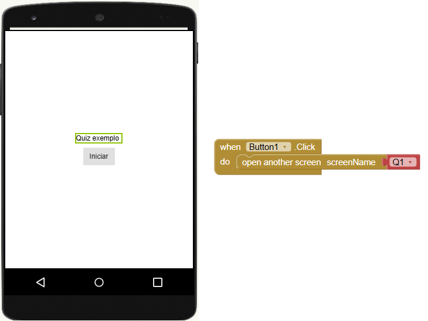
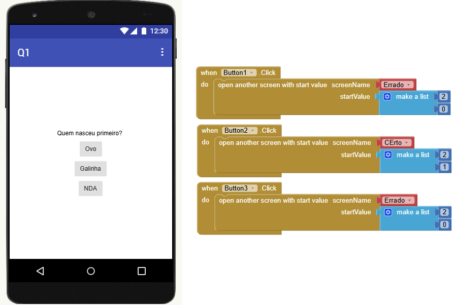
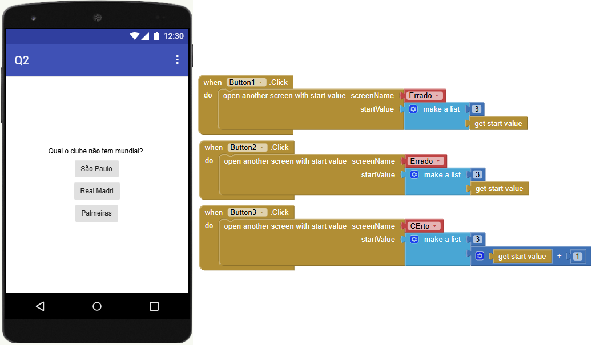
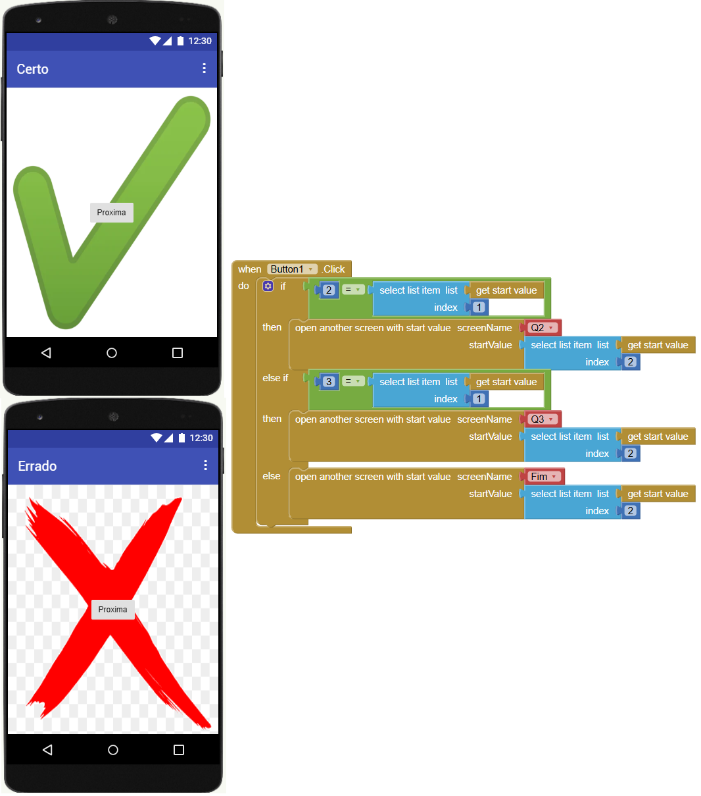
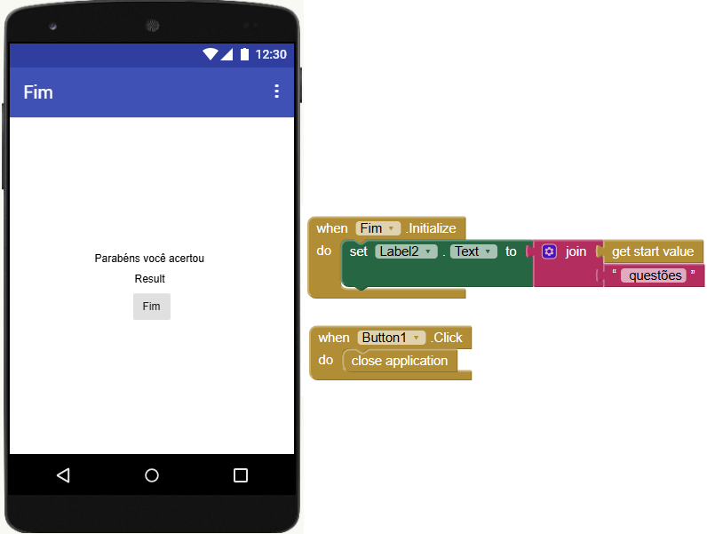

# Exemplo quiz

## Tela inicial

## Primeira questão

## Demais questões

## Telas certo e errado

Este App de exemplo possui apenas três questões, acrescente mais **else if** para as 10 questões, código das duas telas é o mesmo, copie e cole.
## Tela final de resultado
