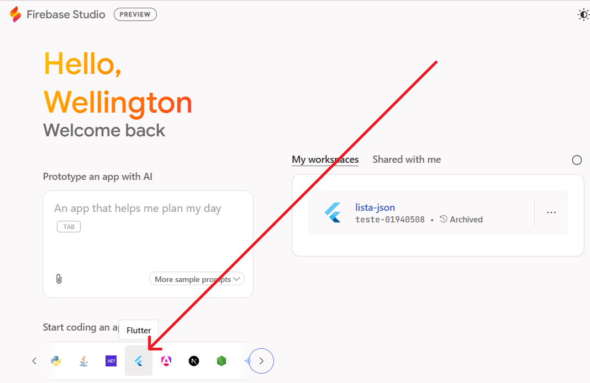

# Aula04 - Flutter

Os principais frameworks para desenvolvimento mobile em 2026 são **Flutter** (da Google, usando *Dart*) e **React Native** (da Meta, usando JavaScript/*TypeScript*), ambos excelentes para criar aplicativos nativos para iOS e Android com uma única base de código. Eles oferecem alta performance, desenvolvimento rápido e forte suporte da comunidade. Outras opções incluem Kotlin Multiplatform (compartilhamento de lógica) e .NET MAUI (para ecossistema Microsoft). 

- https://flutter.dev Site oficial
    - Baixar e Instalar o Ambiente
        - Git
        - VsCode
        - Node.js
    - Arquivo flutter para Windows .zip
        - Descompactar na pasta do seu usuário
        - Configurar a variável de ambiente
    - Baixar e instalar o [Android Studio](https://developer.android.com/codelabs/basic-android-kotlin-compose-install-android-studio?hl=pt-br#0) para testar os apps no **emulador**, pagina de [download](https://developer.android.com/studio?hl=pt-br#get-android-studio).

### [Firebase Studio](https://firebase.google.com/?utm_source=PMAX&utm_medium=display&utm_campaign=Cloud-SS-DR-Firebase-FY26-global-pmax-1713590&utm_content=pmax&gclsrc=aw.ds&gad_source=1&gad_campaignid=23417496167&gbraid=0AAAAADpUDOjzkLWPfS4VKB5bhGuLFbI5t&gclid=Cj0KCQiAqeDMBhDcARIsAJEbU9T4OMVWThSwpR035LaQTzv_BVknaa0i_G_bt3CgeiIG1ixV9uFgwA8aAoxOEALw_wcB&hl=pt-br)
O Firebase Studio é um ambiente de desenvolvimento (IDE) baseado em **nuvem**, impulsionado pelo Gemini, projetado para acelerar a criação de aplicativos full-stack e de IA generativa. Ele integra ferramentas de prototipagem, codificação (baseada em Code OSS) e deploy, permitindo desenvolver, testar e publicar aplicativos web e mobile diretamente do navegador
 
- Para criar um projeto online clique em **"Try FireBase Studio"**, faça login com sua conta google e inicie um **novo projeto flutter**.
 