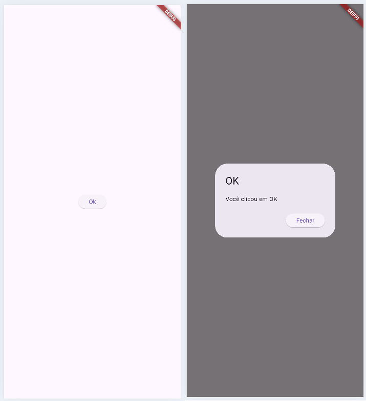
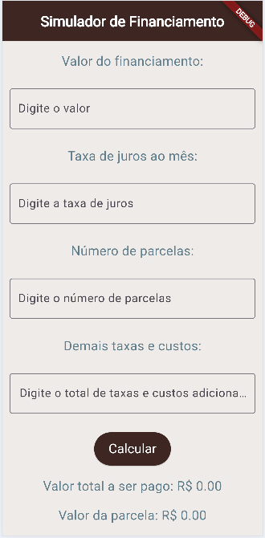
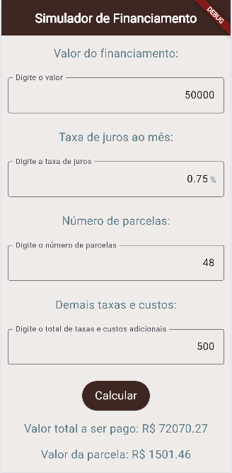
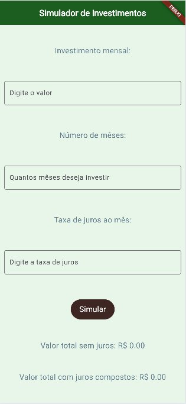
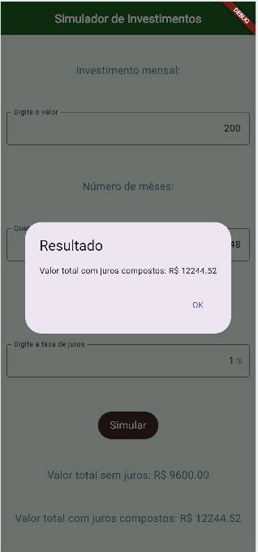

# Aula06 - Flutter

Após instalar o ambiente flutter vamos criar um alô mundo:
- Abra o vscode, pressione CTRL + Shift + P e digite **flutter**, clique em **New Project**, escolha **"Empty..."** projeto vazio.
- Selecione a pasta de origem e coloque o nome do projeto.
- Pronto, um Alô Mundo será criado. basta executar em um navegador como o Chrome ou no Emulador.

## Alterando o código
Vamos criar um botão e um **alert** que abre ao clicar no botão
```dart
import 'package:flutter/material.dart';

void main() {
  runApp(const MainApp());
}

class MainApp extends StatelessWidget {
  const MainApp({super.key});

  void click(BuildContext context) {
    showDialog(
      context: context,
      builder: (BuildContext context) {
        return AlertDialog(
          title: Text("OK"),
          content: Text("Você clicou em OK"),
          actions: <Widget>[
            ElevatedButton(
              child: Text("Fechar"),
              onPressed: () {
                Navigator.of(context).pop();
              },
            ),
          ],
        );
      },
    );
  }

  @override
  Widget build(BuildContext context) {
    return MaterialApp(
      home: Scaffold(
        body: Builder(
          builder: (context) => Center(
            child: ElevatedButton(
              onPressed: () {
                click(context);
              },
              child: const Text("Ok"),
            ),
          ),
        ),
      ),
    );
  }
}
```


### Inputs
Vamos criar um novo aplicativo chamado **inputs**
- Alterar o código para acrescentar dois TextFields para ler o título e o texto do alerta.
- Ao clicar no botão o alerta deve ser aberto com o título e texto informados
- O aplicativo anterior não possuía entrada de dados nem alteração nos atributos (Variáveis da classe) por isso é sem estado **StatelessWidget** (stl),  este deve ser **StatefulWidget** (stf) com alteração de estados.
```dart
import 'package:flutter/material.dart';

void main() {
  runApp(const MainApp());
}

class MainApp extends StatefulWidget {
  const MainApp({super.key});

  @override
  State<MainApp> createState() => _MainAppState();
}

class _MainAppState extends State<MainApp> {
  String? titulo;
  String? texto;

  void alert(BuildContext context) {
    showDialog(
      context: context,
      builder: (BuildContext context) {
        return AlertDialog(
          title: Text(titulo ?? "Sem título"),
          content: Text(texto ?? "Sem descrição"),
          actions: <Widget>[
            ElevatedButton(
              onPressed: () {
                Navigator.of(context).pop();
              },
              child: Text("Fechar"),
            ),
          ],
        );
      },
    );
  }

  @override
  Widget build(BuildContext context) {
    return MaterialApp(
      home: Scaffold(
        body: Padding(
          padding: const EdgeInsets.all(12.0),
          child: Column(
            mainAxisAlignment: MainAxisAlignment.center,
            spacing: 20.0,
            children: [
              TextField(
                decoration: InputDecoration(labelText: "Título"),
                onChanged: (text) {
                  titulo = text;
                },
              ),
              TextField(
                decoration: InputDecoration(labelText: "Texto"),
                onChanged: (text) {
                  texto = text;
                },
              ),
              Center(
                child: Builder(
                  builder: (buttonContext) => ElevatedButton(
                    onPressed: () {
                      alert(buttonContext);
                    },
                    child: Text('Abrir alerta'),
                  ),
                ),
              ),
            ],
          ),
        ),
      ),
    );
  }
}
```
- Estamos utilizando o navegador "Chrome para testar", tente utilizar o Emulador do Android Studio para testar desta vez.
- A primeira vez que o utilizamos pode demorar um pouco, porém aos poucos vai ficando mais rápido.

### Desafios, formulários com uma tela
- A Utilizando o Figma crie protótipos funcionais para cada um dos três desafios.
- B Utilizando o framework flutter desenvolva as três interfaces de apenas uma tela usando formulário.

|Wireframes01|Wireframes02|Wireframes03|Desafios|
|-|-|-|-|
||||**Contextualização:** As taxas de juros continuam autíssimas dificultando a aquisição de bens e serviços. Antes de comprar um bem financiado como um carro, uma moto, um imóvel ou até mesmo um eletrodoméstico, é importante simular o valor das parcelas e o custo total do financiamento.<br>**Objetivo:** Desenvolver um aplicativo semelhante ao da imagem ao lado que recebe como entrada o valor do bem, o número de parcelas, a taxa de juros mensal e as taxas adicionais e exibe o valor da parcela e o Montante total do financiamento.|
||||**Contextualização:** Uma alternativa ao financiamento é a paciência, quando a aquisição de um bem não é de necessidade básica ou essencial. Neste caso, é possível investir o dinheiro e esperar o tempo necessário para adquirir o bem à vista.<br>**Objetivo:** Desenvolver um aplicativo semelhante ao da imagem ao lado que recebe como entrada o valor mensal que podemos investir o número de meses e a taxa de juros mensal e exibe o montante acumulado sem juros e com juros compostos.|
||||**Contextualização:** O professor de instalações elétricas ensina seus alunos como calcular a bitola adequada para cada uso de uma instalação. Solicitou que os alunos de Desenvolvimento de sistemas criem um aplicativo que faça este cálculo.<br>**Objetivo:** Desenvolver um aplicativo semelhante ao da imagem ao lado que recebe como entrada a corrente elétrica em ampères e a distância em metros e exibe a bitola do fio em milímetros quadrados, tanto para tensão de 110V quanto para 220V.<br>**Fórmula:**<br>bitola110 = (2 * corrente * distância) / 294.64<br>bitola220 = (2 * corrente * distância) / 510.4|

Faça os exercícios utilizando a IDE **VsCode**, testando no Navegador ou no Emulador do Android Studio, se preferir pode utilizar a IDE do Android Studio ou **IDX (Firebase Studio)**

## Entregas
- Cada projeto deve estar em um **repositório público separado no GitHub**.
- Nomes sugeridos para os repositórios:
  - financiamento2026
  - investimento2026
  - bitola2026
- Os links dos repositórios devem ser enviados para o professor neste **[Form]()**.
- Todos os repositórios devem ter no arquivo **README.md**
  - Descrição do projeto
  - Print das telas (salvos em uma pasta assets no projeto)
  - Tecnologias
  - Passo a passo de como executar

## Critérios de avaliação
|Criticidade|Capacidades Básicas e Socioemocionais|Critérios|
|-|:-:|-|
||1 Identificar as características de programação de dispositivos móveis|Design: Criou o prototipo configurando um **dispositivo** mobile especificado|
||2 Preparar o ambiente necessário ao desenvolvimento do sistema para a plataforma mobile|Configurou o abiente flutter, Android Studio no computador Local e/ou criou projeto remoto|
||3 Interpretar os requisitos do sistema, tendo em vista a elaboração dos componentes em ambiente mobile|Implementou os componentes visuais conforme especificado|
||4 Definir os elementos de entrada, processamento e saída para a codificação das funcionalidades mobile|Implementou os requisitos de design ou funcionais conforme descrito|
||5 Projetar interfaces para dispositivos móveis|Criou o protótipo funcional, Implementou as funcionalidades conforme wireframes|
||6. Implementar o código respeitando as características da linguagem na plataforma mobile|Implementou na linguagem **Dart** em ambiente local ou remoto|
||1 Demonstrar autogestão|Utilizou IA apenas como apoio tentando entender a solução, contou com ajuda de colegas ou ajudou com objetivo de melhorar o aprendizado|
||2 Demonstrar pensamento analítico|Compreende como o Wireframes, Protótipos e Ambientes de desenvolvimento Mobile se relacionam, Compreende o fluxo de dados entre API, App e Locais|
||3 Demonstrar inteligência emocional|Se dedicou ao aprendizado para compreender o mínimo do componente|
||4 Demonstrar autonomia|Questionou os intrutores ou colegas sobre dúvidas ou problemas ocorridos durante o desenvolvimento. Se propôs a resolver os problemas|