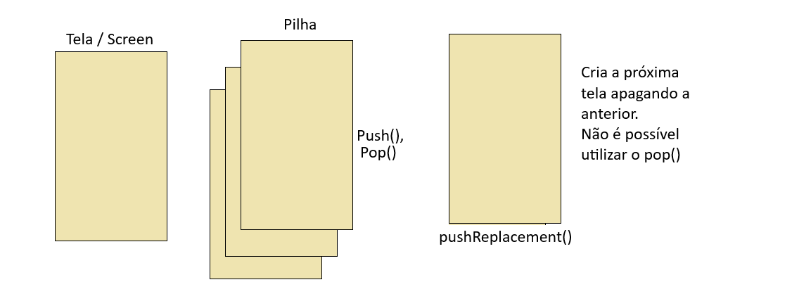
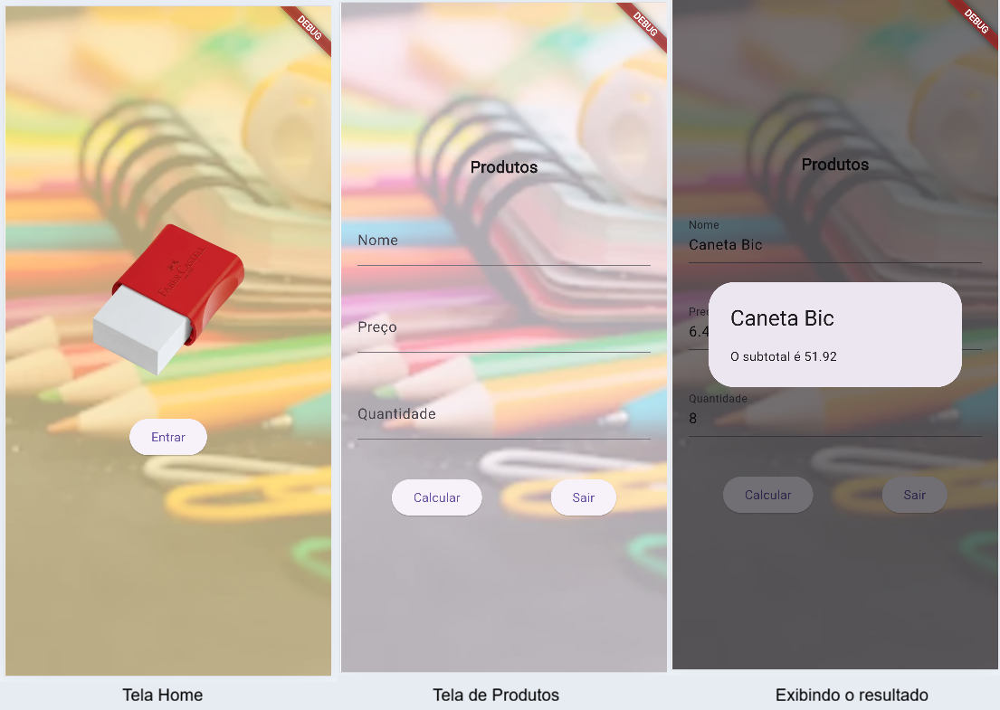

# Aula07 - Navegação e imagens

Para navegar entre as telas podemos utilizar duas formas, push(), pop() ou pushReplacment(), o primeiro mantem a tela anterior na memória e o segundo a destroi.


## Passo a passo de como iniciar um novo projeto com navegação de telas
- 1 CTRL + Shift + P -> Flutter: new Project,
- 2 Escolha: Empty ..., Escolha a pasta, de um nome ao seu projeto
- 3 Crie a seguinte estura de arquivos denro da pasta **lib**
```
lib
    main.dart
    screens
        home.dart
        produtos.dart
```
- Para que possamos utilizar **imagens internas** no App, precisamos criar a pasta **assets** na raiz do projeto e apontar para ela no arquivo *pubspec.yaml*, acrescente o código a seguir no final do arquivo.

```yaml
  assets:
    - assets/
```
O aruivo **pubspec.yaml** ficará com o código semelhante ao a seguir.
```yaml
name: navegacao
description: "A new Flutter project."
publish_to: 'none'
version: 0.1.0+1

environment:
  sdk: ^3.11.0

dependencies:
  flutter:
    sdk: flutter

dev_dependencies:
  flutter_test:
    sdk: flutter
  flutter_lints: ^6.0.0

flutter:
  uses-material-design: true
  assets:
    - assets/
```
Agora dentro da pasta assets salve duas imagens uma para o fundo da tela e outra como logo.
#### Programando
Edite os arquivos a seguir na pasta **lib** conforme os códigos respectivos:
- main.dart
```dart
import 'package:flutter/material.dart';

import 'screens/home.dart';

void main(){
  runApp(MaterialApp(title:'Estudo de navegacao', home: Home()));
}
```
- screens/home.dart
```dart
import 'package:flutter/material.dart';

import 'produtos.dart';

class Home extends StatelessWidget {
  const Home({super.key});

  @override
  Widget build(BuildContext context) {
    return Scaffold(
      backgroundColor: Colors.amber[100],
      body: Container(
        decoration: BoxDecoration(
          image: DecorationImage(
            image: AssetImage("assets/fundo.webp"),
            fit: BoxFit.cover,
            colorFilter: ColorFilter.mode(
              Color.fromRGBO(0, 0, 0, 0.3),
              BlendMode.dstATop,
            ),
          ),
        ),
        child: Column(
          mainAxisAlignment: MainAxisAlignment.center,
          spacing: 40.0,
          children: [
            Center(child: Image.asset("assets/logo.png", width: 200)),
            Center(
              child: ElevatedButton(
                onPressed: () => Navigator.push(
                  context,
                  MaterialPageRoute(builder: (context) => Produtos()),
                ),
                child: Text("Entrar"),
              ),
            ),
          ],
        ),
      ),
    );
  }
}

```
- screens/produtos.dart
```dart
import 'package:flutter/material.dart';

class Produtos extends StatefulWidget {
  const Produtos({super.key});

  @override
  State<Produtos> createState() => _ProdutosState();
}

class _ProdutosState extends State<Produtos> {
  String nome = '';
  double preco = 0.0;
  int quantidade = 0;

  double subTotal() {
    return preco * quantidade;
  }

  void resultado() {
    if (mounted) {
      showDialog(
        context: context,
        builder: (BuildContext context) => AlertDialog(
          title: Text(nome),
          content: Text("O subtotal é ${subTotal().toStringAsFixed(2)}"),
        ),
      );
    }
  }

  @override
  Widget build(BuildContext context) {
    return Scaffold(
      body: Container(
        decoration: BoxDecoration(
          image: DecorationImage(
            image: AssetImage("assets/fundo.webp"),
            fit: BoxFit.cover,
            colorFilter: ColorFilter.mode(
              Color.fromRGBO(0, 0, 0, 0.3),
              BlendMode.dstATop,
            ),
          ),
        ),
        child: Padding(
          padding: const EdgeInsets.all(18.0),
          child: Column(
            mainAxisAlignment: MainAxisAlignment.center,
            spacing: 40.0,
            children: [
              Center(
                child: Text(
                  "Produtos",
                  style: TextStyle(fontWeight: FontWeight.bold, fontSize: 18),
                ),
              ),
              TextField(
                decoration: InputDecoration(labelText: "Nome"),
                onChanged: (value) {
                  nome = value;
                },
              ),
              TextField(
                decoration: InputDecoration(labelText: "Preço"),
                onChanged: (value) {
                  preco = double.parse(value);
                },
              ),
              TextField(
                decoration: InputDecoration(labelText: "Quantidade"),
                onChanged: (value) {
                  quantidade = int.parse(value);
                },
              ),
              Row(
                mainAxisAlignment: MainAxisAlignment.spaceAround,
                children: [
                  ElevatedButton(
                    onPressed: () => resultado(),
                    child: Text("Calcular"),
                  ),
                  ElevatedButton(
                    onPressed: () => Navigator.pop(context),
                    child: Text("Sair"),
                  ),
                ],
              ),
            ],
          ),
        ),
      ),
    );
  }
}
```
## Exeutano
Para exutar o projeto, scolha o navegador **Chrome**, navegue até o **main.dart** e clique em play.
<br>

## Resultado


## Flutter comandos

|Ação|Comando|
|-|-|
|Executar um projeto flutter|flutter run|
|Verificar se está tudo OK|flutter doctor|
|Verificar se está tudo OK com mais detalhes|flutter doctor -v|
|Atualizar as dependencias do projeto|flutter pub get|
|Iniciar um novo projeto| flutter create nome_do_seu_app|
|Iniciar um novo projeto vazio|flutter create --empty nome_do_seu_app|
|Iniciar um novo projeto com o template de aplicativo|flutter create --template=app nome_do_seu_app|
|Atualizar o Flutter|flutter upgrade|